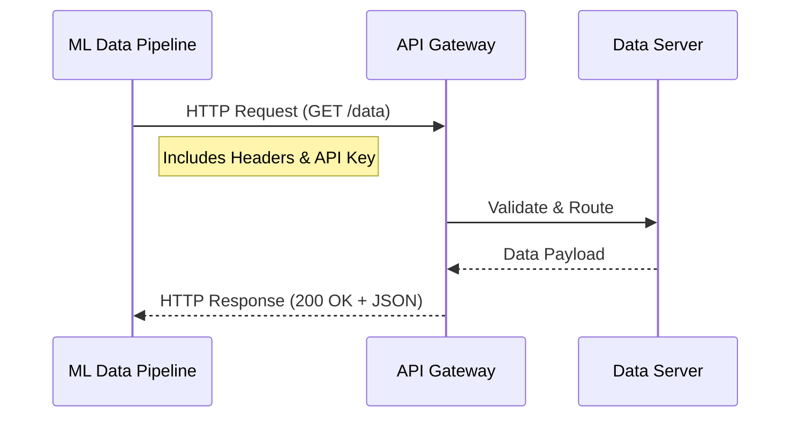
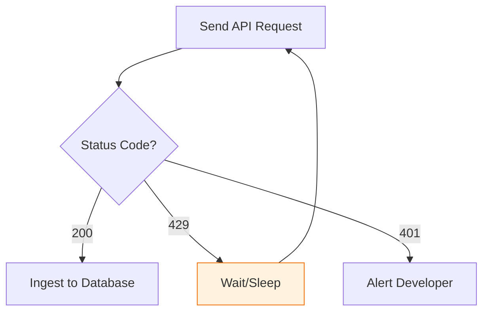

In the Data Engineering lifecycle, **APIs** are the "clean" way to collect data. Unlike web scraping, which is brittle and unstructured, APIs provide a contract-based method to access data that is versioned, documented, and usually delivered in machine-readable formats like JSON.

## 1. How APIs Work: The Request-Response Cycle

An API acts as a middleman between your ML pipeline and a remote server. You send a **Request** (a specific question) and receive a **Response** (the data answer).



### Components of an API Request:

1. **Endpoint (URL):** The address where the data lives (e.g., `api.twitter.com/v2/tweets`).
2. **Method:** What you want to do (`GET` to fetch, `POST` to send).
3. **Headers:** Metadata like your **API Key** or the format you want (`Content-Type: application/json`).
4. **Parameters:** Filters for the data (e.g., `?start_date=2023-01-01`).

## 2. Common API Architectures in ML

### A. REST (Representational State Transfer)

The most common architecture. It treats every piece of data as a "Resource."

* **Best for:** Standardized data fetching.
* **Format:** Almost exclusively **JSON**.

### B. GraphQL

Developed by Meta, it allows the client to define the structure of the data it needs.

* **Advantage in ML:** If a user profile has 100 fields but you only need 3 features for your model, GraphQL prevents "Over-fetching," saving bandwidth and memory.

[Image comparing REST vs GraphQL data fetching efficiency]

### C. Streaming APIs (WebSockets/gRPC)

Used when data needs to be delivered in real-time.

* **ML Use Case:** Algorithmic trading or live social media sentiment monitoring.

## 3. Implementation in Python

The `requests` library is the standard tool for interacting with APIs.

```python
import requests

url = "https://api.example.com/v1/weather"
headers = {
    "Authorization": "Bearer YOUR_TOKEN"
}
params = {
    "city": "Mandsaur",
    "country": "IN",
    "units": "metric"
}

response = requests.get(url, headers=headers, params=params)

if response.status_code == 200:
    data = response.json()
    temperature = data["main"]["temp"]   # Extracting temperature
    humidity = data["main"]["humidity"] # Extracting humidity

    print(f"Temperature in Mandsaur: {temperature}°C")
    print(f"Humidity: {humidity}%")
else:
    print("Failed to fetch weather data")

```

## 4. Challenges: Rate Limiting and Status Codes

APIs are not infinite resources. Providers implement **Rate Limiting** to prevent abuse.

| Status Code | Meaning | Action for ML Pipeline |
| --- | --- | --- |
| **200** | OK | Process the data. |
| **401** | Unauthorized | Check your API Key/Token. |
| **404** | Not Found | Check your Endpoint URL. |
| **429** | Too Many Requests | **Exponential Backoff:** Wait and try again later. |



## 5. Authentication Methods

1. **API Keys:** A simple string passed in the header.
2. **OAuth 2.0:** A more secure, token-based system used by Google, Meta, and Twitter.
3. **JWT (JSON Web Tokens):** Often used in internal microservices.

## References for More Details

* **[REST API Tutorial](https://restfulapi.net/):** Understanding the principles of RESTful design.


* **[Python Requests Guide](https://requests.readthedocs.io/en/latest/):** Mastering HTTP requests for data collection.

---

APIs give us structured data, but sometimes the "front door" is locked. When there is no API, we must use the more aggressive "side window" approach.