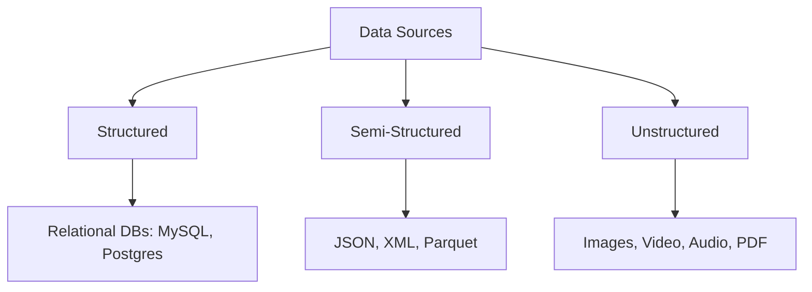
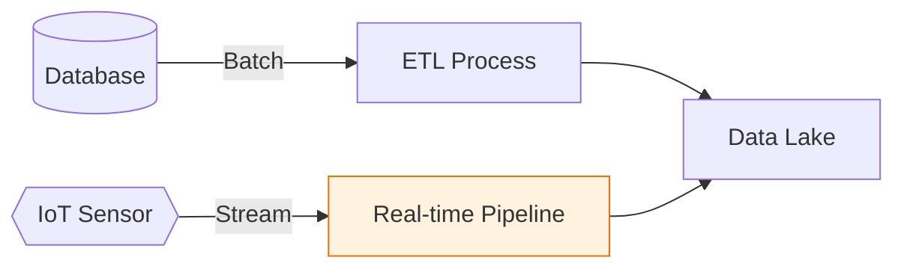

Data is the "fuel" for Machine Learning. However, this fuel is rarely found in one place. As a data engineer, your job is to identify where the raw data lives and how to transport it safely into your environment for processing.

## 1. The Data Source Landscape

We generally categorize data sources based on their **Structure** and their **Storage Method**.

## 2. Common Data Sources

### A. Relational Databases (SQL)

The most common source for tabular data (customer records, transactions).

* **Protocol:** SQL (Structured Query Language).
* **Pros:** Highly reliable (ACID compliant), easy to join tables.
* **Cons:** Hard to scale horizontally; requires a fixed schema.

### B. NoSQL Databases

Used for high-volume, high-velocity, or non-tabular data.

* **Key-Value Stores:** Redis.
* **Document Stores:** MongoDB (Stores data as JSON/BSON).
* **ML Use Case:** Storing user profiles or real-time feature stores.

### C. APIs (Application Programming Interfaces)

Used to pull data from external services like Twitter, Google Maps, or Financial markets.

* **Format:** Usually **JSON** or **REST**.
* **Challenges:** Rate limiting (you can only pull so much data per hour) and authentication.

### D. Cloud Object Storage (The Data Lake)

Services like **AWS S3** or **Google Cloud Storage** act as a dumping ground for raw files before they are processed.

* **ML Use Case:** Storing millions of images for a Computer Vision model.

## 3. Batch vs. Streaming Sources

How the data arrives at your model is just as important as where it comes from.

| Feature | Batch Processing | Stream Processing |
| --- | --- | --- |
| **Source** | Databases, CSV files, Data Lakes | Kafka, Kinesis, IoT Sensors |
| **Frequency** | Hourly, Daily, Weekly | Real-time (Milliseconds) |
| **Use Case** | Training a model on historical sales | Predicting fraud during a transaction |

## 4. Web Scraping & Crawling

When data isn't available via API or DB, we use scrapers (like `BeautifulSoup` or `Scrapy`) to extract information from HTML.

* **Ethics Check:** Always check a site's `robots.txt` before scraping to ensure you are legally and ethically allowed to take the data.

## 5. Identifying High-Quality Sources

Not all data sources are equal. When evaluating a source for an ML project, ask:

1. **Freshness:** How often is this data updated?
2. **Reliability:** Does the source go down often?
3. **Completeness:** Does it have missing values ()?
4. **Granularity:** Is the data at the level we need (e.g., individual transactions vs. daily totals)?

## References for More Details

* **[Google Cloud - Data Source Types](https://cloud.google.com/architecture/data-lifecycle-cloud-platform):** Understanding how cloud providers handle different data types.

* **[MongoDB University](https://university.mongodb.com/):** Learning the difference between Document stores and SQL.

---

Finding the data is only the first step. Once we have access, we need to move it into our systems without losing information or causing bottlenecks.