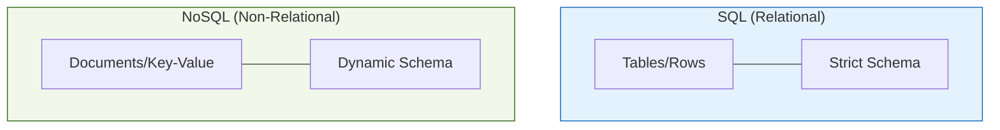
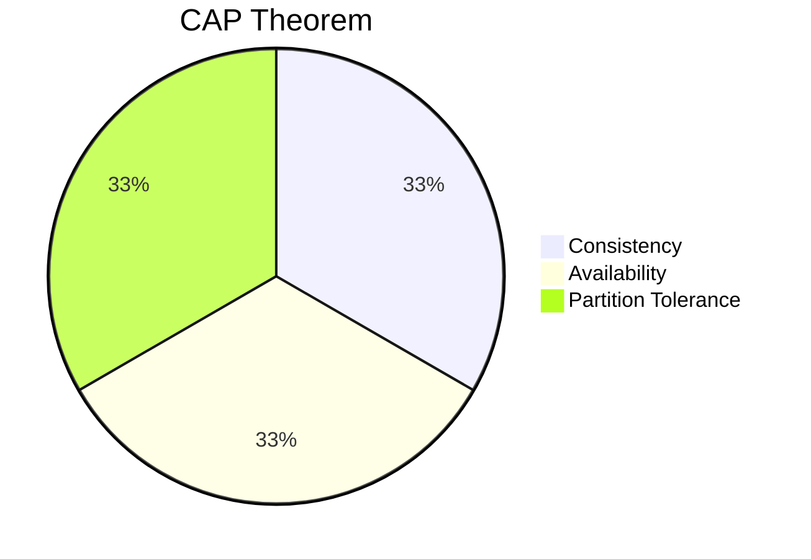

Choosing between a **SQL (Relational)** and a **NoSQL (Non-Relational)** database is one of the most critical decisions in a Data Engineering pipeline. In Machine Learning, this choice often depends on whether your data is fixed and structured or evolving and unstructured.

## 1. The Architectural Divide

## 2. SQL: Relational Databases

**Examples:** PostgreSQL, MySQL, SQLite, Oracle.

SQL databases store data in rows and columns. They are built on **ACID** properties (Atomicity, Consistency, Isolation, Durability), ensuring that every transaction is processed reliably.

* **Best for:** Structured data where relationships are key (e.g., linking a `User_ID` to `Transactions` and `Product_Details`).
* **Scaling:** Vertically (buying a bigger, more powerful server).
* **ML Use Case:** Serving as the "Source of Truth" for historical training data where data integrity is paramount.

## 3. NoSQL: Non-Relational Databases

**Examples:** MongoDB (Document), Cassandra (Column-family), Redis (Key-Value), Neo4j (Graph).

NoSQL databases are designed for distributed data and high-speed horizontal scaling. They are often **BASE** compliant (Basically Available, Soft state, Eventual consistency).

* **Best for:** Unstructured or semi-structured data (JSON, social media feeds, sensor logs).
* **Scaling:** Horizontally (adding more cheap servers to a cluster).
* **ML Use Case:** * **Feature Stores:** Using Redis for ultra-fast lookup of features during real-time inference.
* **Unstructured Storage:** Using MongoDB to store raw JSON metadata for NLP tasks.

## 4. Key Differences Comparison

| Feature | SQL | NoSQL |
| --- | --- | --- |
| **Data Model** | Tabular (Rows/Columns) | Document, Key-Value, Graph |
| **Schema** | Fixed (Pre-defined) | Dynamic (On-the-fly) |
| **Joins** | Very efficient ($$JOIN$$) | Generally avoided (Data is denormalized) |
| **Query Language** | Structured Query Language (SQL) | Varies (e.g., MQL for MongoDB) |
| **Standard** | ACID | BASE |

## 5. CAP Theorem: The Data Engineer's Trade-off

When choosing a database for a distributed ML system, you must consider the **CAP Theorem**. It states that a distributed system can only provide two out of the following three:

1. **Consistency:** Every read receives the most recent write.
2. **Availability:** Every request receives a response (even if it's not the latest).
3. **Partition Tolerance:** The system continues to operate despite network failures.

## 6. Hybrid Approaches: The "Polyglot" Strategy

Modern ML architectures rarely use just one.

* **Postgres (SQL)** might store the user account and labels.
* **MongoDB (NoSQL)** might store the raw log data.
* **S3 (Object Store)** might store the actual trained `.pkl` or `.onnx` model files.

## References for More Details

* **[PostgreSQL Documentation](https://www.postgresql.org/docs/):** Learning about complex joins and indexing for speed.

* **[MongoDB Architecture Guide](https://www.mongodb.com/docs/manual/core/data-modeling-introduction/):** Understanding document-based data modeling.

---

Storing data is one thing; getting it into your system is another. Let's look at how we build the bridges between these databases and our models.