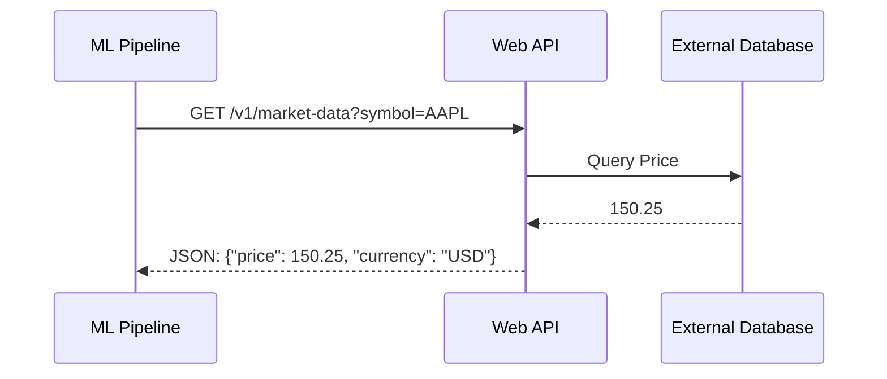
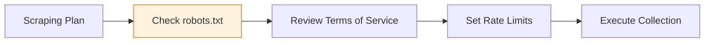

The internet is the primary source of data for modern Machine Learning, from sentiment analysis of tweets to training LLMs on billions of webpages. There are two main ways to "ingest" this data: **APIs** (the front door) and **Web Scraping** (the side window).

## 1. APIs: The Structured Front Door

An **API (Application Programming Interface)** is a formal agreement between two systems. It allows you to request specific data and receive it in a predictable, structured format (usually JSON).

### Types of APIs in ML
* **REST (Representational State Transfer):** The standard for most web services. Uses HTTP methods like `GET` to fetch data.
* **GraphQL:** Allows you to request *exactly* the fields you need, reducing data transfer size—ideal for mobile data collection.
* **Webhooks:** Instead of you asking for data, the server "pushes" data to you when an event occurs (e.g., a new user sign-up).

## 2. Web Scraping: The Unstructured Side Window

When a website does not provide an API, we use **Web Scraping**. This involves writing code that downloads the HTML of a page and "parses" (extracts) the specific information we need.

### The Scraping Toolkit

1. **Requests / HTTPX:** For downloading the raw HTML content.
2. **BeautifulSoup:** For navigating the HTML tree and finding tags (e.g., `<h1>`, `<table>`).
3. **Selenium / Playwright:** For scraping "Dynamic" sites that require JavaScript to load (like Infinite Scroll dashboards).

## 3. Comparison: API vs. Scraping

| Feature | APIs | Web Scraping |
| --- | --- | --- |
| **Data Format** | JSON/XML (Easy to parse) | HTML (Messy/Unstructured) |
| **Stability** | High (Versioned) | Low (Breaks if the UI changes) |
| **Legality** | Encouraged by the provider | Gray area (Depends on Terms of Service) |
| **Speed** | Fast & Efficient | Slower (Requires rendering) |

## 4. The Ethics of Web Data Collection

Data Engineering isn't just about "can we get the data," but "should we?"

1. **Robots.txt:** Always check `website.com/robots.txt` to see which parts of the site the owner has forbidden for crawlers.
2. **Rate Limiting:** Do not spam a server with thousands of requests per second. This is effectively a DDoS attack. Use `time.sleep()`.
3. **Terms of Service (ToS):** Many sites (like LinkedIn or Amazon) strictly forbid scraping in their user agreements.

## 5. Cleaning Web Data

Data from the web is "noisy." You will almost always need to perform these steps immediately after collection:

* **HTML Stripping:** Removing `<script>` and `<style>` tags.
* **Encoding Fixes:** Converting symbols like `&amp;` to `&`.
* **Deduplication:** Removing identical articles or comments scraped from different parts of a site.

## References for More Details

* **[Real Python - API Integration](https://realpython.com/api-integration-in-python/):** Learning the `requests` library.

* **[Scrapy Documentation](https://docs.scrapy.org/en/latest/):** Building industrial-scale web crawlers.

---

Now that we have collected data from databases and the web, we need to move it into our training environment. This is where the "Pipeline" begins.