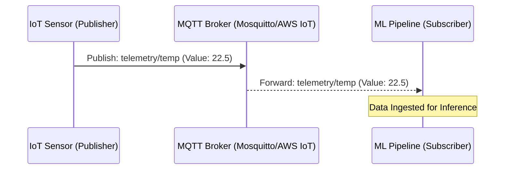
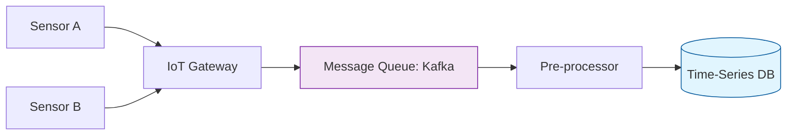

The **Internet of Things (IoT)** represents a network of physical objects embedded with sensors and software. For Machine Learning, IoT is a goldmine for **Predictive Maintenance**, **Smart Cities**, and **Industrial Automation**. However, the sheer volume and "noise" of sensor data require a specific engineering approach.

## 1. IoT Data Characteristics

IoT data differs from web or database data in three major ways:

1.  **High Velocity:** Sensors may pulse data every millisecond ($1000\text{Hz}$), creating massive streams.
2.  **Time-Series Nature:** Every data point is a tuple of $(\text{timestamp}, \text{value})$. The order is critical.
3.  **Low Signal-to-Noise Ratio:** Sensors are often affected by environmental interference (heat, vibration, or electronic "jitter").

## 2. Communication Protocols: MQTT vs. HTTP

While web apps use HTTP, IoT devices often use **MQTT (Message Queuing Telemetry Transport)**. It is a lightweight, "publish-subscribe" protocol designed for low-bandwidth, high-latency environments.

## 3. Data Ingestion Architecture

Because IoT devices can generate millions of events per second, we cannot write directly to a standard SQL database. We use a **Message Queue** as a buffer.

* **Producer:** The IoT device or gateway.
* **Broker:** **Apache Kafka** or **AWS Kinesis** (handles the high-speed data stream).
* **Consumer:** An ingestion service that writes to a **Time-Series Database (TSDB)** like InfluxDB or TimescaleDB.

## 4. Edge vs. Cloud Processing

In IoT, sending *all* data to the cloud is expensive and slow. We use **Edge Computing** to filter data locally.

* **On the Edge (Device/Gateway):**
* **Downsampling:** Instead of sending 1000 readings per second, send the average every 1 second.
* **Anomaly Detection:** Only send data if a value exceeds a safety threshold (e.g., Temperature ).

* **In the Cloud:** 
    * **Model Training:** Using historical logs to train a predictive model.
    * **Long-term Storage:** Archiving data for regulatory compliance.

## 5. Common Challenges in IoT Ingestion

### A. Clock Drift

IoT devices may have slightly different internal clocks. When merging data from two sensors,  on Sensor A might actually be  on Sensor B. Data engineers must perform **Time Synchronization**.

### B. Out-of-Order Data

Due to network lag, a packet sent at 10:00:01 might arrive *after* a packet sent at 10:00:02. Your pipeline must be able to re-sort data based on the original timestamp.

### C. Missing Values (Packet Loss)

Wireless signals drop. You must decide whether to **Interpolate** missing values (estimate based on neighbors) or leave them as nulls.

## References for More Details

* **[MQTT Essentials](https://www.hivemq.com/mqtt-essentials/):** Deep dive into how IoT messaging works.

* **[InfluxDB Guide to Time-Series Data](https://www.influxdata.com/time-series-database/):** Understanding why TSDBs are better than SQL for sensors.

---

Whether your data comes from a SQL database, a web scraper, a mobile app, or an IoT sensor, it all flows into the same place: The Pipeline.