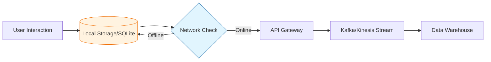
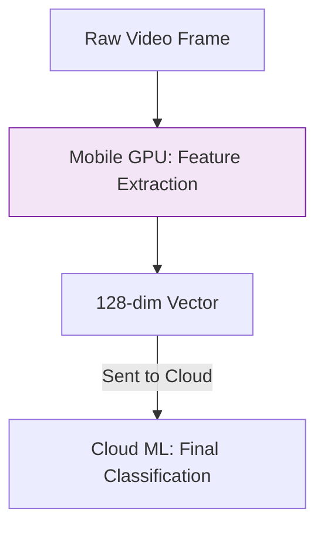

Data collection from mobile devices is a critical component for building personalized ML models (like recommendation engines). Unlike servers, mobile devices are "unreliable" nodes—they lose connectivity, run out of battery, and have limited processing power.

## 1. Telemetry and Event Tracking

The most common data collected from mobile apps is **Telemetry**—the logs of how a user interacts with the interface.

* **Explicit Events:** Actions the user takes (e.g., `button_click`, `purchase_complete`).
* **Implicit Events:** Passive data collection (e.g., `time_spent_on_screen`, `scroll_depth`).
* **Device Metadata:** OS version, device model, and screen resolution (crucial for feature engineering).

## 2. Ingestion Architectures

Because mobile devices aren't always online, data collection follows a **Store-and-Forward** pattern.

### Batching and Throttling

To save battery and data plans, mobile SDKs (like Firebase or Mixpanel) don't send data every second. They **batch** events locally and "flush" them to the server when the device is on Wi-Fi or charging.

## 3. Sensors: The "Eyes and Ears"

Mobile apps provide rich multi-modal data that isn't available from web browsers. This data is often used in **Activity Recognition** or **Biometric ML models**.

| Sensor Type | Data Produced | ML Use Case |
| --- | --- | --- |
| **Accelerometer** | 3-axis motion ($$x, y, z$$) | Detecting walking vs. running. |
| **GPS** | Latitude, Longitude | Location-based recommendations. |
| **Microphone** | Audio waveforms | Speech-to-text or voice commands. |
| **Camera** | Image/Video frames | Facial recognition or AR filters. |

## 4. Privacy and Regulations (ATT & GDPR)

Data collection on mobile is heavily restricted by platform owners (Apple and Google).

1. **App Tracking Transparency (ATT):** On iOS, users must explicitly "Opt-in" to be tracked across apps.
2. **Zero-Knowledge Collection:** Modern apps often use **Differential Privacy**, adding "noise" to data locally so the server learns general trends without seeing individual user identities.
3. **PII Masking:** Personally Identifiable Information (like email or name) must be hashed or removed before hitting the ML training bucket.

## 5. Edge Computing: Processing before Ingestion

To reduce the amount of data sent to the cloud, we sometimes perform **Edge Inference**.

* **Pre-processing:** Scaling images or normalizing audio on the device.
* **Feature Extraction:** Running a small model on the phone to extract "embeddings" (vectors) and sending only the vectors to the server, instead of the raw, heavy files.

## References for More Details

* **[Firebase Analytics Documentation](https://firebase.google.com/docs/analytics):** Learning how industry-standard event tracking works.

* **[Apple Developer - Data Privacy](https://developer.apple.com/documentation/apptrackingtransparency):** Understanding the constraints of mobile data collection.

---

Whether from the web, databases, or mobile apps, all this raw data is messy. The next step is to build a system that moves and cleans this data automatically.