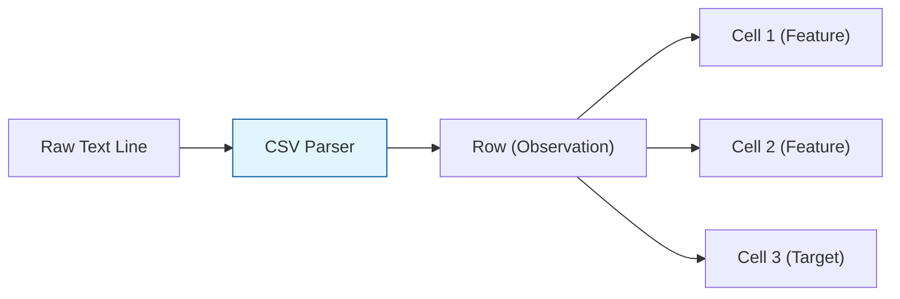

**CSV (Comma-Separated Values)** is a plain-text format used to store tabular data. Despite being one of the oldest formats, it remains the most common way to share datasets in the Machine Learning community (e.g., on platforms like Kaggle).

## 1. Structure of a CSV

A CSV file represents a 2D table where each line is a **row** and each piece of data is separated by a **delimiter** (usually a comma).

```text
id,feature_1,feature_2,label
1,0.85,22,1
2,0.12,45,0
3,0.55,30,1

```



## 2. Why CSV is the "Standard" for ML

1. **Human Readable:** You can open a CSV in any text editor, Excel, or Google Sheets to inspect the data manually.
2. **Universal Support:** Every programming language (Python, R, Julia, C++) and every ML library (Scikit-Learn, TensorFlow, PyTorch) can parse CSVs.
3. **Simplicity:** No complex headers or binary encoding; it is just text.

## 3. The Performance Trade-off

While CSV is great for sharing, it has significant limitations for **Production Data Engineering**.

| Feature | CSV (Plain Text) | Parquet/Avro (Binary) |
| --- | --- | --- |
| **Storage Size** | Large (No compression) | Small (Highly compressed) |
| **Read Speed** | Slow (Must parse text) | Fast (Direct memory mapping) |
| **Schema** | None (Everything is a string) | Strict (Enforces data types) |
| **Partial Reading** | No (Must read whole row) | Yes (Columnar access) |


## 4. Handling CSVs in Python (Pandas)

Pandas is the primary tool for moving CSV data into an ML pipeline.

```python
import pandas as pd

# Standard loading
df = pd.read_csv('dataset.csv')

# Handling Large Files (Chunking)
# For files larger than RAM, we process them in pieces.
chunk_size = 10000
for chunk in pd.read_csv('big_data.csv', chunksize=chunk_size):
    process_for_ml(chunk)

```

## 5. Common "CSV Traps" in ML Pipelines

As a data engineer, you must watch out for these common errors that can break your model:

### A. The Delimiter Collision

If a feature contains a comma (e.g., an address like `"New York, NY"`), a naive parser will split it into two columns.

* **Fix:** Use quotes (`" "`) or change the delimiter to a Tab (`\t`) or Pipe (`|`).

### B. Type Inference Errors

Since CSVs have no schema, Pandas "guesses" the data type. It might treat an ID `00123` as the integer `123`, losing the leading zeros.

* **Fix:** Explicitly define types: `pd.read_csv(file, dtype={'id': str})`.

### C. Encoding Issues

Files created on Windows (UTF-16) might crash on a Linux server (UTF-8).

* **Fix:** Always standardize on **UTF-8** encoding.

## 6. When to Use (and When to Move On)

* **Use CSV if:** You are sharing a small dataset (MB), doing initial EDA, or sending data to a non-technical stakeholder.
* **Avoid CSV if:** You are working with "Big Data" (GBs or TBs), require strict data types, or need high-performance streaming.

## References for More Details

* **[Pandas `read_csv` Documentation](https://pandas.pydata.org/docs/reference/api/pandas.read_csv.html):** Learning about the 50+ parameters available for handling messy CSVs.

* **[RFC 4180 - The CSV Standard](https://tools.ietf.org/html/rfc4180):** Understanding the formal definition of the CSV format.

---

CSV is easy to read, but it's inefficient for large datasets. For more complex, nested data like what we get from APIs, we need a more flexible format.