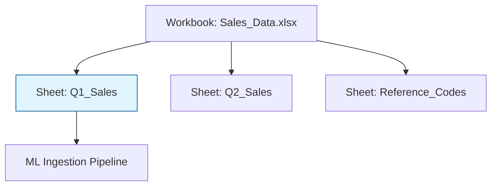

While CSVs are the favorite of developers, **Excel (.xlsx)** is the undisputed king of the business world. Most domain experts, financial analysts, and stakeholders store their primary data in workbooks. As a data engineer, you must be able to ingest these files while navigating their unique complexities.

## 1. Excel vs. CSV: More Than Just Tables

Unlike a CSV, which is a single flat text file, an Excel file is actually a **compressed collection of XML files** (for `.xlsx`). 

| Feature | CSV | Excel (.xlsx) |
| :--- | :--- | :--- |
| **Capacity** | Unlimited rows (limited by disk) | 1,048,576 rows per sheet |
| **Structure** | Single table | Multiple sheets (Workbooks) |
| **Metadata** | None | Includes formatting, formulas, and charts |
| **Data Types** | Everything is a string | Explicit types (Date, Currency, Number) |

## 2. The Multi-Sheet Challenge

A single Excel workbook often contains multiple datasets spread across different tabs. In an ML pipeline, you must specify which sheet contains your features.



## 3. Reading Excel with Python

To process Excel files, Python requires an engine like `openpyxl` or `xlrd`. Pandas wraps these to provide a simple interface.

```python
import pandas as pd

# Load a specific sheet
df = pd.read_excel('company_data.xlsx', sheet_name='Training_Data')

# Loading multiple sheets into a dictionary of DataFrames
all_sheets = pd.read_excel('company_data.xlsx', sheet_name=None)
# Access the 'Metadata' sheet
metadata = all_sheets['Metadata']

```

## 4. Common Pitfalls in Excel Ingestion

Excel allows for "human-friendly" formatting that is "machine-hostile." Watch out for these:

### A. Merged Cells

Merged cells create `NaN` (null) values for all but the first cell in the merge.

* **Fix:** Use `df.fillna(method='ffill')` to propagate values downward or across.

### B. Header Offsets

Business reports often have titles or empty rows at the top before the data starts.

* **Fix:** Use the `skiprows` parameter: `pd.read_csv(..., skiprows=3)`.

### C. Formulas vs. Values

If a cell contains `=SUM(A1:A10)`, a basic parser might read the formula string instead of the calculated result ().

* **Note:** Standard Pandas readers fetch the **calculated value**, but if the file hasn't been saved recently, the values might be stale.

## 5. Performance Note

Excel files are significantly slower to read than CSV or Parquet.

* **Benchmarking:** Reading a 100MB Excel file can take **10–20x longer** than reading the same data from a CSV because the engine must decompress the XML and parse formatting.
* **Best Practice:** If you are running an iterative ML experiment, convert the Excel file to **Parquet** or **Pickle** once, then use that faster file for the rest of your work.

## 6. Summary: When to Use Excel

* **Use Excel if:** You are receiving data from non-technical departments, need to preserve multi-sheet relationships, or require the data types (like Dates) to be pre-defined.
* **Avoid Excel if:** You have more than 1 million rows, or you need to read data in a high-speed production environment.

## References for More Details

* **[Pandas `read_excel` Guide](https://pandas.pydata.org/docs/reference/api/pandas.read_excel.html):** Advanced parameters like `usecols` and `converters`.

* **[Openpyxl Documentation](https://openpyxl.readthedocs.io/en/stable/):** Modifying Excel files (writing formulas, adding colors) programmatically.

---

Excel is great for humans, but for web-based data and highly nested structures, we use a format that looks more like a Python dictionary.