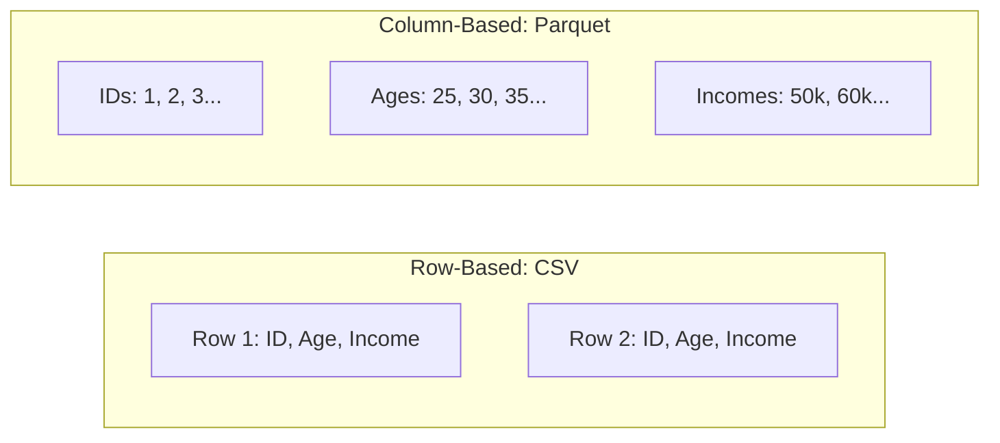

**Apache Parquet** is an open-source, column-oriented data file format designed for efficient data storage and retrieval. Unlike CSV or JSON, which store data row-by-row, Parquet organizes data by **columns**. This single architectural shift makes it the industry standard for modern data lakes and ML feature stores.

## 1. Row-based vs. Columnar Storage

To understand Parquet, you must understand the difference in how data is laid out on your hard drive.

* **Row-based (CSV/SQL):** Stores all data for "User 1," then all data for "User 2."
* **Columnar (Parquet):** Stores all "User IDs" together, then all "Ages" together, then all "Incomes" together.




## 2. Why Parquet is Superior for ML

### A. Column Projection (Selective Reading)

In ML, you might have a dataset with 500 columns, but your specific model only needs 5 features.

* **CSV:** You must read the entire file into memory to get those 5 columns.
* **Parquet:** The system "jumps" directly to the 5 columns you need and skips the other 495. This reduces I/O by over 90%.

### B. Drastic Compression

Because Parquet stores similar data types together, it can use highly efficient compression algorithms (like Snappy or Gzip).

* **Example:** In an "Age" column, numbers are similar. Parquet can store "30, 30, 30, 31" as "3x30, 1x31" (**Run-Length Encoding**).

### C. Schema Preservation

Parquet is a binary format that stores **metadata**. It "knows" that a column is a 64-bit float or a Timestamp. You never have to worry about a "Date" column being accidentally read as a string.

## 3. Parquet vs. CSV: The Benchmarks

| Feature | CSV | Parquet |
| --- | --- | --- |
| **Storage Size** | 1.0x (Large) | **~0.2x (Small)** |
| **Query Speed** | Slow | **Very Fast** |
| **Cost (Cloud)** | Expensive (S3 scans more data) | **Cheap** (S3 scans less data) |
| **ML Readiness** | Requires manual type casting | **Plug-and-play** |

## 4. Using Parquet in Python

Pandas and PyArrow make it easy to switch from CSV to Parquet.

```python
import pandas as pd

# Saving a dataframe to Parquet
# Requires 'pyarrow' or 'fastparquet' installed
df.to_parquet('large_dataset.parquet', compression='snappy')

# Reading only specific columns (The magic of Parquet!)
df_subset = pd.read_parquet('large_dataset.parquet', columns=['feature_1', 'target'])

```

## 5. When to use Parquet

1. **Production Pipelines:** Always use Parquet for data passed between different stages of a pipeline.
2. **Large Datasets:** If your data is MB, the speed gains become obvious.
3. **Cloud Storage:** If storing data in AWS S3 or Google Cloud Storage, Parquet will save you significant money on data egress/scan costs.

## References for More Details

* **[Apache Parquet Official Documentation](https://parquet.apache.org/):** Deep diving into the binary file structure.

* **[Databricks - Why Parquet?](https://www.databricks.com/glossary/what-is-parquet)** Understanding Parquet's role in the "Lakehouse" architecture.

---

Parquet is the king of analytical data storage. However, some streaming applications require a format that is optimized for high-speed row writes rather than column reads.