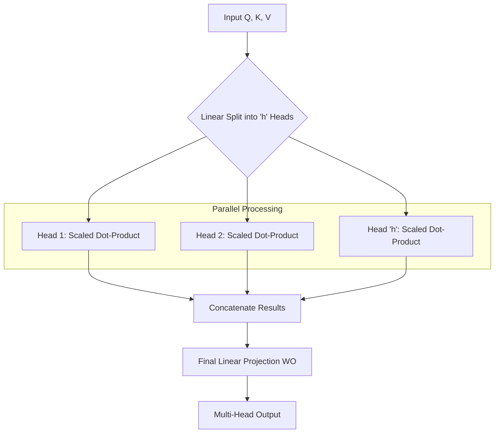

While [Self-Attention](./self-attention) is powerful, a single attention head often averages out the relationships between words. **Multi-Head Attention** solves this by running multiple self-attention operations in parallel, allowing the model to focus on different aspects of the input simultaneously.

## 1. The Concept: Why Multiple Heads?

If we use only one attention head, the model might focus entirely on the strongest relationship (e.g., the subject of a sentence). However, a word often has multiple relationships:
* **Head 1:** Might focus on the **Grammar** (Subject-Verb agreement).
* **Head 2:** Might focus on the **Context** (What does "it" refer to?).
* **Head 3:** Might focus on the **Visual/Spatial** relations (Is the object "on" or "under" the table?).

By using multiple heads, we allow the model to "attend" to these different representation subspaces at once.

## 2. How it Works: Split, Attend, Concatenate

The process of Multi-Head Attention follows four distinct steps:

1.  **Linear Projection (Split):** The input Query ($Q$), Key ($K$), and Value ($V$) are projected into $h$ different, lower-dimensional versions using learned weight matrices.
2.  **Parallel Attention:** We apply the [Scaled Dot-Product Attention](./self-attention#3-the-calculation-process) to each of the $h$ heads independently.
3.  **Concatenation:** The outputs from all heads are concatenated back into a single vector.
4.  **Final Linear Projection:** A final weight matrix ($W^O$) is applied to the concatenated vector to bring it back to the expected output dimension.

## 3. Mathematical Representation

For each head $i$, the attention is calculated as:

$$
\text{head}_i = \text{Attention}(QW_i^Q, KW_i^K, VW_i^V)
$$

The final output is the concatenation of these heads multiplied by an output weight matrix:

$$
\text{MultiHead}(Q, K, V) = \text{Concat}(\text{head}_1, \dots, \text{head}_h)W^O
$$

## 4. Advanced Logic Flow (Mermaid)

The following diagram visualizes how the model splits a single high-dimensional embedding into multiple "heads" to process information in parallel.



## 5. Key Advantages

* **Ensemble Effect:** It acts like an ensemble of models, where each head learns something unique.
* **Stable Training:** By dividing the  by the number of heads, the internal dimensionality stays manageable, preventing the dot-products from growing too large.
* **Resolution:** It improves the "resolution" of the attention map, making it less likely that one dominant word will "wash out" the influence of others.

## 6. Implementation with PyTorch

Using the `nn.MultiheadAttention` module is the standard way to implement this in production.

```python
import torch
import torch.nn as nn

# Parameters
embed_dim = 128 # Dimension of the model
num_heads = 8   # Number of parallel attention heads
# Note: embed_dim must be divisible by num_heads (128/8 = 16 per head)

mha_layer = nn.MultiheadAttention(embed_dim, num_heads)

# Input shape: (sequence_length, batch_size, embed_dim)
query = torch.randn(20, 1, 128)
key = torch.randn(20, 1, 128)
value = torch.randn(20, 1, 128)

# attn_output: the projected result; attn_weights: the attention map
attn_output, attn_weights = mha_layer(query, key, value)

print(f"Output size: {attn_output.shape}")      # [20, 1, 128]
print(f"Attention weights: {attn_weights.shape}") # [1, 20, 20]

```

## References

* **Original Paper:** [Attention Is All You Need (Vaswani et al.)](https://arxiv.org/abs/1706.03762)
* **Visualizing Attention:** [A Survey of Attention Mechanisms](https://arxiv.org/abs/2101.02257)

---

**Multi-Head Attention is the engine. But how do we organize these engines into a structure that can actually translate languages or generate text?**