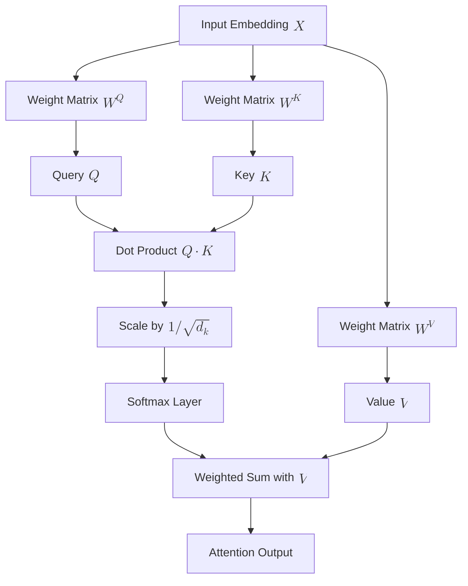

**Self-Attention** (also known as Intra-Attention) is the mechanism that allows a model to look at other words in an input sequence to get a better encoding for the word it is currently processing. 

Unlike [RNNs](../rnn/rnn-basics), which process words one by one, Self-Attention allows every word to "talk" to every other word simultaneously, regardless of their distance.

## 1. Why do we need Self-Attention?

Consider the sentence: *"The animal didn't cross the street because **it** was too tired."*

When a model processes the word **"it"**, it needs to know what "it" refers to. Is it the animal or the street? 
* In a standard RNN, if the sentence is long, the model might "forget" about the animal by the time it reaches "it".
* In **Self-Attention**, the model calculates a score that links "it" strongly to "animal" and weakly to "street".

## 2. The Three Vectors: Query, Key, and Value

To calculate self-attention, we create three vectors from every input word (embedding) by multiplying it by three weight matrices ($W^Q, W^K, W^V$) that are learned during training.

| Vector | Analogy (The Library) | Purpose |
| :--- | :--- | :--- |
| **Query ($Q$)** | The topic you are searching for. | Represents the current word looking at other words. |
| **Key ($K$)** | The label on the spine of the book. | Represents the "relevance" tag of all other words. |
| **Value ($V$)** | The information inside the book. | Represents the actual content of the word. |

## 3. The Calculation Process

The attention score is calculated through a series of matrix operations:

1.  **Dot Product:** We multiply the Query of the current word by the Keys of all other words.
2.  **Scaling:** We divide by the square root of the dimension of the key ($\sqrt{d_k}$) to keep gradients stable.
3.  **Softmax:** We apply a Softmax function to turn scores into probabilities (weights) that sum to 1.
4.  **Weighted Sum:** We multiply the weights by the Value vectors to get the final output for that word.

$$
\text{Attention}(Q, K, V) = \text{softmax}\left(\frac{QK^T}{\sqrt{d_k}}\right)V
$$

## 4. Advanced Flow Logic (Mermaid)

The following diagram represents how an input embedding is transformed into an Attention output.



## 5. Multi-Head Attention

In practice, we don't just use one self-attention mechanism. We use **Multi-Head Attention**. This involves running several self-attention calculations (heads) in parallel.

* One head might focus on the **subject-verb** relationship.
* Another head might focus on **adjectives**.
* Another head might focus on **contextual references**.

By combining these, the model gets a much richer understanding of the text.

## 6. Implementation with PyTorch

Modern deep learning frameworks provide highly optimized modules for this.

```python
import torch
import torch.nn as nn

# Embedding dim = 512, Number of heads = 8
multihead_attn = nn.MultiheadAttention(embed_dim=512, num_heads=8)

# Input shape: (sequence_length, batch_size, embed_dim)
query = torch.randn(10, 1, 512)
key = torch.randn(10, 1, 512)
value = torch.randn(10, 1, 512)

attn_output, attn_weights = multihead_attn(query, key, value)

print(f"Output shape: {attn_output.shape}") # [10, 1, 512]

```

## References

* **Original Paper:** [Attention Is All You Need (2017)](https://arxiv.org/abs/1706.03762)
* **The Illustrated Transformer:** [Jay Alammar's Blog](https://jalammar.github.io/illustrated-transformer/)
* **Harvard NLP:** [The Annotated Transformer](http://nlp.seas.harvard.edu/2018/04/03/attention.html)

---

**Self-Attention allows the model to understand the context of a sequence. But how do we stack these layers to build the most powerful models in AI today?**