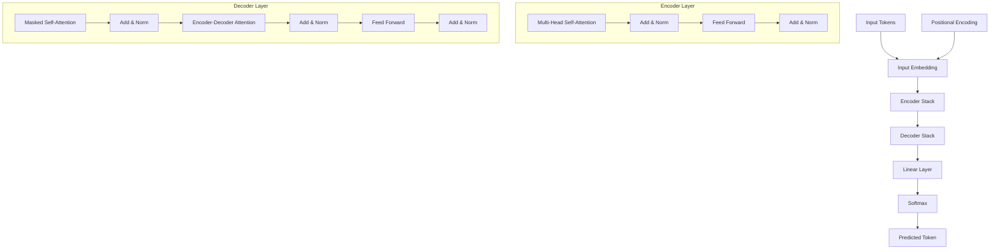

Introduced in the 2017 paper *"Attention Is All You Need"*, the **Transformer** shifted the paradigm of sequence modeling. By removing recurrence (RNNs) and convolutions (CNNs) entirely and relying solely on [Self-Attention](./self-attention), Transformers allowed for massive parallelization and state-of-the-art performance in NLP and beyond.

## 1. High-Level Architecture

The Transformer follows an **Encoder-Decoder** structure:
* **The Encoder (Left):** Maps an input sequence to a sequence of continuous representations.
* **The Decoder (Right):** Uses the encoder's representation and previous outputs to generate an output sequence, one element at a time.

## 2. The Encoder Stack

An encoder consists of a stack of identical layers (typically 6). Each layer has two sub-layers:
1.  **Multi-Head Self-Attention:** Allows the encoder to look at other words in the input sentence as it encodes a specific word.
2.  **Position-wise Feed-Forward Network (FFN):** A simple fully connected network applied to each position independently and identically.

:::info Key Feature
Each sub-layer uses **Residual Connections** (Add) followed by **Layer Normalization** (Norm). This is often abbreviated as `Add & Norm`.
:::

## 3. The Decoder Stack

The decoder also has a stack of identical layers, but it includes a third sub-layer:
1.  **Masked Multi-Head Attention:** Ensures that the prediction for a specific position can only depend on the known outputs at positions before it (preventing the model from "cheating" by looking ahead).
2.  **Encoder-Decoder Attention:** Performs attention over the encoder's output. This helps the decoder focus on relevant parts of the input sequence.
3.  **Feed-Forward Network (FFN):** Similar to the encoder's FFN.

## 4. Positional Encoding

Since Transformers do not use RNNs, they have no inherent sense of the **order** of words. To fix this, we add **Positional Encodings** to the input embeddings. These are vectors that follow a specific mathematical pattern (often sine and cosine functions) to give the model information about the relative or absolute position of words.

$$
PE_{(pos, 2i)} = \sin(pos / 10000^{2i/d_{model}})
$$
$$
PE_{(pos, 2i+1)} = \cos(pos / 10000^{2i/d_{model}})
$$

## 5. Transformer Data Flow (Mermaid)

This diagram visualizes how a single token moves through the Transformer stack.



## 6. Why Transformers Won

| Feature | RNNs / LSTMs | Transformers |
| --- | --- | --- |
| **Processing** | Sequential (Slow) | Parallel (Fast on GPUs) |
| **Long-range Ties** | Difficult (Vanishing Gradient) | Easy (Direct Attention) |
| **Scaling** | Hard to scale to massive data | Designed for massive data & parameters |
| **Example Models** | ELMo | BERT, GPT-4, Llama 3 |

## 7. Simple Implementation (PyTorch)

PyTorch provides a high-level `nn.Transformer` module, but you can also access the individual components:

```python
import torch
import torch.nn as nn

# Parameters
d_model = 512
nhead = 8
num_encoder_layers = 6

# Define Encoder Layer
encoder_layer = nn.TransformerEncoderLayer(d_model=d_model, nhead=nhead)
# Define Transformer Encoder
transformer_encoder = nn.TransformerEncoder(encoder_layer, num_layers=num_encoder_layers)

# Input shape: (S, N, E) where S is seq_length, N is batch, E is d_model
src = torch.randn(10, 32, 512)
out = transformer_encoder(src)

print(f"Output shape: {out.shape}") # [10, 32, 512]

```

## References

* **Original Paper:** [Attention Is All You Need (Vaswani et al.)](https://arxiv.org/abs/1706.03762)
* **Visual Guide:** [The Illustrated Transformer](https://jalammar.github.io/illustrated-transformer/)
* **DeepLearning.AI:** [Transformer Network (C5W4L06)](https://www.youtube.com/watch?v=AFkGPmU16QA)

---

**The Transformer architecture is the engine. But how do we train it? Does it read the whole internet at once?**