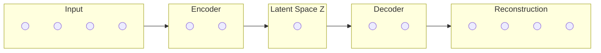

An **Autoencoder** is a type of artificial neural network used to learn efficient data codings in an unsupervised manner. The aim of an autoencoder is to learn a lower-dimensional representation (encoding) for a higher-dimensional dataset, typically for **dimensionality reduction**, **denoising**, or **feature extraction**.

Unlike traditional networks, the "labels" for an autoencoder are the input data itself. It tries to reconstruct its own input.

## 1. The Architecture: The Hourglass Design

An autoencoder is composed of two main parts connected by a "bottleneck":

1.  **The Encoder:** This part of the network compresses the input into a latent-space representation. It reduces the spatial dimensions.
2.  **The Bottleneck (Latent Space):** This is the layer that contains the compressed representation of the input data. It represents the "knowledge" the network has captured.
3.  **The Decoder:** This part of the network aims to reconstruct the input from the latent space representation as closely as possible.

## 2. The Objective Function

The network is trained to minimize the **Reconstruction Loss**, which measures the difference between the original input ($x$) and the reconstructed output ($\hat{x}$).

If the input is continuous, we typically use **Mean Squared Error (MSE)**:

$$
L(x, \hat{x}) = \|x - \hat{x}\|^2
$$

## 3. Advanced Structural Logic (Mermaid)

The following diagram illustrates how the information is squeezed through the bottleneck to force the network to prioritize the most important features.



## 4. Common Types of Autoencoders

| Type | Purpose | Mechanism |
| --- | --- | --- |
| **Undercomplete** | Dimensionality Reduction | The latent space is smaller than the input space, forcing compression. |
| **Denoising (DAE)** | Feature Robustness | Takes a partially corrupted input and learns to recover the original undistorted version. |
| **Sparse** | Feature Selection | Adds a penalty to the loss function that encourages the network to activate only a small number of neurons. |
| **Variational (VAE)** | Generative Modeling | Instead of a single point, the encoder predicts a probability distribution (mean and variance) in the latent space. |

## 5. Use Cases

* **Dimensionality Reduction:** A non-linear alternative to PCA (Principal Component Analysis).
* **Image Denoising:** Removing "grain" or noise from photographs or medical scans.
* **Anomaly Detection:** If a model is trained to reconstruct "normal" data, it will have a high reconstruction error when it sees "anomalous" data.
* **Recommendation Systems:** Learning latent user preferences (similar to [Collaborative Deep Learning](./cnn-applications/recommendation-systems)).

## 6. Implementation with Keras

Building a simple undercomplete autoencoder for the MNIST dataset:

```python
import tensorflow as tf
from tensorflow.keras import layers, models

# Input size: 784 (28x28 flattened)
input_img = layers.Input(shape=(784,))

# Encoder: Compress to 32 dimensions
encoded = layers.Dense(32, activation='relu')(input_img)

# Decoder: Reconstruct back to 784
decoded = layers.Dense(784, activation='sigmoid')(encoded)

# The Autoencoder Model
autoencoder = models.Model(input_img, decoded)

autoencoder.compile(optimizer='adam', loss='binary_crossentropy')

```

## References

* **Keras Blog:** [Building Autoencoders in Keras](https://blog.keras.io/building-autoencoders-in-keras.html)

---

**Standard autoencoders are great for compression, but what if you want to generate *new* data that looks like the training set?**