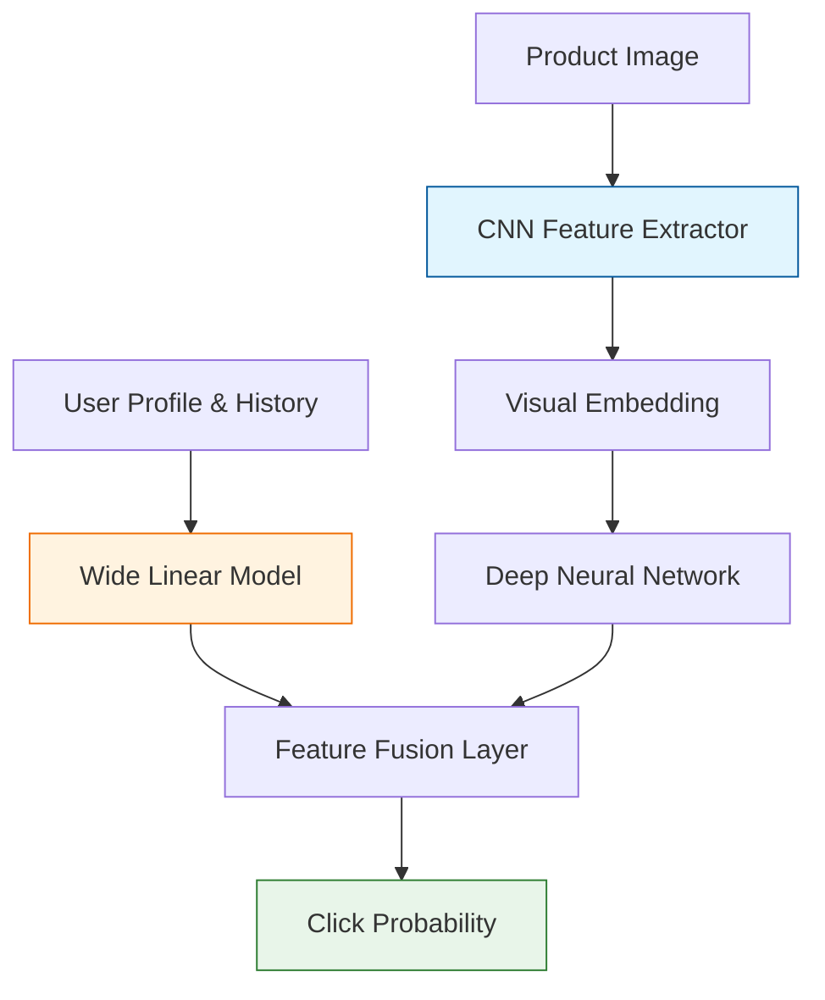

Traditional recommendation systems relied on **Collaborative Filtering** (finding similar users) or **Content-Based Filtering** (matching tags). Modern systems, however, use **Deep Learning** to understand the actual content of the items—images, text, and video—to make highly personalized "visual" or "semantic" recommendations.

## 1. The Role of CNNs in Recommendations

CNNs have revolutionized recommendation engines in industries where the "visual" aspect is the primary driver of user interest (e.g., Fashion, Home Decor, or Social Media).

### A. Visual Search and Similarity
In apps like Pinterest or Instagram, CNNs extract feature vectors (embeddings) from images. If a user likes a photo of a "mid-century modern chair," the system finds other images whose feature vectors are mathematically close in vector space.

### B. Extracting Latent Features
Traditional systems might only know a product is "Blue" and "Large." A CNN can detect latent features that aren't in the metadata, such as "minimalist aesthetic," "high-waisted cut," or "warm lighting."

## 2. Hybrid Architectures

Modern recommenders rarely use just one model. They often combine multiple neural networks in a "Wide & Deep" architecture:

1.  **The Deep Component (CNN/RNN):** Processes unstructured data like product images or video thumbnails to learn high-level abstractions.
2.  **The Wide Component (Linear):** Handles structured categorical data like user ID, location, or past purchase history.
3.  **The Ranking Head:** Combines these signals to predict the probability that a user will click or buy.



## 3. Collaborative Deep Learning (CDL)

**Collaborative Deep Learning** integrates deep learning for content features with a ratings matrix.

* The CNN learns a representation of the item (e.g., a movie poster or a song's spectrogram).
* The system then uses these "deep features" to fill in the gaps in the user-item matrix where data is missing (the **Cold Start** problem).

## 4. Solving the "Cold Start" Problem

The **Cold Start** problem occurs when a new item is added to the platform and has no ratings yet.

* **Without CNNs:** The item won't be recommended because no one has interacted with it.
* **With CNNs:** The model "sees" the item, recognizes it is similar to other popular items visually, and can start recommending it immediately based on content alone.

## 5. Use Case: Pinterest's "Visual Pin" Recommender

Pinterest uses a massive CNN architecture called **PinSage**. It uses Graph Convolutional Networks (GCN) that combine:

1. **Visual features** (what the pin looks like).
2. **Graph features** (what other pins it is frequently "saved" with).

This allows the system to recommend a "rustic dining table" even if the user just started browsing "wooden cabins."

## 6. Implementation Sketch (Feature Extraction)

To build a visual recommender, we often use a pre-trained CNN just to get the "embeddings" (the output of the last pooling layer before classification).

```python
import tensorflow as tf
from tensorflow.keras.applications import ResNet50
from tensorflow.keras.preprocessing import image
from sklearn.metrics.pairwise import cosine_similarity

# 1. Load ResNet50 without the classification head
model = ResNet50(weights='imagenet', include_top=False, pooling='avg')

# 2. Extract features from two different product images
def get_embedding(img_path):
    img = image.load_img(img_path, target_size=(224, 224))
    x = image.img_to_array(img)
    x = np.expand_dims(x, axis=0)
    return model.predict(x)

feat1 = get_embedding('product_A.jpg')
feat2 = get_embedding('product_B.jpg')

# 3. Calculate similarity score (0 to 1)
similarity = cosine_similarity(feat1, feat2)
print(f"Product Similarity: {similarity[0][0]}")

```

## References

* **Google Research:** [Wide & Deep Learning for Recommender Systems](https://arxiv.org/abs/1606.07792)

---

**Visual recommendations are powerful, but they are only part of the story. To understand how a user's interests change over time, we need models that can remember the sequence of their actions.**