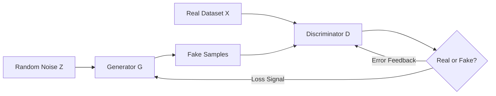

Introduced by Ian Goodfellow in 2014, **Generative Adversarial Networks (GANs)** are a class of machine learning frameworks where two neural networks contest with each other in a game. This framework allows the model to learn how to generate new, synthetic data that is indistinguishable from real data.

## 1. The Adversarial Concept: The Forger and the Detective

A GAN consists of two distinct models that are trained simultaneously through competition:

1.  **The Generator ($G$):** Think of this as a **forger**. Its goal is to create realistic images (or data) from random noise to trick the discriminator.
2.  **The Discriminator ($D$):** Think of this as a **detective**. Its goal is to distinguish between "real" data (from the training set) and "fake" data (produced by the generator).

## 2. The Training Process: A Zero-Sum Game

The GAN training process is a "minimax" game where the Generator tries to minimize the probability that the Discriminator is correct, while the Discriminator tries to maximize it.

1.  **The Generator** takes random noise as input and produces a synthetic sample.
2.  **The Discriminator** receives both real samples and synthetic samples.
3.  **Feedback Loop:** * If the Detective (D) catches the Forger (G), G learns how to improve its forgery.
    * If the Forger (G) tricks the Detective (D), D learns how to be a better investigator.

Eventually, the Generator becomes so good that the Discriminator can only guess with 50% accuracy (equivalent to a coin flip).

## 3. Mathematical Objective

The entire system can be described by the following value function $V(D, G)$:

$$
\min_G \max_D V(D, G) = \mathbb{E}_{x \sim p_{data}(x)}[\log D(x)] + \mathbb{E}_{z \sim p_z(z)}[\log(1 - D(G(z)))]
$$

* $D(x)$: Discriminator's estimate of the probability that real data $x$ is real.
* $G(z)$: The Generator's output for a given noise $z$.
* $D(G(z))$: Discriminator's estimate of the probability that a fake sample is real.

## 4. Architectural Flow (Mermaid)

The following diagram illustrates the interaction between the two networks and the data sources.



## 5. Challenges in Training GANs

Training GANs is notoriously difficult because of the delicate balance required between the two models:

* **Mode Collapse:** The Generator discovers a single "type" of output that tricks the Discriminator and keeps producing only that (e.g., a model supposed to generate all digits only generates the number "7").
* **Vanishing Gradients:** If the Discriminator is too good, the Generator doesn't get enough feedback to learn.
* **Convergence:** Unlike standard models, GANs may never reach a stable point, instead oscillating back and forth.

## 6. Popular GAN Variants

| Variant | Key Feature | Use Case |
| --- | --- | --- |
| **DCGAN** | Uses Convolutional layers instead of Dense layers. | Generating high-quality images. |
| **CycleGAN** | Learns to translate images from one domain to another without paired data. | Turning photos into paintings (e.g., Zebra to Horse). |
| **StyleGAN** | Allows control over specific "styles" (age, hair color, etc.). | Generating hyper-realistic human faces. |
| **Pix2Pix** | Conditional GAN for image-to-image translation. | Converting sketches into realistic photos. |

## 7. Implementation Sketch (PyTorch)

```python
import torch
import torch.nn as nn

# Simple Discriminator
discriminator = nn.Sequential(
    nn.Linear(784, 128),
    nn.LeakyReLU(0.2),
    nn.Linear(128, 1),
    nn.Sigmoid()
)

# Simple Generator
generator = nn.Sequential(
    nn.Linear(100, 256),
    nn.ReLU(),
    nn.Linear(256, 784),
    nn.Tanh() # Outputs pixels between -1 and 1
)

```

## References

* **Original Paper:** [Generative Adversarial Networks (Goodfellow et al.)](https://arxiv.org/abs/1406.2661)
* **Google Developers:** [GANs Course](https://developers.google.com/machine-learning/gan)
* **This Person Does Not Exist:** [A showcase of StyleGAN capabilities](https://thispersondoesnotexist.com/)

---

**GANs are masters of generation, but they are hard to control. What if we wanted a model that can gradually "denoise" an image into existence?**