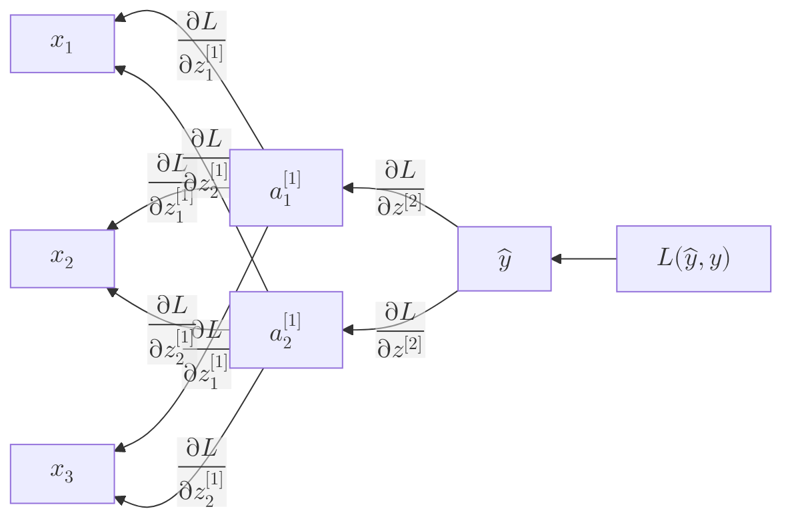

**Backpropagation** (short for "backward propagation of errors") is the central algorithm that allows neural networks to learn. If [Forward Propagation](./forward-propagation) is how the network makes a guess, Backpropagation is how it realizes how wrong it was and adjusts its internal weights to do better next time.

## 1. The High-Level Concept

Imagine you are a manager of a large factory (the network). At the end of the day, the final product is defective (a high **Loss**). To fix the problem, you don't just blame the person at the exit door; you trace the mistake backward through every department to find out who contributed most to the error and tell them to adjust their process.

## 2. The Four Steps of Training

Backpropagation is the third step in the general training loop:

1.  **Forward Pass:** Calculate the prediction ($y_{pred}$).
2.  **Loss Calculation:** Calculate the error using a [Loss Function](./loss-functions) (e.g., $L = (y_{actual} - y_{pred})^2$).
3.  **Backward Pass (Backpropagation):** Calculate the **Gradient** of the loss with respect to every weight and bias in the network.
4.  **Weight Update:** Adjust the weights slightly in the opposite direction of the gradient.

## 3. The Secret Sauce: The Chain Rule

Mathematically, we want to find out how much the Loss ($L$) changes when we change a specific weight ($w$). This is the derivative $\frac{\partial L}{\partial w}$.

Because the weight is buried deep inside the network, we use the **Chain Rule** from calculus to "unpeel" the layers:

$$
\frac{\partial L}{\partial w} = \frac{\partial L}{\partial \text{out}} \cdot \frac{\partial \text{out}}{\partial \text{net}} \cdot \frac{\partial \text{net}}{\partial w}
$$

Where:

- $\text{out}$ = output of the neuron
- $\text{net}$ = weighted sum input to the neuron

By applying the chain rule repeatedly, we can propagate the error gradient backward through the network.

This allows us to calculate the error contribution of a neuron in the 10th layer, and then use that result to calculate the error of a neuron in the 9th layer, and so on, all the way back to the input.

## 4. Visualizing the Gradient Flow

Information flows backward through the same paths it took during the forward pass.



In this diagram, the arrows represent the flow of gradients backward through the network. Each neuron receives gradients from the neurons it feeds into, allowing it to compute how much it contributed to the final loss.

**Quick overview of the steps during backpropagation:**

1. Start at the output layer and compute the gradient of the loss with respect to the output.
2. Use the chain rule to propagate this gradient backward through each layer.
3. At each neuron, compute the gradient with respect to its weights and biases.

## 5. The Vanishing Gradient Problem

In very deep networks, as we multiply many small derivatives together using the chain rule, the gradient can become extremely small by the time it reaches the first layers.

* **Result:** The early layers stop learning because their weights are barely changing.
* **The Solution:** This is why we use activation functions like **ReLU** instead of Sigmoid, as ReLU doesn't "squash" gradients as severely.

## 6. Simple Implementation Logic

In modern libraries like PyTorch or TensorFlow, you don't have to write the calculus yourself—they use **Autograd** (Automatic Differentiation).

```python
# A conceptual example using PyTorch logic
import torch

# 1. Initialize weights with 'requires_grad'
w = torch.tensor([2.0], requires_grad=True)
x = torch.tensor([5.0])
y_actual = torch.tensor([12.0])

# 2. Forward Pass
y_pred = w * x

# 3. Calculate Loss
loss = (y_actual - y_pred)**2

# 4. BACKPROPAGATION (The Magic Step)
loss.backward()

# 5. Check the Gradient
print(f"Gradient of loss w.r.t w: {w.grad}") 
# This tells us how to change 'w' to reduce 'loss'

```

---

**Now that we have the "Gradients" (the direction of change), how do we actually move the weights to reach the minimum error?**