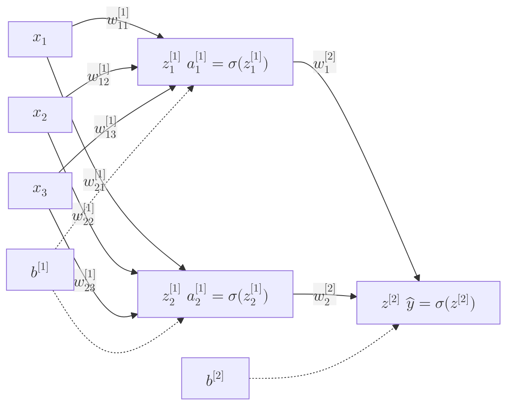

**Forward Propagation** is the process by which a neural network transforms input data into an output prediction. It is the "inference" stage where data flows through the network layers, undergoing linear transformations and non-linear activations until it reaches the final layer.

## 1. The Step-by-Step Flow

In a dense (fully connected) network, the signal moves from left to right. For every neuron in a hidden or output layer, two distinct steps occur:

### Step A: The Linear Transformation (Z)
The neuron takes all inputs from the previous layer, multiplies them by their respective weights, and adds a bias term. This is essentially a multi-dimensional linear equation.

$$
z = \sum_{i=1}^{n} (w_i \cdot x_i) + b
$$

Where:

- $x_i$ = input features from the previous layer
- $w_i$ = weights associated with each input
- $b$ = bias term

### Step B: The Non-Linear Activation (A)
The result $z$ is passed through an **Activation Function** (like ReLU or Sigmoid). This step is crucial because it allows the network to learn complex, non-linear patterns.

$$
a = \sigma(z)
$$

## 2. Forward Propagation in Matrix Form

In practice, we don't calculate one neuron at a time. We use **Linear Algebra** to calculate entire layers simultaneously. This is why GPUs (which are great at matrix math) are so important for Deep Learning.

If $W^{[1]}$ is the weight matrix for the first layer and $X$ is our input vector:

$$
Z^{[1]} = W^{[1]} \cdot X + b^{[1]}
$$

Then, we apply the activation function:

$$
A^{[1]} = \sigma(Z^{[1]})
$$

This output $A^{[1]}$ then becomes the "input" for the next layer.

## 3. A Visual Example

Imagine a simple network with 1 Hidden Layer:



1. **Input:** Your features (e.g., pixel values of an image).
2. **Hidden Layer:** Extracts abstract features (e.g., edges or shapes).
3. **Output Layer:** Provides the final guess (e.g., "This is a dog with 92% probability").

## 4. Why "Propagate"?

The term "propagate" is used because the output of one layer is the input of the next. The information "spreads" through the network. Each layer acts as a filter, refining the raw data into more meaningful representations until a decision can be made at the end.

## 5. Implementation in Pure Python (NumPy)

This snippet demonstrates the math behind a single forward pass for a network with one hidden layer.

```python
import numpy as np

def sigmoid(x):
    return 1 / (1 + np.exp(-x))

# 1. Inputs (3 features)
X = np.array([0.5, 0.1, -0.2])

# 2. Weights and Biases (Hidden Layer with 2 neurons)
W1 = np.random.randn(2, 3) 
b1 = np.random.randn(2)

# 3. Weights and Biases (Output Layer with 1 neuron)
W2 = np.random.randn(1, 2)
b2 = np.random.randn(1)

# --- FORWARD PASS ---

# Layer 1 (Hidden)
z1 = np.dot(W1, X) + b1
a1 = sigmoid(z1)

# Layer 2 (Output)
z2 = np.dot(W2, a1) + b2
prediction = sigmoid(z2)

print(f"Model Prediction: {prediction}")

```

## 6. What happens next?

Forward propagation gives us a prediction. However, at the start, the weights are random, so the prediction will be wrong. To make the model "learn," we must:

1. Compare the prediction to the truth using a **Loss Function**.
2. Send the error backward through the network using **Backpropagation**.

## References

* **DeepLearning.AI:** [Neural Networks and Deep Learning (Week 2)](https://www.coursera.org/learn/neural-networks-deep-learning)
* **Khan Academy:** [Matrix Multiplication Foundations](https://www.khanacademy.org/math/precalculus/x9e81a4f98389efdf:matrices)

---

**We have the prediction. Now, how do we tell the network it made a mistake?** Head over to the [Backpropagation](./backpropagation.mdx) guide to learn how neural networks learn from their errors!