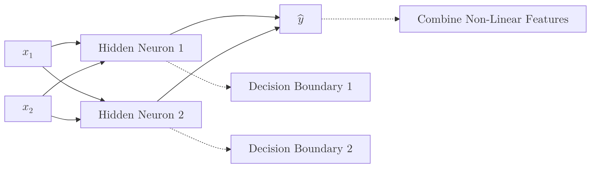

A **Multi-Layer Perceptron (MLP)** is a class of feedforward artificial neural network. While a simple [Perceptron](./perceptron) consists of just one neuron, an MLP consists of at least three layers of nodes: an **input layer**, a **hidden layer**, and an **output layer**.

By stacking these layers and using non-linear activation functions, MLPs can solve problems that are not linearly separable, such as the famous XOR gate.

## 1. Architecture of an MLP

In an MLP, every node in one layer connects with a certain weight to every node in the following layer. This is often called a **Fully Connected** or **Dense** layer.

### The Three Layers:

1.  **Input Layer:** Receives the raw data. The number of neurons equals the number of features in your dataset.
2.  **Hidden Layers:** The "engine room" where the model learns complex features. A network can have many hidden layers (this is what makes it "Deep").
3.  **Output Layer:** Produces the final prediction (e.g., a probability for classification or a value for regression).

## 2. Solving the XOR Problem

The simple perceptron failed at XOR because it could only draw one straight line. An MLP solves this by using hidden neurons to create multiple decision boundaries and then combining them.



## 3. The Feedforward Process

Data moves in one direction: from input to output. At each neuron, the following calculation occurs:

1. **Weighted Sum:** $z = \sum (w \cdot x) + b$
2. **Activation:** $a = \sigma(z)$

Without a **non-linear activation function** (like Sigmoid or ReLU), multiple layers would mathematically collapse into a single layer, making the "depth" of the network useless.

## 4. How MLPs Learn: Backpropagation

Training an MLP involves two main phases:

1. **Forward Pass:** The data flows through the network to generate a prediction.
2. **Loss Calculation:** We measure the "error" (difference between prediction and reality).
3. **Backward Pass (Backpropagation):** The error is sent backward through the network. Using **Calculus (The Chain Rule)**, the network calculates how much each weight contributed to the error and updates them using **Gradient Descent**.

$$
w_{new} = w_{old} - \eta \frac{\partial \text{Loss}}{\partial w}
$$

Where:

* **$\eta$ (Learning Rate):** A small value that controls how much we adjust the weights.
* **$\frac{\partial \text{Loss}}{\partial w}$:** The gradient of the loss with respect to the weight.
* **Loss Function:** Common choices include Mean Squared Error for regression and Cross-Entropy for classification.

## 5. Implementation with Keras

```python
from tensorflow.keras.models import Sequential
from tensorflow.keras.layers import Dense

# 1. Define the MLP Architecture
model = Sequential([
    # Input layer implicitly defined by input_shape
    # Hidden Layer 1: 16 neurons
    Dense(16, activation='relu', input_shape=(8,)), 
    # Hidden Layer 2: 8 neurons
    Dense(8, activation='relu'),
    # Output Layer: 1 neuron (Binary Classification)
    Dense(1, activation='sigmoid')
])

# 2. Compile the model
model.compile(optimizer='adam', loss='binary_crossentropy', metrics=['accuracy'])

# 3. Summary
model.summary()

```

## 6. Key Advantages & Use Cases

* **Pattern Recognition:** Excellent for tabular data where features have complex interactions.
* **Universal Approximation:** Mathematically, an MLP with even one hidden layer can approximate any continuous function.
* **Foundation:** MLPs are the ancestors of more specialized networks like **CNNs** (for images) and **RNNs** (for text).

## References

* **3Blue1Brown:** [But what is a Neural Network?](https://www.youtube.com/watch?v=aircAruvnKk)
* **Deep Learning Book:** [Chapter 6: Deep Feedforward Networks](https://www.deeplearningbook.org/contents/mlp.html)

---

**We mentioned that "Activation Functions" are the secret sauce that makes hidden layers work. But which one should you choose?**