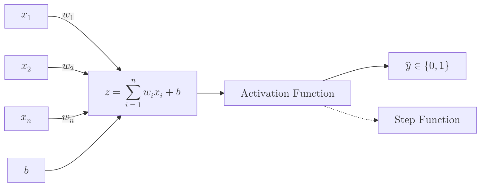

The **Perceptron** is the simplest form of a neural network, introduced by Frank Rosenblatt in 1958. It is a mathematical model inspired by the biological neuron, designed to perform binary classification (predicting whether an input belongs to one of two categories).

## 1. Biological Inspiration

Just as a biological neuron receives signals through dendrites and "fires" an impulse through the axon once a threshold is reached, the artificial perceptron sums up its inputs and triggers an output based on a threshold.


## 2. Anatomy of a Perceptron

A perceptron consists of four main parts:

1.  **Input Values ($x_1, x_2, ... x_n$):** The features of your data.
2.  **Weights ($w_1, w_2, ... w_n$):** Values that represent the "strength" or importance of each input.
3.  **Bias ($b$):** An additional parameter that allows the model to shift the activation function left or right.
4.  **Activation Function:** A rule (usually a Step Function) that decides the final output.



## 3. The Mathematics of "Firing"

The perceptron calculates a weighted sum of the inputs and adds a bias. This result is passed through a **Step Function**.

### The Weighted Sum ($z$):

$$
z = \sum_{i=1}^{n} w_i x_i + b
$$

### The Activation (Heaviside Step Function):

The output  is determined by whether  is positive or negative:

$$
y = \begin{cases} 1 & \text{if } z \geq 0 \\ 0 & \text{if } z < 0 \end{cases}
$$

## 4. How the Perceptron Learns

The learning process is an iterative adjustment of weights and bias. If the model makes a mistake, the weights are updated using the **Perceptron Learning Rule**:

$$
w_{new} = w_{old} + \eta(y_{actual} - y_{predicted})x_i
$$

Where:

* **$\eta$ (Learning Rate):** A small value (e.g., 0.01) that controls how drastically we update the weights.
* **$y_{actual}$:** The true label (0 or 1).
* **$y_{predicted}$:** The output from the perceptron.

## 5. The Critical Limitation: Linearity

The Perceptron can only solve problems that are **Linearly Separable**. This means it can only learn to classify data that can be separated by a straight line.

### The XOR Problem

In 1969, Minsky and Papert proved that a single-layer perceptron could not solve the **XOR** logic gate because the points cannot be separated by a single straight line. This discovery led to the first "AI Winter," which only ended when researchers began stacking perceptrons to create **Multi-Layer Perceptrons (MLP)**.

## 6. Implementation with NumPy

```python
import numpy as np

def step_function(z):
    return 1 if z >= 0 else 0

def perceptron(inputs, weights, bias):
    # Calculate z = (w1*x1 + w2*x2 + ... + wn*xn) + b
    z = np.dot(inputs, weights) + bias
    return step_function(z)

# Example: AND Gate logic
# Inputs: [0, 0], [0, 1], [1, 0], [1, 1]
weights = np.array([1, 1])
bias = -1.5

print(perceptron([1, 1], weights, bias)) # Output: 1 (True)
print(perceptron([0, 1], weights, bias)) # Output: 0 (False)

```

---

**One neuron can't solve complex problems. But what happens when we connect thousands of them in layers?**