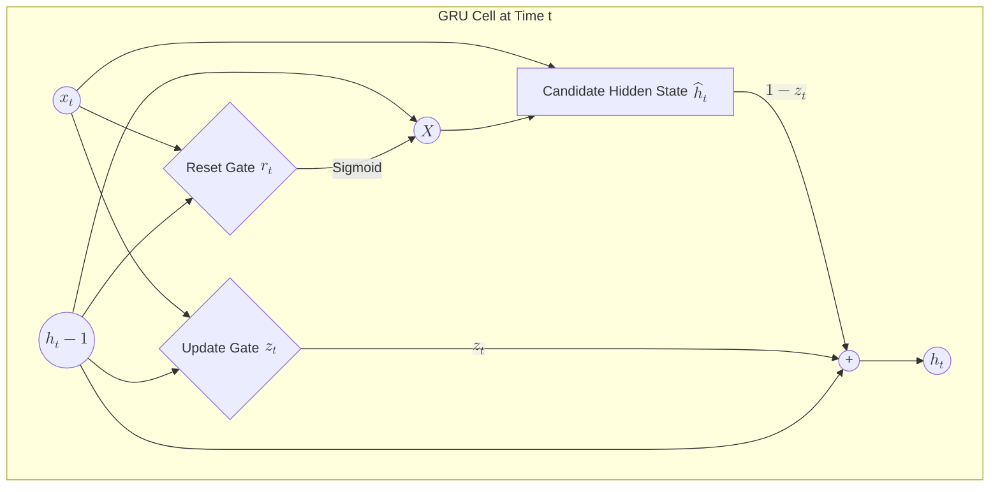

The **Gated Recurrent Unit (GRU)**, introduced by Cho et al. in 2014, is a streamlined variation of the LSTM. It was designed to solve the [Vanishing Gradient problem](./rnn-basics#4-the-major-flaw-vanishing-gradients) while being computationally more efficient by reducing the number of gates and removing the separate "cell state."

## 1. Why GRU? (The Efficiency Factor)

While LSTMs are powerful, they are complex. GRUs provide a "lightweight" version that often performs just as well as LSTMs on many tasks (especially smaller datasets) but trains faster because it has fewer parameters.

**Key Differences:**
* **No Cell State:** GRUs only use the Hidden State ($h_t$) to transfer information.
* **Two Gates instead of Three:** GRUs combine the "Forget" and "Input" gates into a single **Update Gate**.
* **Merged Hidden State:** It merges the input and hidden state logic.

## 2. The GRU Architecture: Under the Hood

A GRU cell relies on two primary gates to control the flow of information:

### A. The Reset Gate ($r_t$)
The Reset Gate determines how much of the **past knowledge** to forget. If the reset gate is near 0, the network ignores the previous hidden state and starts fresh with the current input.

### B. The Update Gate ($z_t$)
The Update Gate acts similarly to the LSTM's forget and input gates. It decides how much of the previous memory to keep and how much of the new candidate information to add.

## 3. Advanced Structural Logic (Mermaid)

The following diagram illustrates how the input $x_t$ and the previous state $h_{t-1}$ interact through the gating mechanisms to produce the new state $h_t$.



## 4. The Mathematical Formulas

The GRU's behavior is defined by the following four equations:

1. **Update Gate:** $z_t = \sigma(W_z \cdot [h_{t-1}, x_t])$
2. **Reset Gate:**  $r_t = \sigma(W_r \cdot [h_{t-1}, x_t])$
3. **Candidate Hidden State:** $\tilde{h}_t = \tanh(W \cdot [r_t \odot h_{t-1}, x_t])$
4. **Final Hidden State:** $h_t = (1 - z_t) \odot h_{t-1} + z_t \odot \tilde{h}_t$

:::note
The $\odot$ symbol represents element-wise multiplication (Hadamard product). The final equation shows a linear interpolation between the previous state and the candidate state.
:::

## 5. GRU vs. LSTM: Which one to use?

| Feature | GRU | LSTM |
| --- | --- | --- |
| **Complexity** | Simple (2 Gates) | Complex (3 Gates) |
| **Parameters** | Fewer (Faster training) | More (Higher capacity) |
| **Memory** | Hidden state only | Hidden state + Cell state |
| **Performance** | Better on small/medium data | Better on large, complex sequences |

## 6. Implementation with TensorFlow/Keras

Using GRUs in Keras is nearly identical to using LSTMs—just swap the layer name.

```python
import tensorflow as tf
from tensorflow.keras.layers import GRU, Dense, Embedding

model = tf.keras.Sequential([
    Embedding(input_dim=1000, output_dim=64),
    GRU(128, return_sequences=False), # Fast and efficient
    Dense(10, activation='softmax')
])

model.compile(optimizer='adam', loss='categorical_crossentropy')

```

## References

* **Original Paper:** [Learning Phrase Representations using RNN Encoder-Decoder (Cho et al., 2014)](https://arxiv.org/abs/1406.1078)

---

**GRUs and LSTMs are excellent for sequences, but they process data one step at a time (left to right). What if the context of a word depends on the words that come *after* it?**