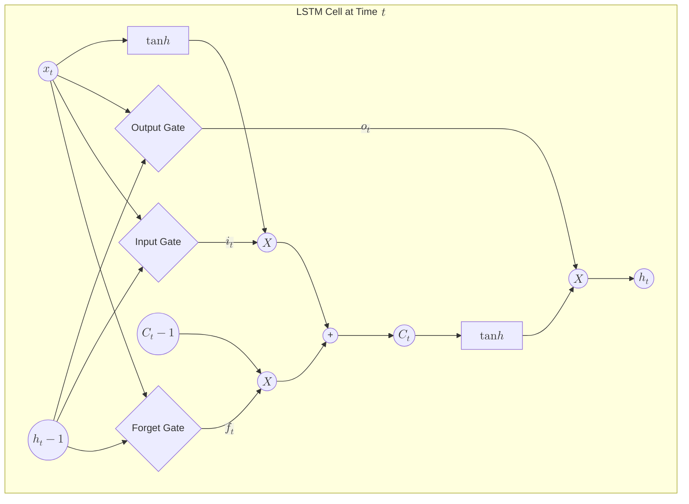

Standard [RNNs](./rnn-basics) have a major weakness: they have a very short memory. Because of the **Vanishing Gradient** problem, they struggle to connect information that is far apart in a sequence. 

**LSTMs**, introduced by Hochreiter & Schmidhuber, were specifically designed to overcome this. They introduce a "Cell State" (a long-term memory track) and a series of "Gates" that control what information is kept and what is discarded.

## 1. The Core Innovation: The Cell State

The "Secret Sauce" of the LSTM is the **Cell State ($C_t$)**. You can imagine it as a conveyor belt that runs straight down the entire chain of sequences, with only some minor linear interactions. It is very easy for information to just flow along it unchanged.

## 2. The Three Gates of LSTM

An LSTM uses three specialized gates to protect and control the cell state. Each gate is composed of a **Sigmoid** neural net layer and a point-wise multiplication operation.

### A. The Forget Gate ($f_t$)
This gate decides what information we are going to throw away from the cell state. 
* **Input:** $h_{t-1}$ (previous hidden state) and $x_t$ (current input).
* **Output:** A number between 0 (completely forget) and 1 (completely keep).

$$
f_t = \sigma(W_f \cdot [h_{t-1}, x_t] + b_f)
$$

### B. The Input Gate ($i_t$)
This gate decides which new information we’re going to store in the cell state. It works in tandem with a **tanh** layer that creates a vector of new candidate values ($\tilde{C}_t$).

$$
i_t = \sigma(W_i \cdot [h_{t-1}, x_t] + b_i)
$$
$$
\tilde{C}_t = \tanh(W_C \cdot [h_{t-1}, x_t] + b_C)
$$

### C. The Output Gate ($o_t$)
This gate decides what our next hidden state ($h_t$) should be. The hidden state contains information on previous inputs and is also used for predictions.

$$
o_t = \sigma(W_o \cdot [h_{t-1}, x_t] + b_o)
$$
$$
h_t = o_t \odot \tanh(C_t)
$$

## 3. Advanced Architectural Logic (Mermaid)

The flow within a single LSTM cell is highly structured. The "Cell State" acts as the horizontal spine, while gates regulate the vertical flow of information.



## 4. LSTM vs. Standard RNN

| Feature | Standard RNN | LSTM |
| --- | --- | --- |
| **Architecture** | Simple (Single Tanh layer) | Complex (4 interacting layers) |
| **Memory** | Short-term only | Long and Short-term |
| **Gradient Flow** | Suffers from Vanishing Gradient | Resists Vanishing Gradient via the Cell State |
| **Complexity** | Low | High (More parameters to train) |

## 5. Implementation with PyTorch

In PyTorch, the `nn.LSTM` module automatically handles the complex gating logic and cell state management.

```python
import torch
import torch.nn as nn

# input_size=10, hidden_size=20, num_layers=1
lstm = nn.LSTM(10, 20, batch_first=True)

# Input shape: (batch_size, seq_len, input_size)
input_seq = torch.randn(1, 5, 10)

# Initial Hidden State (h0) and Cell State (c0)
h0 = torch.zeros(1, 1, 20)
c0 = torch.zeros(1, 1, 20)

# Forward pass returns output and a tuple (hn, cn)
output, (hn, cn) = lstm(input_seq, (h0, c0))

print(f"Output shape: {output.shape}") # [1, 5, 20]
print(f"Final Cell State shape: {cn.shape}") # [1, 1, 20]

```

## References

* **Colah's Blog:** [Understanding LSTM Networks](https://colah.github.io/posts/2015-08-Understanding-LSTMs/) (Essential Reading)
* **Stanford CS224N:** [RNNs and LSTMs](http://web.stanford.edu/class/cs224n/)

---

**LSTMs are powerful but computationally expensive because of their three gates. Is there a way to simplify this without losing the memory benefits?**