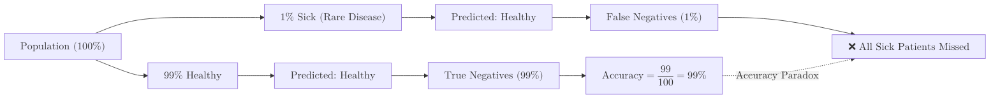

**Accuracy** is the most basic and intuitive metric used to evaluate a classification model. In simple terms, it answers the question: *"Out of all the predictions made, how many were correct?"*

## 1. The Mathematical Formula

Accuracy is calculated by dividing the number of correct predictions by the total number of input samples.

Using the components of a [Confusion Matrix](./confusion-matrix), the formula is:

$$
\text{Accuracy} = \frac{TP + TN}{TP + TN + FP + FN}
$$

Where:

* **TP (True Positives):** Correctly predicted positive samples.
* **TN (True Negatives):** Correctly predicted negative samples.
* **FP (False Positives):** Incorrectly predicted as positive.
* **FN (False Negatives):** Incorrectly predicted as negative.

**Example:**

Imagine you have a dataset of 100 emails, where 80 are spam and 20 are not spam. Your model makes the following predictions:

| Actual \ Predicted | Spam | Not Spam |
| --- | --- | --- |
| **Spam** | 70 (TP) | 10 (FN) |
| **Not Spam** | 5 (FP) | 15 (TN) |

Using the formula:

$$
\text{Accuracy} = \frac{70 + 15}{70 + 15 + 5 + 10} = \frac{85}{100} = 0.85 \text{ or } 85\%
$$

This means your model correctly identified 85% of the emails.

## 2. When Accuracy Works Best

Accuracy is a reliable metric **only** when your dataset is **balanced**. 

* **Example:** You are building a model to classify images as either "Cats" or "Dogs." Your dataset has 500 cats and 500 dogs.
* If your model gets an accuracy of 90%, you can be confident that it is performing well across both categories.

## 3. The "Accuracy Paradox" (Imbalanced Data)

Accuracy becomes highly misleading when one class significantly outweighs the other. This is known as the **Accuracy Paradox**.

### The Scenario:

Imagine a Rare Disease test where only **1%** of the population is actually sick.

1.  If a "lazy" model is programmed to simply say **"Healthy"** for every single patient...
2.  It will be **99% accurate**.



**The problem?** Even though the accuracy is 99%, the model failed to find the 1% of people who actually need help. In high-stakes fields like medicine or fraud detection, accuracy is often the least important metric.

## 4. Implementation with Scikit-Learn

```python
from sklearn.metrics import accuracy_score

# Actual target values
y_true = [0, 1, 1, 0, 1, 1]

# Model predictions
y_pred = [0, 1, 0, 0, 1, 1]

# Calculate Accuracy
score = accuracy_score(y_true, y_pred)

print(f"Accuracy: {score * 100:.2f}%")
# Output: Accuracy: 83.33%

```

## 5. Pros and Cons

| Advantages | Disadvantages |
| --- | --- |
| **Simple to understand:** Easy to explain to non-technical stakeholders. | **Useless for Imbalance:** Can hide poor performance on minority classes. |
| **Single Number:** Provides a quick, high-level overview of model health. | **Ignores Probability:** Doesn't tell you how confident the model was in its choice. |
| **Standardized:** Used across almost every classification project. | **Cost Blind:** Treats "False Positives" and "False Negatives" as equally bad. |

## 6. How to move beyond Accuracy?

To get a true picture of your model's performance—especially if your data is "skewed"—you should look at Accuracy alongside:

* **Precision:** How many of the predicted positives were actually positive?
* **Recall:** How many of the actual positives did we successfully find?
* **F1-Score:** The harmonic mean of Precision and Recall.

## References

* **Google Developers:** [Classification: Accuracy](https://developers.google.com/machine-learning/crash-course/classification/accuracy)
* **StatQuest:** [Accuracy, Precision, and Recall](https://www.youtube.com/watch?v=Kdsp6soqA7o)

---

**If Accuracy isn't enough to catch rare diseases or credit card fraud, what is?** Stay tuned for our next chapter on **Precision & Recall** to find out!