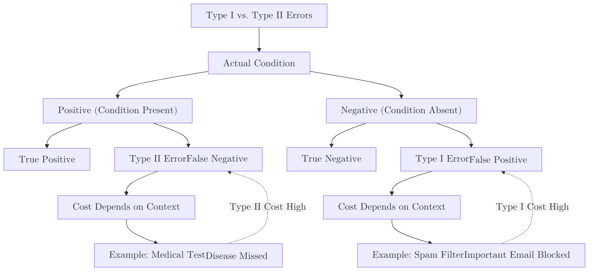
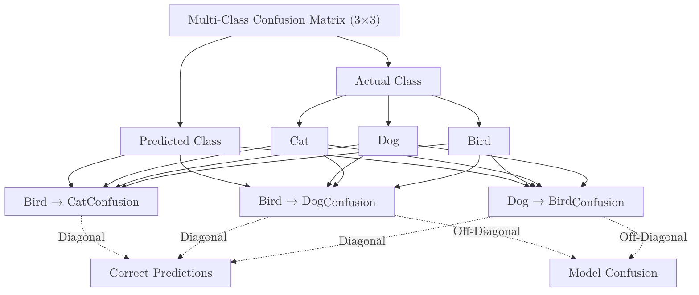

A **Confusion Matrix** is a table used to describe the performance of a classification model. While "Accuracy" tells you how often the model is correct, the Confusion Matrix tells you exactly **how** it is failing and which classes are being swapped.

## 1. The 2x2 Layout

For a binary classification (Yes/No, Spam/Ham), the matrix consists of four quadrants:

| | Predicted: **Negative** | Predicted: **Positive** |
| :--- | :--- | :--- |
| **Actual: Negative** | **True Negative (TN)** | **False Positive (FP)** |
| **Actual: Positive** | **False Negative (FN)** | **True Positive (TP)** |

### Breaking Down the Quadrants:
* **True Positive (TP):** You predicted positive, and it was true. (e.g., You predicted a patient has cancer, and they do).
* **True Negative (TN):** You predicted negative, and it was true. (e.g., You predicted a patient is healthy, and they are).
* **False Positive (FP):** You predicted positive, but it was false. (Also known as a **Type I Error** or a "False Alarm").
* **False Negative (FN):** You predicted negative, but it was positive. (Also known as a **Type II Error** or a "Miss").

## 2. Type I vs. Type II Errors

The "cost" of these errors depends entirely on your specific problem.



* **In Cancer Detection:** A **Type II Error (FN)** is much worse because a sick patient goes untreated.
* **In Spam Filtering:** A **Type I Error (FP)** is worse because an important work email is hidden in the trash.

## 3. Implementation with Scikit-Learn

```python
from sklearn.metrics import confusion_matrix, ConfusionMatrixDisplay
import matplotlib.pyplot as plt

# Actual values and Model predictions
y_true = [0, 1, 0, 1, 0, 1, 1, 0]
y_pred = [0, 1, 1, 1, 0, 0, 1, 0]

# 1. Generate the matrix
cm = confusion_matrix(y_true, y_pred)

# 2. Visualize it
disp = ConfusionMatrixDisplay(confusion_matrix=cm, display_labels=['Negative', 'Positive'])
disp.plot(cmap=plt.cm.Blues)
plt.show()

```

## 4. Multi-Class Confusion Matrices

The matrix isn't just for binary problems. If you are classifying "Cat," "Dog," and "Bird," your matrix will be 3x3. The diagonal line from top-left to bottom-right represents correct predictions. Any numbers off that diagonal show you which animals the model is confusing.



## 5. Summary: What can we calculate from here?

The Confusion Matrix is the "mother" of all classification metrics. From these four numbers, we derive:

* **Accuracy:** 
* **Precision:** 
* **Recall:** 
* **F1-Score:** The balance between Precision and Recall.

## References

* **StatQuest:** [Confusion Matrices Explained](https://www.youtube.com/watch?v=Kdsp6soqA7o)
* **Scikit-Learn:** [Confusion Matrix API](https://scikit-learn.org/stable/modules/generated/sklearn.metrics.confusion_matrix.html)

---

**Now that you can see where the model is making mistakes, let's learn how to turn those mistakes into a single score.**