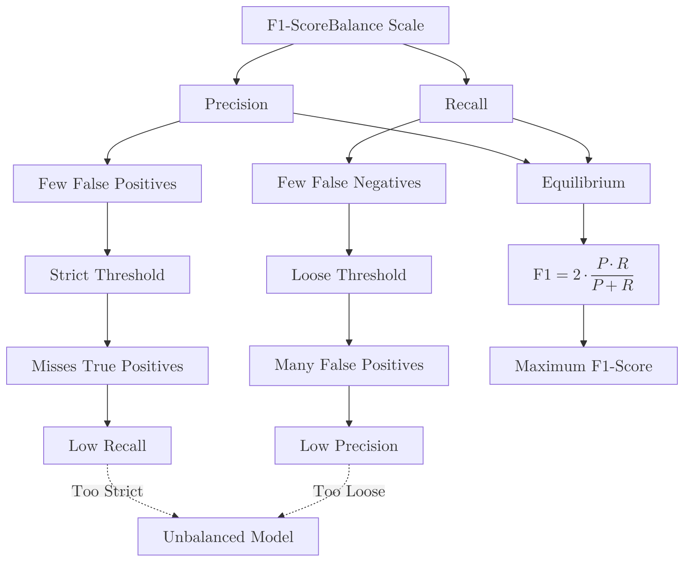

The **F1-Score** is a single metric that combines [Precision](./precision) and [Recall](./recall) into a single value. It is particularly useful when you have an imbalanced dataset and you need to find an optimal balance between "False Positives" and "False Negatives."

## 1. The Mathematical Formula

The F1-Score is the **harmonic mean** of Precision and Recall. Unlike a simple average, the harmonic mean punishes extreme values. If either Precision or Recall is very low, the F1-Score will also be low.

$$
F1 = 2 \cdot \frac{\text{Precision} \cdot \text{Recall}}{\text{Precision} + \text{Recall}}
$$


### Why use the Harmonic Mean?

If we used a standard arithmetic average, a model with 1.0 Precision and 0.0 Recall would have a "decent" score of 0.5. However, such a model is useless. The harmonic mean ensures that if one metric is 0, the total score is 0.

## 2. When to Use the F1-Score

F1-Score is the best choice when:

1.  **Imbalanced Classes:** You have a large number of "Negative" samples and few "Positive" ones (e.g., Fraud detection).
2.  **Equal Importance:** You care equally about minimizing False Positives (Precision) and False Negatives (Recall).

## 3. Visualizing the Balance

Think of the F1-Score as a "balance scale." If you tilt too far toward catching everyone (Recall), your precision drops. If you tilt too far toward being perfectly accurate (Precision), you miss people. The F1-Score is highest when these two are in equilibrium.



## 4. Implementation with Scikit-Learn

```python
from sklearn.metrics import f1_score

# Actual target values
y_true = [0, 1, 1, 0, 1, 1, 0]

# Model predictions
y_pred = [0, 1, 0, 0, 1, 1, 1]

# Calculate F1-Score
score = f1_score(y_true, y_pred)

print(f"F1-Score: {score:.2f}")
# Output: F1-Score: 0.75

```

## 5. Summary Table: Which Metric to Trust?

| Scenario | Best Metric | Why? |
| --- | --- | --- |
| **Balanced Data** | **Accuracy** | Simple and representative. |
| **Spam Filter** | **Precision** | False Positives (real mail in spam) are very bad. |
| **Cancer Screen** | **Recall** | False Negatives (missing a sick patient) are fatal. |
| **Fraud Detection** | **F1-Score** | Need to catch thieves (Recall) without blocking everyone (Precision). |

## 6. Beyond Binary: Macro vs. Weighted F1

If you have more than two classes (Multi-class classification), you'll see these options:

* **Macro F1:** Calculates F1 for each class and takes the unweighted average. Treats all classes as equal.
* **Weighted F1:** Calculates F1 for each class but weights them by the number of samples in that class.

## References

* **Scikit-Learn:** [F1 Score Documentation](https://scikit-learn.org/stable/modules/generated/sklearn.metrics.f1_score.html)
* **Towards Data Science:** [The F1 Score Paradox](https://towardsdatascience.com/the-f1-score-2236378a31).

**The F1-Score gives us a snapshot at a single threshold. But how do we evaluate a model's performance across ALL possible thresholds?**