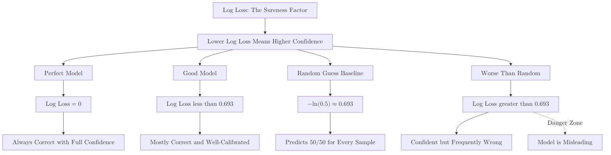

**Log Loss**, also known as **Cross-Entropy Loss**, is a performance metric that evaluates a classification model based on its **predicted probabilities**. Unlike [Accuracy](./accuracy), which only looks at the final label, Log Loss punishes models that are "confidently wrong."

:::note
**Prerequisites:** Familiarity with basic classification concepts like **predicted probabilities** and **binary labels** (0 and 1). If you're new to these concepts, consider reviewing the [Confusion Matrix](./confusion-matrix) documentation first.
:::

## 1. The Core Intuition: The Penalty System

Log Loss measures the "closeness" of a prediction probability to the actual binary label ($0$ or $1$). 

* If the actual label is **1** and the model predicts **0.99**, the Log Loss is very low.
* If the actual label is **1** and the model predicts **0.01**, the Log Loss is extremely high.

**Crucially:** Log Loss penalizes wrong predictions exponentially. It is better to be "unsure" (0.5) than to be "confidently wrong" (0.01 when the answer is 1).

## 2. The Mathematical Formula

For a binary classification problem, the Log Loss is calculated as:

$$
\text{Log Loss} = -\frac{1}{N} \sum_{i=1}^{N} [y_i \log(p_i) + (1 - y_i) \log(1 - p_i)]
$$

**Where:**

* **$N$:** Total number of samples.
* **$y_i$:** Actual label (0 or 1).
* **$p_i$:** Predicted probability of the sample belonging to class 1.
* **$\log$:** The natural logarithm (base $e$).

**Breaking it down:**
* If the actual label $y_i$ is **1**, the formula simplifies to $-\log(p_i)$. The closer $p_i$ is to 1, the lower the loss.
* If the actual label $y_i$ is **0**, the formula simplifies to $-\\log(1 - p_i)$. The closer $p_i$ is to 0, the lower the loss.


## 3. Comparison with Accuracy

Imagine two models predicting a single sample where the true label is **1**.

| Model | Predicted Probability | Prediction (Threshold 0.5) | Accuracy | Log Loss |
| :--- | :--- | :--- | :--- | :--- |
| **Model A** | **0.95** | Correct | 100% | **Low** (Good) |
| **Model B** | **0.51** | Correct | 100% | **High** (Weak) |

Even though both models have the same **Accuracy**, Log Loss tells us that **Model A** is superior because it is more certain about the correct answer.

## 4. Implementation with Scikit-Learn

To calculate Log Loss, you must use `predict_proba()` to get the raw probabilities.

```python
from sklearn.metrics import log_loss

# Actual labels
y_true = [1, 0, 1, 1]

# Predicted probabilities for the '1' class
y_probs = [0.9, 0.1, 0.8, 0.4]

# Calculate Log Loss
score = log_loss(y_true, y_probs)

print(f"Log Loss: {score:.4f}")
# Output: Log Loss: 0.3522

```

## 5. Pros and Cons

| Advantages | Disadvantages |
| --- | --- |
| **Probability-Focused:** Captures the nuances of model confidence. | **Non-Intuitive:** A value of "0.21" is harder to explain to a business client than "90% accuracy." |
| **Optimizable:** This is the loss function used to train models like Logistic Regression and Neural Networks. | **Sensitive to Outliers:** A single prediction of 0% probability for a class that turns out to be true will result in a Log Loss of **infinity**. |

---

## 6. Key Takeaway: The "Sureness" Factor

A "perfect" model has a Log Loss of 0. A baseline model that simply predicts a 50/50 chance for every sample will have a Log Loss of approximately 0.693 ($-\ln(0.5)$). If your model's Log Loss is higher than 0.693, it is performing worse than a random guess!



## References

* **Scikit-Learn:** [Log Loss Documentation](https://scikit-learn.org/stable/modules/generated/sklearn.metrics.log_loss.html)
* **Machine Learning Mastery:** [A Gentle Introduction to Cross-Entropy](https://machinelearningmastery.com/cross-entropy-for-machine-learning/)

---

**We have explored almost every way to evaluate a classifier. Now, let's switch gears and look at how we measure errors in numbers and values.**