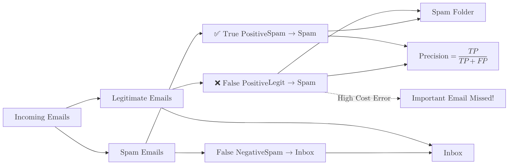

**Precision** (also known as Positive Predictive Value) measures the accuracy of the model's positive predictions. It answers the question: *"Of all the times the model predicted 'Positive', how many were actually 'Positive'?"*

## 1. The Mathematical Formula

Precision is calculated by taking the number of correctly predicted positive results and dividing it by the total number of positive predictions made by the model.

$$
\text{Precision} = \frac{TP}{TP + FP}
$$

Where:

* **TP (True Positives):** Correctly predicted positive samples.
* **FP (False Positives):** The "False Alarms"—cases where the model predicted positive, but it was actually negative.

## 2. When Precision is the Priority

You should prioritize Precision when the **cost of a False Positive is high**. In other words, you want to be very sure when you cry "wolf."

### Real-World Example: Spam Filtering

* **Positive Class:** An email is Spam.
* **False Positive:** A legitimate email from your boss is marked as "Spam."
* **The Goal:** We want high Precision. It is better to let a few spam emails into the Inbox (low Recall) than to accidentally hide an important work email (low Precision).



## 3. The Precision-Recall Trade-off

There is usually a tug-of-war between Precision and Recall. 

* If you make your model extremely "picky" (only predicting positive when it is 99.9% certain), your **Precision will increase**, but you will miss many actual positive cases (**Recall will decrease**).
* Conversely, if your model is very "sensitive" and flags everything that looks remotely suspicious, your **Recall will increase**, but you will get many false alarms (**Precision will decrease**).

## 4. Implementation with Scikit-Learn

```python
from sklearn.metrics import precision_score

# Actual target values (e.g., 1 = Spam, 0 = Inbox)
y_true = [0, 1, 0, 0, 1, 1, 0]

# Model predictions
y_pred = [0, 0, 1, 0, 1, 1, 0]

# Calculate Precision
# The 'pos_label' parameter specifies which class is considered "Positive"
score = precision_score(y_true, y_pred)

print(f"Precision Score: {score:.2f}")
# Output: Precision Score: 0.67
# (Out of 3 'Spam' predictions, only 2 were actually Spam)

```

## 5. Pros and Cons

| Advantages | Disadvantages |
| --- | --- |
| **Minimizes False Alarms:** Crucial for user trust (e.g., avoiding wrong medical diagnoses). | **Ignores Missed Cases:** Doesn't care about the positive cases the model missed completely. |
| **High Specificity:** Focuses purely on the quality of the positive class predictions. | **Can be Manipulated:** A model can have 100% precision by only making one single, very safe prediction. |

## References

* **Scikit-Learn Documentation:** [Precision-Recall-F1](https://scikit-learn.org/stable/modules/model_evaluation.html#precision-recall-f-measure-metrics)
* **StatQuest:** [Precision and Recall Clearly Explained](https://www.youtube.com/watch?v=Kdsp6soqA7o)

---

**Precision tells us how "reliable" our positive predictions are. But what about the cases we missed entirely?**