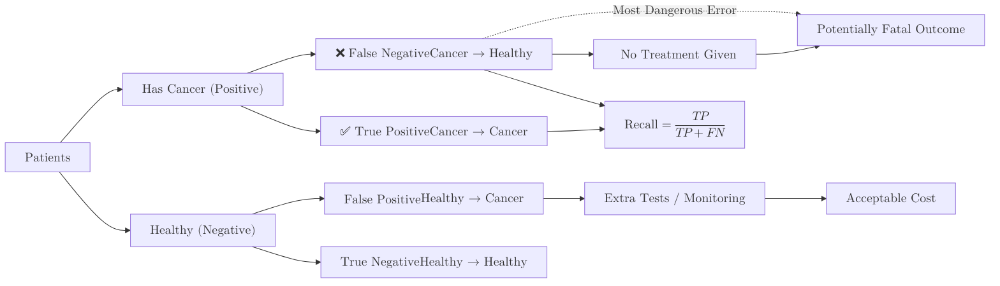

**Recall**, also known as **Sensitivity** or **True Positive Rate (TPR)**, measures the model's ability to find all the positive samples in a dataset. It answers the question: *"Of all the actual positive cases that exist, how many did the model correctly identify?"*

## 1. The Mathematical Formula

Recall is calculated by dividing the number of correctly predicted positive results by the total number of actual positives (those we caught + those we missed).

$$
\text{Recall} = \frac{TP}{TP + FN}
$$

Where:

* **TP (True Positives):** Correctly predicted positive samples.
* **FN (False Negatives):** The "Misses"—cases that were actually positive, but the model incorrectly labeled them as negative.

## 2. When Recall is the Top Priority

You should prioritize Recall when the **cost of a False Negative is extremely high**. In these scenarios, it is better to have a few "false alarms" than to miss a single positive case.

### Real-World Example: Cancer Detection


* **Positive Class:** Patient has cancer.
* **False Negative:** The patient has cancer, but the model says they are "Healthy."
* **The Consequence:** The patient does not receive treatment, which could be fatal. 
* **The Goal:** We want **100% Recall**. We would rather tell a healthy person they need more tests (False Positive) than tell a sick person they are fine (False Negative).



## 3. The Precision-Recall Inverse Relationship

As you saw in the [Precision module](./precision), there is an inherent trade-off.

* **To increase Recall:** You can make your model "less strict." If a bank flags *every* transaction as potentially fraudulent, it will have 100% Recall (it caught every thief), but its Precision will be terrible (it blocked every honest customer too).
* **To increase Precision:** You make the model "more strict," which inevitably leads to missing some positive cases, thereby lowering Recall.

## 4. Implementation with Scikit-Learn

```python
from sklearn.metrics import recall_score

# Actual target values (1 = Sick, 0 = Healthy)
y_true = [1, 1, 1, 0, 1, 0, 1]

# Model predictions
y_pred = [1, 0, 1, 0, 1, 0, 0]

# Calculate Recall
score = recall_score(y_true, y_pred)

print(f"Recall Score: {score:.2f}")
# Output: Recall Score: 0.60
# (We found 3 out of 5 sick people; we missed 2)

```

## 5. Summary Table: Precision vs. Recall

| Metric | Focus | Goal | Failure Mode |
| --- | --- | --- | --- |
| **Precision** | Quality | "Don't cry wolf." | High Precision misses many real cases. |
| **Recall** | Quantity | "Leave no one behind." | High Recall creates many false alarms. |

## 6. How to Balance Both?

If you need a single number that accounts for both the "False Alarms" of Precision and the "Misses" of Recall, you need the **F1-Score**.

## References

* **Google Machine Learning Crash Course:** [Recall Metric](https://developers.google.com/machine-learning/crash-course/classification/precision-and-recall)
* **Wikipedia:** [Sensitivity and Specificity](https://en.wikipedia.org/wiki/Sensitivity_and_specificity)

---

**Is your model struggling to choose between Precision and Recall? Let's look at the "middle ground" metric.**