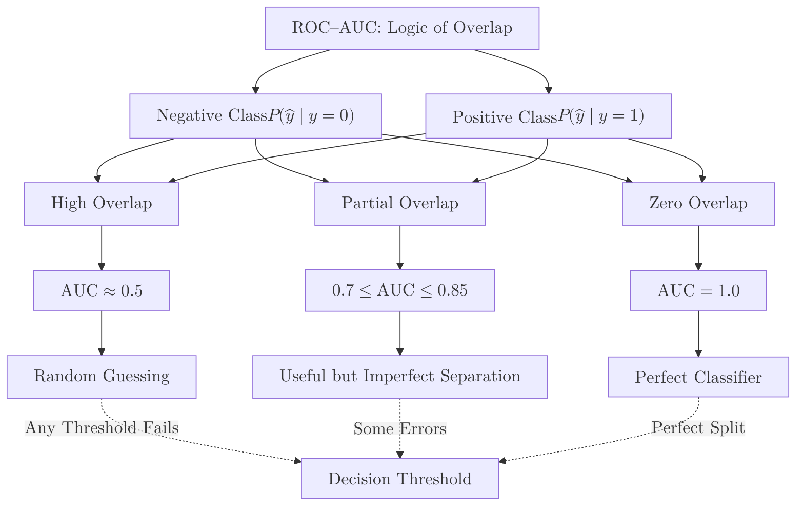

In classification tasks, especially binary classification, it's crucial to evaluate how well a model distinguishes between the positive and negative classes. The **ROC Curve (Receiver Operating Characteristic Curve)** and **AUC (Area Under the Curve)** are powerful tools for this purpose.

> While metrics like **Accuracy** and **F1-Score** evaluate a model based on a single "cut-off" or threshold (usually 0.5), **ROC** and **AUC** help us evaluate how well the model separates the two classes across **all possible thresholds**.

:::note
**Prerequisites:** Familiarity with basic classification metrics like **True Positives (TP)**, **False Positives (FP)**, **True Negatives (TN)**, and **False Negatives (FN)**. If you're new to these concepts, consider reviewing the [Confusion Matrix](./confusion-matrix) documentation first.
:::

## 1. Defining the Terms

To understand the ROC curve, we need to look at two specific rates:

1.  **True Positive Rate (TPR) / Recall:** $TPR = \frac{TP}{TP + FN}$ 
    (How many of the actual positives did we catch?)
2.  **False Positive Rate (FPR):** $FPR = \frac{FP}{FP + TN}$ 
    (How many of the actual negatives did we incorrectly flag as positive?)

## 2. The ROC Curve (Receiver Operating Characteristic)

The ROC curve is a plot of **TPR (Y-axis)** against **FPR (X-axis)**. 

* **Each point** on the curve represents a TPR/FPR pair corresponding to a particular decision threshold.
* **A "Perfect" Classifier** would have a curve that goes straight up the Y-axis and then across (covering the top-left corner).
* **A Random Classifier** (like flipping a coin) is represented by a 45-degree diagonal line.

## 3. AUC (Area Under the Curve)

The **AUC** is the literal area under the ROC curve. It provides an aggregate measure of performance across all possible classification thresholds.

* **AUC = 1.0:** A perfect model (100% correct predictions).
* **AUC = 0.5:** A useless model (no better than random guessing).
* **AUC = 0.0:** A model that is perfectly wrong (it predicts the exact opposite of the truth).

**Interpretation:** AUC can be thought of as the probability that the model will rank a randomly chosen positive instance higher than a randomly chosen negative one.

## 4. Why use ROC-AUC?

1.  **Scale-Invariant:** It measures how well predictions are ranked, rather than their absolute values.
2.  **Threshold-Invariant:** It evaluates the model's performance without having to choose a specific threshold. This is great if you haven't decided yet how "picky" the model should be.
3.  **Balanced Evaluation:** It is highly effective for comparing different models against each other on the same dataset.

## 5. Implementation with Scikit-Learn

To calculate AUC, you usually need the **prediction probabilities** rather than the hard class labels.

```python
from sklearn.metrics import roc_curve, roc_auc_score
import matplotlib.pyplot as plt

# 1. Get probability scores from the model
# (Assume model is already trained)
y_probs = model.predict_proba(X_test)[:, 1] 

# 2. Calculate AUC
auc_value = roc_auc_score(y_test, y_probs)
print(f"AUC Score: {auc_value:.4f}")

# 3. Generate the curve points
fpr, tpr, thresholds = roc_curve(y_test, y_probs)

# 4. Plotting
plt.plot(fpr, tpr, label=f'AUC = {auc_value:.2f}')
plt.plot([0, 1], [0, 1], 'k--') # Diagonal random line
plt.xlabel('False Positive Rate')
plt.ylabel('True Positive Rate')
plt.title('ROC Curve')
plt.legend()
plt.show()

```

## 6. The Logic of Overlap

The higher the AUC, the less the "Positive" and "Negative" probability distributions overlap. When the overlap is zero, the model can perfectly distinguish between the two.



## References

* **Google Machine Learning Crash Course:** [ROC Curve and AUC](https://developers.google.com/machine-learning/crash-course/classification/roc-and-auc)
* **StatQuest:** [ROC and AUC Clearly Explained](https://www.youtube.com/watch?v=4jRBRDbJemM)

---

**We have mastered classification metrics. But how do we evaluate a model that predicts continuous numbers, like house prices or stock trends?**