While a [Train-Test Split](./train-test-split) is a great starting point, it has a major weakness: your results can vary significantly depending on which specific rows end up in the test set.

**K-Fold Cross-Validation** solves this by repeating the split process multiple times and averaging the results, ensuring every single data point gets to be part of the "test set" at least once.

## 1. How the Algorithm Works

The process follows a simple rotation logic:
1.  **Split** the data into **K** equal-sized "folds" (usually $K=5$ or $K=10$).
2.  **Iterate:** For each fold $i$:
    * Treat Fold $i$ as the **Test Set**.
    * Treat the remaining $K-1$ folds as the **Training Set**.
    * Train the model and record the score.
3.  **Aggregate:** Calculate the mean and standard deviation of all $K$ scores.

## 2. Visualizing the Process

```mermaid
graph TB
    TITLE["$$\text{K-Fold Cross-Validation}$$"]

    %% Dataset
    TITLE --> DATA["$$\text{Full Dataset}$$"]

    %% Folds
    DATA --> F1["$$\text{Fold 1}$$"]
    DATA --> F2["$$\text{Fold 2}$$"]
    DATA --> F3["$$\text{Fold 3}$$"]
    DATA --> Fk["$$\text{Fold } k$$"]

    %% Iterations
    F1 --> I1["$$\text{Iteration 1}$$<br/>$$\text{Validation: Fold 1}$$<br/>$$\text{Training: Others}$$"]
    F2 --> I2["$$\text{Iteration 2}$$<br/>$$\text{Validation: Fold 2}$$<br/>$$\text{Training: Others}$$"]
    F3 --> I3["$$\text{Iteration 3}$$<br/>$$\text{Validation: Fold 3}$$<br/>$$\text{Training: Others}$$"]
    Fk --> Ik["$$\text{Iteration } k$$<br/>$$\text{Validation: Fold } k$$<br/>$$\text{Training: Others}$$"]

    %% Model Training & Evaluation
    I1 --> M1["$$\text{Train Model}$$"]
    I2 --> M2["$$\text{Train Model}$$"]
    I3 --> M3["$$\text{Train Model}$$"]
    Ik --> Mk["$$\text{Train Model}$$"]

    M1 --> S1["$$\text{Score}_1$$"]
    M2 --> S2["$$\text{Score}_2$$"]
    M3 --> S3["$$\text{Score}_3$$"]
    Mk --> Sk["$$\text{Score}_k$$"]

    %% Final Result
    S1 --> AVG["$$\text{Average Score}$$"]
    S2 --> AVG
    S3 --> AVG
    Sk --> AVG

    AVG --> PERF["$$\text{Cross-Validated Performance}$$"]

```



## 3. Why Use K-Fold?

### A. Reliability (Reducing Variance)

By averaging 10 different test scores, you get a much more stable estimate of how the model will perform on new data. It eliminates the "luck of the draw."

### B. Maximum Data Utility

In a standard split, 20% of your data is never used for training. In K-Fold, every data point is used for training $K-1$ times and for testing exactly once. This is especially vital for small datasets.

### C. Hyperparameter Tuning

K-Fold is the foundation for **Grid Search**. It helps you find the best settings for your model (like the depth of a tree) without overfitting to one specific validation set.

## 4. Implementation with Scikit-Learn

```python
from sklearn.model_selection import cross_val_score, KFold
from sklearn.ensemble import RandomForestClassifier

# 1. Initialize model and data
model = RandomForestClassifier()

# 2. Define the K-Fold strategy
kf = KFold(n_splits=5, shuffle=True, random_state=42)

# 3. Perform Cross-Validation
# This returns an array of 5 scores
scores = cross_val_score(model, X, y, cv=kf, scoring='accuracy')

print(f"Scores for each fold: {scores}")
print(f"Mean Accuracy: {scores.mean():.4f}")
print(f"Standard Deviation: {scores.std():.4f}")

```

## 5. Variations of Cross-Validation

* **Stratified K-Fold:** Used for imbalanced data. It ensures each fold has the same percentage of samples for each class as the whole dataset.
* **Leave-One-Out (LOOCV):** A extreme case where $K$ equals the total number of samples ($N$). Extremely computationally expensive but uses the most data possible.
* **Time-Series Split:** Unlike random K-Fold, this respects the chronological order of data (Training on the past, testing on the future).

## 6. Pros and Cons

| Advantages | Disadvantages |
| --- | --- |
| **Robustness:** Provides a more accurate measure of model generalization. | **Computationally Expensive:** Training the model $K$ times takes $K$ times longer. |
| **Confidence:** The standard deviation tells you how "stable" the model is. | **Not for Big Data:** If your model takes 10 hours to train, doing it 10 times is often impractical. |

## References

* **Scikit-Learn:** [Cross-Validation Guide](https://scikit-learn.org/stable/modules/cross_validation.html)
* **StatQuest:** [K-Fold Cross-Validation Explained](https://www.youtube.com/watch?v=fSytzGwwBVw)

---

**Now that you have a robust way to validate your model, how do you handle data where the classes are heavily skewed (e.g., 99% vs 1%)?**