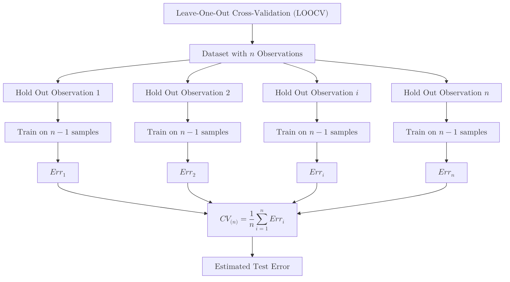

**Leave-One-Out Cross-Validation (LOOCV)** is an extreme case of [K-Fold Cross-Validation](./k-fold-cross-validation). Instead of splitting the data into 5 or 10 groups, LOOCV sets $K$ equal to $N$, the total number of data points in your set.

In each iteration, the model is trained on every data point except **one**, which is used as the test set.

## 1. How the Algorithm Works

If you have a dataset with $n$ samples:
1.  **Select** the first sample to be the test set.
2.  **Train** the model on the remaining $n-1$ samples.
3.  **Evaluate** the model on the single test sample and record the error.
4.  **Repeat** this process $n$ times, so that each sample serves as the test set exactly once.
5.  **Average** the $n$ resulting errors to get the final performance metric.

## 2. Mathematical Representation

The LOOCV estimate of the test error is the average of these $n$ test errors:

$$
CV_{(n)} = \frac{1}{n} \sum_{i=1}^{n} Err_i
$$

Where $Err_i$ is the error (e.g., Mean Squared Error or Misclassification) calculated on the $i^{th}$ observation when the model was fit using all data except that observation.



## 3. When to Use LOOCV?

### Small Datasets

When you only have 20 or 50 samples, a standard 80/20 split would leave you with very little data for training. LOOCV allows you to use $n-1$ samples for training, maximizing the model's ability to learn the underlying patterns.

### Bias vs. Variance

* **Low Bias:** Since we use almost all the data for training in each step, the model behaves very similarly to how it would if trained on the full dataset.
* **High Variance:** Because the training sets in each iteration are almost identical (overlapping by $n-2$ samples), the outputs are highly correlated. This can lead to a higher variance in the final error estimate compared to K-Fold.

## 4. Implementation with Scikit-Learn

```python
from sklearn.model_selection import LeaveOneOut, cross_val_score
from sklearn.linear_model import LinearRegression
import numpy as np

# 1. Initialize data and model
X = np.array([[1], [2], [3], [4]])
y = np.array([2, 3.9, 6.1, 8.2])
model = LinearRegression()

# 2. Initialize LOOCV
loo = LeaveOneOut()

# 3. Perform Cross-Validation
# This will run 4 times because we have 4 samples
scores = cross_val_score(model, X, y, cv=loo, scoring='neg_mean_squared_error')

print(f"MSE for each iteration: {np.abs(scores)}")
print(f"Average MSE: {np.abs(scores).mean():.4f}")

```

## 5. LOOCV vs. K-Fold Cross-Validation

| Feature | LOOCV | K-Fold ($K=10$) |
| --- | --- | --- |
| **Computations** |  $N$ (Total samples) | 10 |
| **Computational Cost** | Very High | Moderate |
| **Bias** | Extremely Low | Higher than LOOCV |
| **Variance** | High | Low |
| **Best For** | Small datasets ($N < 100$) | Large/Standard datasets |


## 6. The "Shortcut" for Linear Regression

For certain models like **Linear Regression**, you don't actually have to train the model  times. There is a mathematical identity that allows you to calculate the LOOCV error with a single model fit:

$$
CV_{(n)} = \frac{1}{n} \sum_{i=1}^{n} \left( \frac{y_i - \hat{y}_i}{1 - h_i} \right)^2
$$

Where $h_i$ is the leverage (diagonal of the hat matrix). This makes LOOCV as fast as a single training session for linear models!

## References

* **An Introduction to Statistical Learning (ISLR):** Chapter 5.1.2 covers LOOCV in depth.
* **Scikit-Learn:** [LeaveOneOut Documentation](https://scikit-learn.org/stable/modules/generated/sklearn.model_selection.LeaveOneOut.html)

---

**LOOCV is great for small data, but what if your classes are unbalanced (e.g., 99% vs 1%)? Standard LOOCV might struggle to capture the minority class.**
