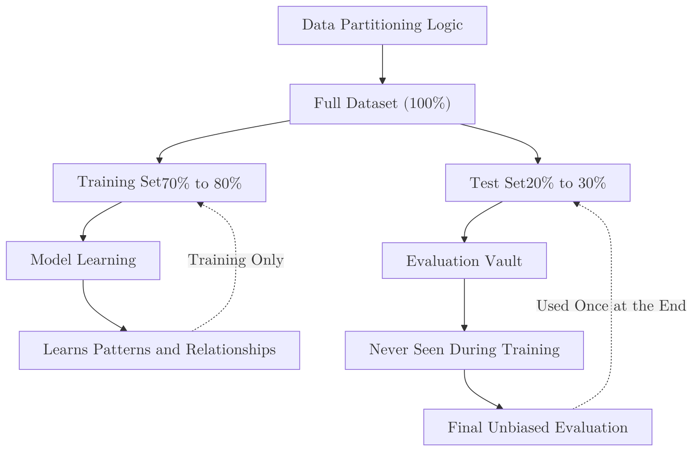

The **Train-Test Split** is a technique used to evaluate the performance of a machine learning algorithm. It involves taking your primary dataset and partitioning it into two separate subsets: one to build the model and another to validate its predictions.

## 1. Why do we split data?

In Machine Learning, we don't care how well a model remembers the past; we care how well it predicts the **future**. 

If we train our model on the *entire* dataset, we have no way of knowing if the model actually learned the underlying patterns or if it simply memorized the noise in that specific data. Testing on the same data used for training is a "cardinal sin" known as **Data Leakage**.

## 2. The Partitioning Logic

Typically, the data is split into two (or sometimes three) parts:

1.  **Training Set (70-80%):** This is the data used by the algorithm to learn the relationships between features and targets.
2.  **Test Set (20-30%):** This data is kept in a "vault." The model never sees it during training. It is used only at the very end to provide an unbiased evaluation.



## 3. Important Considerations

### Randomness and Reproducibility

When splitting data, we use a random process. However, for scientific consistency, we use a **Random State** (seed). This ensures that every time you run your code, you get the exact same split, making your experiments reproducible.

### Stratification

If you are working with imbalanced classes (e.g., 90% "Healthy", 10% "Sick"), a simple random split might accidentally put all the "Sick" cases in the training set and none in the test set.
**Stratified Splitting** ensures that the proportion of classes is preserved in both the training and testing subsets.

## 4. Implementation with Scikit-Learn

```python
from sklearn.model_selection import train_test_split

# Assume X contains features and y contains the target
X_train, X_test, y_train, y_test = train_test_split(
    X, 
    y, 
    test_size=0.2,       # 20% for testing
    random_state=42,     # For reproducibility
    stratify=y           # Keep class proportions equal
)

print(f"Training samples: {len(X_train)}")
print(f"Testing samples: {len(X_test)}")

```

## 5. Pros and Cons

| Advantages | Disadvantages |
| --- | --- |
| **Simplicity:** Very easy to understand and implement. | **High Variance:** If the dataset is small, a different random split can lead to very different results. |
| **Speed:** Fast to compute, as the model is only trained once. | **Waste of Data:** A portion of your valuable data is never used to train the model. |
| **Standard Practice:** The universal starting point for any ML project. | **Not for Time-Series:** Random splitting ruins data where order matters (e.g., Stock prices). |

## References

* **Scikit-Learn:** [train_test_split Documentation](https://scikit-learn.org/stable/modules/generated/sklearn.model_selection.train_test_split.html)
* **Google ML Crash Course:** [Splitting Data](https://developers.google.com/machine-learning/crash-course/training-and-test-sets/splitting-data)

---

**A single split is a good start, but what if your "random" test set happens to be particularly easy or hard? To solve this, we use a more robust technique.**