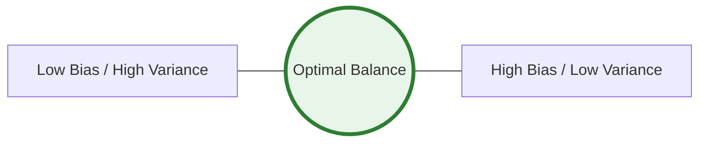

Building a machine learning model is only half the battle. The most dangerous mistake a Data Scientist can make is assuming that a model with **99% accuracy** on the training data will perform just as well in the real world.

**Model Evaluation** is the process of using different metrics and validation strategies to understand how well your model generalizes to data it has never seen before.

## 1. The Trap of "Memorization" (Overfitting)

If you give a student the exact same questions from their textbook on their final exam, they might get a 100% just by memorizing the answers. However, if you give them a new problem and they fail, they haven't actually learned the subject.

In Machine Learning, this is called **Overfitting**.

* **Training Error:** How well the model performs on the data it studied.
* **Generalization Error:** How well the model performs on new, unseen data.

**The Goal:** We want to minimize the Generalization Error, not just the Training Error.

## 2. The Bias-Variance Tradeoff

Every model's error can be broken down into two main components:

### Bias (Underfitting)
The error from erroneous assumptions in the learning algorithm. High bias can cause an algorithm to miss the relevant relations between features and target outputs.
* *Analogy:* Trying to fit a straight line through a curved set of points.

### Variance (Overfitting)

The error from sensitivity to small fluctuations in the training set. High variance can cause an algorithm to model the random noise in the training data.
* *Analogy:* Following every single data point so closely that the model becomes "wiggly."

## 3. The Evaluation Workflow

To evaluate a model properly, we never use the same data for training and testing. We typically split our dataset into three parts:

| Split | Purpose |
| --- | --- |
| **Training Set** | Used to teach the model (The "Textbook"). |
| **Validation Set** | Used to tune hyperparameters and pick the best model version. |
| **Test Set** | The "Final Exam." Used only once at the very end to see real-world performance. |

## 4. Why Accuracy Isn't Enough

Imagine a model designed to detect a very rare disease that only affects 1 in 1,000 people.
If the model simply predicts **"Healthy"** for everyone, it will be **99.9% accurate**.

However, it is a **useless model** because it failed to find the 1 person who was actually sick. This is why we need more advanced metrics like:

* **Precision & Recall** (For Classification)
* **Mean Absolute Error** (For Regression)
* **F1-Score** (For Imbalanced Data)

## 5. The Evaluation Roadmap

In the upcoming chapters, we will dive deep into specific evaluation tools:

1. **Confusion Matrices:** Seeing exactly where your classifier is getting confused.
2. **ROC & AUC:** Understanding the trade-off between sensitivity and specificity.
3. **Cross-Validation:** Making the most of limited data.
4. **Regression Metrics:** Measuring the "distance" between reality and prediction.

## References

* **Google Machine Learning Crash Course:** [Generalization](https://developers.google.com/machine-learning/crash-course/generalization/video-lecture)
* **StatQuest:** [Bias and Variance](https://www.youtube.com/watch?v=EuBBz3bI-aA)