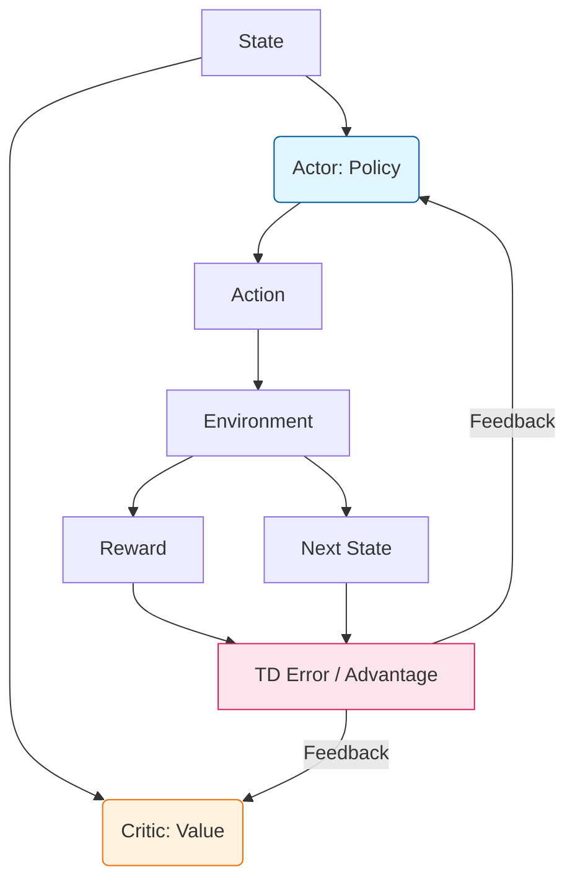

**Actor-Critic** methods are a hybrid architecture in Reinforcement Learning that combine the best of both worlds: **Policy Gradients** and **Value-Based** learning. 

In this setup, we use two neural networks:
1.  **The Actor:** Learns the strategy (Policy). It decides which action to take.
2.  **The Critic:** Learns to evaluate the action. It tells the Actor how "good" the action was by estimating the Value function.

## 1. Why use Actor-Critic?

* **Policy Gradients (Actor only):** Have high variance and can be slow to converge because they rely on full episode returns.
* **Q-Learning (Critic only):** Can be biased and struggles with continuous action spaces.
* **Actor-Critic:** Uses the Critic to reduce the variance of the Actor, leading to faster and more stable learning.

## 2. How it Works: The Advantage

The Critic doesn't just predict the reward; it predicts the **Advantage** ($A$). The Advantage tells us if an action was better than the average action expected from that state.

$$
A(s, a) = Q(s, a) - V(s)
$$

Where:

* **$Q(s, a)$:** The value of taking a specific action.
* **$V(s)$:** The average value of the state (The Baseline).

If $A > 0$, the Actor is encouraged to take that action more often. If $A < 0$, the Actor is discouraged.

## 3. The Learning Loop



## 4. Popular Variations

### A2C (Advantage Actor-Critic)

A synchronous version where multiple agents run in parallel environments. The "Master" agent waits for all workers to finish their steps before updating the global network.

### A3C (Asynchronous Advantage Actor-Critic)

Introduced by DeepMind, this version is asynchronous. Each worker updates the global network independently without waiting for others, making it extremely fast.

### PPO (Proximal Policy Optimization)

A modern, state-of-the-art Actor-Critic algorithm used by OpenAI. It ensures that updates to the policy aren't "too large," preventing the model from collapsing during training.

## 5. Implementation Logic (Pseudo-code)

```python
# 1. Get action from Actor
probs = actor(state)
action = sample(probs)

# 2. Interact with Environment
next_state, reward = env.step(action)

# 3. Get values from Critic
value = critic(state)
next_value = critic(next_state)

# 4. Calculate Advantage (TD Error)
# Advantage = (r + gamma * next_v) - v
advantage = reward + gamma * next_value - value

# 5. Backpropagate
actor_loss = -log_prob(action) * advantage.detach()
critic_loss = advantage.pow(2)

(actor_loss + critic_loss).backward()

```

## 6. Pros and Cons

| Advantages | Disadvantages |
| --- | --- |
| **Lower Variance:** Much more stable than pure Policy Gradients. | **Complexity:** Harder to tune because you are training two networks at once. |
| **Online Learning:** Can update after every step (doesn't need to wait for the end of an episode). | **Sample Inefficient:** Can still require millions of interactions for complex games. |
| **Continuous Actions:** Handles continuous movement smoothly. | **Sensitive to Hyperparameters:** Learning rates for Actor and Critic must be balanced. |

## References

* **DeepMind's A3C Paper:** "Asynchronous Methods for Deep Reinforcement Learning."
* **OpenAI Spinning Up:** Documentation on PPO and Actor-Critic variants.
* **Reinforcement Learning with David Silver:** Lecture 7 (Policy Gradient and Actor-Critic).
* **Sutton & Barto's "Reinforcement Learning: An Introduction":** Chapter on Actor-Critic Methods.