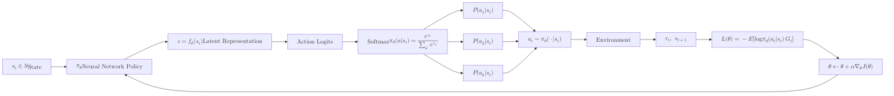

**Policy Gradient** methods are a class of reinforcement learning algorithms that optimize the policy ($\pi$) directly. Unlike [Q-Learning](./q-learning), which learns the value of being in a state, Policy Gradients learn the probability distribution of actions.

## 1. Why Choose Policy Gradients?

While Q-Learning is powerful, it struggles with:
1.  **Continuous Action Spaces:** It's hard to find the maximum Q-value if there are infinite possible actions (e.g., the exact degree to turn a steering wheel).
2.  **Stochastic Policies:** In some games (like Rock-Paper-Scissors), the best strategy is to be random. Q-Learning is inherently deterministic.
3.  **High Variance:** Value functions can be unstable.

## 2. The Core Concept

We represent the policy using a parameterized function (usually a Neural Network) $\pi_\theta(a|s)$. This function outputs the probability of taking action $a$ given state $s$.



### The Policy Gradient Theorem

The goal is to adjust the weights  to maximize the total expected reward . We use gradient ascent to update the parameters:

$$
\nabla_\theta J(\theta) \approx E_{\pi_\theta} [\nabla_\theta \log \pi_\theta(a|s) G_t]
$$

Where:

* **$\nabla_\theta \log \pi_\theta(a|s)$**: The direction that increases the probability of the action taken.
* **$G_t$**: The total return (cumulative reward). If $G_t$ is high, we push the probability up; if $G_t$ is low (or negative), we push the probability down.

## 3. The REINFORCE Algorithm (Monte Carlo Policy Gradient)

REINFORCE is the most fundamental policy gradient algorithm. It follows these steps:

1. **Act:** Run the policy to complete an entire episode and record $(s_t, a_t, r_t)$.
2. **Calculate Returns:** For each step, calculate the total future reward $G_t$.
3. **Update:** Update the weights using the gradient.

## 4. Pros and Cons

| Advantages | Disadvantages |
| --- | --- |
| **Action Flexibility:** Works perfectly with continuous and high-dimensional action spaces. | **High Variance:** Updates can be very noisy because one "lucky" or "unlucky" episode can heavily bias the gradient. |
| **Simplicty:** Optimizes the performance measure directly. | **Sample Inefficient:** Often requires thousands of episodes to learn simple tasks. |
| **Convergence:** Generally has better convergence properties than value-based methods. | **Local Optima:** Can get stuck in sub-optimal strategies easily. |

## 5. Improving Policy Gradients: Baselines

To reduce the high variance of the gradient, we often subtract a **Baseline** $b(s)$ (usually the average reward expected from that state). This ensures we only push the probability up if the reward was *better than average*.

$$
\nabla_\theta J(\theta) = E_{\pi_\theta} [\nabla_\theta \log \pi_\theta(a|s) (G_t - b(s))]
$$

## 6. Implementation Sketch (PyTorch)

```python
import torch
import torch.nn as nn
import torch.optim as optim

# 1. Define the Policy Network
class Policy(nn.Module):
    def __init__(self):
        super(Policy, self).__init__()
        self.affine1 = nn.Linear(4, 128)
        self.affine2 = nn.Linear(128, 2) # 2 possible actions

    def forward(self, x):
        x = torch.relu(self.affine1(x))
        action_scores = self.affine2(x)
        return torch.softmax(action_scores, dim=1)

# 2. Select Action based on probabilities
probs = policy(state)
m = torch.distributions.Categorical(probs)
action = m.sample()

# 3. Update Policy (after episode)
# loss = -log_prob * reward
loss = -m.log_prob(action) * cumulative_reward
optimizer.zero_grad()
loss.backward()
optimizer.step()

```

## References

* **Andrej Karpathy's "Deep Reinforcement Learning: Pong from Pixels":** The best blog post for understanding the intuition of Policy Gradients.
* **Spinning Up in Deep RL (OpenAI):** A comprehensive educational resource for policy-based methods.

---

**Policy Gradients are great for actions, but they are noisy. Q-Learning is stable but biased. What if we combined them?**