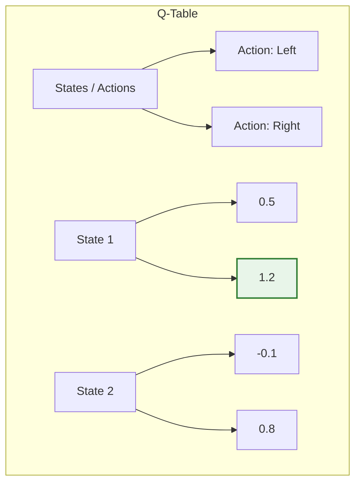
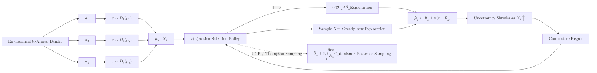

**Q-Learning** is a model-free, off-policy reinforcement learning algorithm. It aims to learn a **Policy**, which tells an agent what action to take under what circumstances to maximize the total reward over time.

Unlike Supervised Learning, there is no "correct label." The agent learns by interacting with an environment, receiving feedback (rewards or penalties), and updating its internal "knowledge" (the Q-Table).

## 1. The RL Framework: Agent & Environment

In any Q-Learning problem, we have:
* **Agent:** The learner/decision-maker.
* **State ($s$):** The current situation of the agent (e.g., coordinates on a grid).
* **Action ($a$):** What the agent can do (e.g., move Up, Down, Left, Right).
* **Reward ($r$):** The feedback received from the environment.

## 2. The Q-Table

The "Q" in Q-Learning stands for **Quality**. The Q-Table is a lookup table where rows represent **States** and columns represent **Actions**. Each cell $Q(s, a)$ contains a value representing the expected future reward for taking action $a$ in state $s$.



## 3. The Bellman Equation (The Heart of Q-Learning)

The agent updates its Q-values using the **Bellman Equation**. This formula allows the agent to learn the value of a state based on the rewards it expects to get in the *future*.

$$
Q(s, a) \leftarrow Q(s, a) + \alpha [R + \gamma \max_{a'} Q(s', a') - Q(s, a)]
$$

**Breaking down the math:**

* **$\alpha$ (Learning Rate):** How much new information overrides old information (0 to 1).
* **$R$:** The immediate reward received.
* **$\gamma$ (Discount Factor):** How much we care about future rewards vs. immediate ones (0 = short-sighted, 1 = long-term vision).
* **$\max_{a'} Q(s', a')$:** The maximum predicted reward for the *next* state.
* **$[ \dots ]$ (Temporal Difference):** The difference between the "Target" (what we found) and the "Estimate" (what we previously thought).

## 4. Exploration vs. Exploitation ($\epsilon$-greedy)

An agent faces a dilemma: should it try new things or stick to what it knows works?

* **Exploration:** Choosing a random action to discover more about the environment.
* **Exploitation:** Choosing the action with the highest Q-value.

We use the **Epsilon-Greedy Strategy**:

1. Generate a random number between 0 and 1.
2. If number $< \epsilon$, **Explore**.
3. Otherwise, **Exploit**. *(Usually, $\epsilon$ decays over time as the agent becomes more confident.)*

## 5. Visualizing the Q-Learning Process



**In this diagram:**

* The agent interacts with a K-Armed Bandit environment.
* It selects actions based on an $\epsilon$-greedy policy.
* It updates its estimates of action values based on received rewards.

## 6. Basic Implementation (Python)

```python
import numpy as np

# 1. Initialize Q-Table with zeros
q_table = np.zeros([state_space_size, action_space_size])

# 2. Hyperparameters
alpha = 0.1   # Learning rate
gamma = 0.95  # Discount factor
epsilon = 0.1 # Exploration rate

# 3. Training Loop
for episode in range(1000):
    state = env.reset()
    done = False
    
    while not done:
        # Action Selection (Epsilon-Greedy)
        if np.random.uniform(0, 1) < epsilon:
            action = env.action_space.sample() # Explore
        else:
            action = np.argmax(q_table[state]) # Exploit
            
        # Perform action
        next_state, reward, done, _ = env.step(action)
        
        # Update Q-Value (Bellman Equation)
        old_value = q_table[state, action]
        next_max = np.max(q_table[next_state])
        
        new_value = old_value + alpha * (reward + gamma * next_max - old_value)
        q_table[state, action] = new_value
        
        state = next_state

```

## 7. Limitations of Tabular Q-Learning

While powerful, standard Q-Learning fails when the **State Space** is too large.

* **Example:** In Chess, there are  possible states. A Q-Table cannot fit in any computer's RAM.
* **Solution:** Use a Neural Network to *approximate* the Q-values instead of storing them in a table. This is called **Deep Q-Learning (DQN)**.

## References

* **[Reinforcement Learning: An Introduction (Sutton & Barto)]:** The definitive textbook on the subject.
* **DeepMind's Introduction to RL:** Great for understanding the transition to Deep Learning.

---

**You've seen how agents learn through trial and error. But how do we scale this to complex games like Atari or Go?**