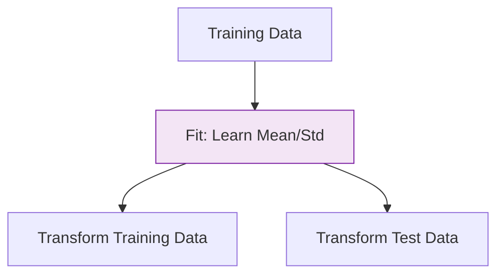

Before feeding data into an algorithm, it must be cleaned and transformed. Scikit-Learn provides a robust suite of **Transformers**—classes that follow a standard `.fit()` and `.transform()` API—to automate this work.

## 1. Handling Missing Values

Machine Learning models cannot handle `NaN` (Not a Number) or `null` values. The `SimpleImputer` class helps fill these gaps.

```python
from sklearn.impute import SimpleImputer
import numpy as np

# Sample data with missing values
X = [[1, 2], [np.nan, 3], [7, 6]]

# strategy='mean', 'median', 'most_frequent', or 'constant'
imputer = SimpleImputer(strategy='mean')
X_filled = imputer.fit_transform(X)

```

## 2. Encoding Categorical Data

Computers understand numbers, not words. If you have a column for "City" (New York, Paris, Tokyo), you must encode it.

### A. One-Hot Encoding (Nominal)

Creates a new binary column for each category. Best for data without a natural order.

```python
from sklearn.preprocessing import OneHotEncoder

encoder = OneHotEncoder(sparse_output=False)
cities = [['New York'], ['Paris'], ['Tokyo']]
encoded_cities = encoder.fit_transform(cities)

```

### B. Ordinal Encoding (Ranked)

Converts categories into integers (). Use this when the order matters (e.g., Small, Medium, Large).

## 3. Feature Scaling

As discussed in our [Data Engineering module](../../data-engineering-basics/data-cleaning-and-preprocessing/feature-scaling), scaling ensures that features with large ranges (like Salary) don't overpower features with small ranges (like Age).

### Standardization (`StandardScaler`)

Rescales data to have a mean of  and a standard deviation of .

$$
z = \frac{x - \mu}{\sigma}
$$

### Normalization (`MinMaxScaler`)

Rescales data to a fixed range, usually .

```python
from sklearn.preprocessing import StandardScaler

scaler = StandardScaler()
X_scaled = scaler.fit_transform(X_filled)

```

## 4. The `fit` vs `transform` Rule

One of the most important concepts in Scikit-Learn is the distinction between these two methods:

* **`.fit()`**: The transformer calculates the parameters (e.g., the mean and standard deviation of your data). **Only do this on Training data.**
* **`.transform()`**: The transformer applies those calculated parameters to the data.
* **`.fit_transform()`**: Does both in one step.



:::warning
Never `fit` on your Test data. This leads to **Data Leakage**, where your model "cheats" by seeing the distribution of the test set during training.
:::

## 5. ColumnTransformer: Selective Processing

In real datasets, you have a mix of types: some columns need scaling, others need encoding, and some need nothing. `ColumnTransformer` allows you to apply different prep steps to different columns simultaneously.

```python
from sklearn.compose import ColumnTransformer

preprocessor = ColumnTransformer(
    transformers=[
        ('num', StandardScaler(), ['age', 'income']),
        ('cat', OneHotEncoder(), ['city', 'gender'])
    ])

# X_processed = preprocessor.fit_transform(df)

```

---

## References for More Details

* **[Scikit-Learn Preprocessing Guide](https://scikit-learn.org/stable/modules/preprocessing.html):** Discovering advanced transformers like `PowerTransformer` or `PolynomialFeatures`.
* **[Imputing Missing Values](https://scikit-learn.org/stable/modules/impute.html):** Learning about `IterativeImputer` (MICE) and `KNNImputer`.

---

**Manual data preparation can get messy and hard to replicate. To solve this, Scikit-Learn uses a powerful tool to chain all these steps together into a single object.**