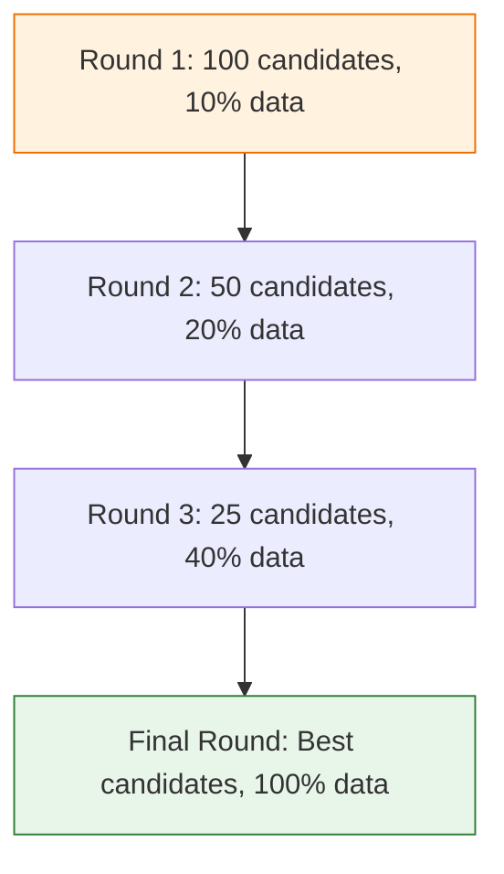
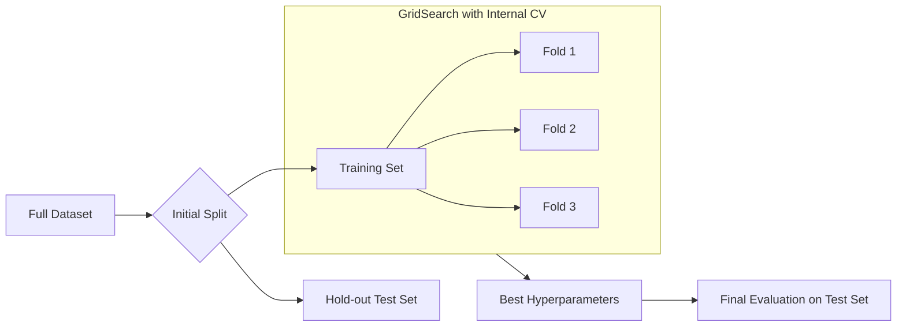

In Machine Learning, there is a crucial difference between **Parameters** and **Hyperparameters**:

* **Parameters:** Learned by the model during training (e.g., weights in a regression or coefficients in a neural network).
* **Hyperparameters:** Set by the engineer *before* training starts (e.g., the depth of a Decision Tree or the number of neighbors in KNN).

**Hyperparameter Tuning** is the automated search for the best combination of these settings to minimize error.

## 1. Why Tune Hyperparameters?

Most algorithms come with default settings that work reasonably well, but they are rarely optimal for your specific data. Proper tuning can often bridge the gap between a mediocre model and a state-of-the-art one.

## 2. GridSearchCV: The Exhaustive Search

`GridSearchCV` takes a predefined list of values for each hyperparameter and tries **every possible combination**. 

* **Pros:** Guaranteed to find the best combination within the provided grid.
* **Cons:** Computationally expensive. If you have 5 parameters with 5 values each, you must train the model $5^5 = 3,125$ times.

```python
from sklearn.model_selection import GridSearchCV
from sklearn.ensemble import RandomForestClassifier

param_grid = {
    'n_estimators': [50, 100, 200],
    'max_depth': [None, 10, 20],
    'min_samples_split': [2, 5]
}

grid_search = GridSearchCV(RandomForestClassifier(), param_grid, cv=5)
grid_search.fit(X_train, y_train)

print(f"Best Parameters: {grid_search.best_params_}")

```

## 3. RandomizedSearchCV: The Efficient Alternative

Instead of trying every combination, `RandomizedSearchCV` picks a fixed number of random combinations from a distribution.

* **Pros:** Much faster than GridSearch. It often finds a result almost as good as GridSearch in a fraction of the time.
* **Cons:** Not guaranteed to find the absolute best "peak" in the parameter space.

```python
from sklearn.model_selection import RandomizedSearchCV
from scipy.stats import randint

param_dist = {
    'n_estimators': randint(50, 500),
    'max_depth': [None, 10, 20, 30, 40, 50],
}

random_search = RandomizedSearchCV(RandomForestClassifier(), param_dist, n_iter=20, cv=5)
random_search.fit(X_train, y_train)

```

## 4. Advanced: Successive Halving

For massive datasets, even Random Search is slow. Scikit-Learn offers **HalvingGridSearch**. It trains all combinations on a small amount of data, throws away the bottom 50%, and keeps "promising" candidates for the next round with more data.



## 5. Avoiding the Validation Trap

If you tune your hyperparameters using the **Test Set**, you are "leaking" information. The model will look great on that test set, but fail on new data.

**The Solution:** Use **Nested Cross-Validation** or ensure that your `GridSearchCV` only uses the **Training Set** (it will internally split the training data into smaller validation folds).



## 6. Tuning Strategy Summary

| Method | Best for... | Resource Usage |
| --- | --- | --- |
| **Manual Tuning** | Initial exploration / small models | Low |
| **GridSearch** | Small number of parameters | High |
| **RandomSearch** | Many parameters / large search space | Moderate |
| **Halving Search** | Large datasets / expensive training | Low-Moderate |

## References for More Details

* **[Sklearn Tuning Guide](https://scikit-learn.org/stable/modules/grid_search.html):** Deep dive into `HalvingGridSearchCV` and custom scoring.

---

**Now that your model is fully optimized and tuned, it's time to evaluate its performance using metrics that go beyond simple "Accuracy."**