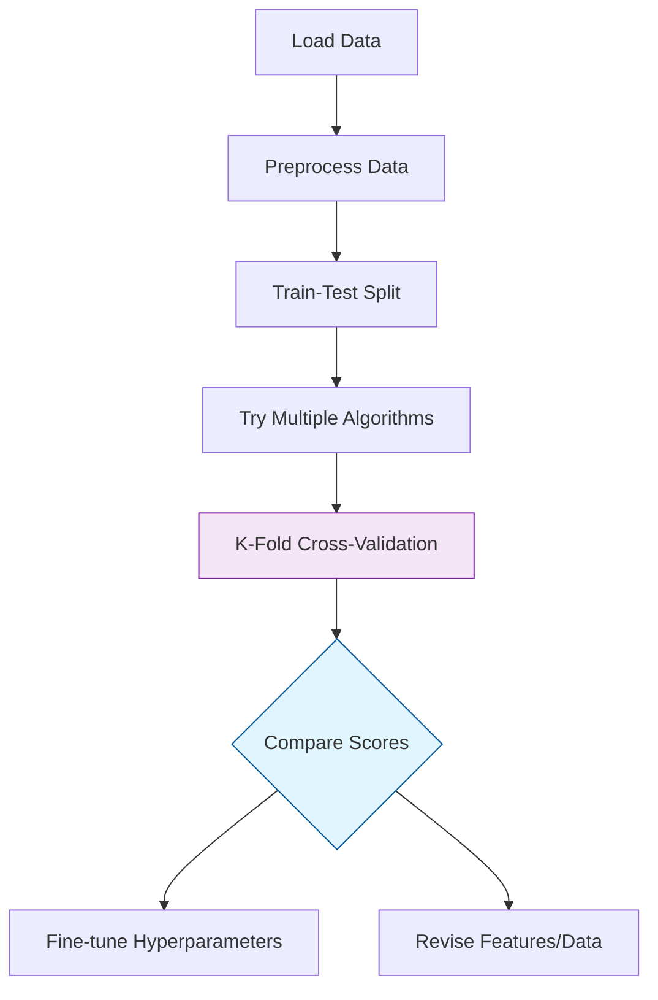

**Model Selection** is the process of selecting the most appropriate Machine Learning algorithm for a specific task. However, a model that performs perfectly on your training data might fail miserably in the real world. To prevent this, we use validation techniques to ensure our model **generalizes**.

## 1. The Scikit-Learn Estimator API

In Scikit-Learn, every model (classifier or regressor) is an **Estimator**. They all share a consistent interface:

1.  **Initialize:** `model = RandomForestClassifier()`
2.  **Train:** `model.fit(X_train, y_train)`
3.  **Predict:** `y_pred = model.predict(X_test)`

## 2. Training vs. Testing: The Fundamental Split

The "Golden Rule" of Machine Learning is to never evaluate your model on the same data it used for training. We use `train_test_split` to create a "hidden" set of data.

```python
from sklearn.model_selection import train_test_split

# Usually 80% for training and 20% for testing
X_train, X_test, y_train, y_test = train_test_split(
    X, y, test_size=0.2, random_state=42, stratify=y
)

```

:::tip Why `stratify=y`?
For classification, this ensures the ratio of classes (e.g., 90% "No" and 10% "Yes") is identical in both the training and testing sets.
:::

## 3. Cross-Validation (K-Fold)

A single train-test split can be lucky or unlucky depending on which rows ended up in the test set. **K-Fold Cross-Validation** provides a more stable estimate of model performance.

**How it works:**

1. Split the data into  equal parts (folds).
2. Train the model  times. Each time, use 1 fold for testing and the remaining  folds for training.
3. Average the scores from all  rounds.

### Implementation: `cross_val_score`

```python
from sklearn.model_selection import cross_val_score
from sklearn.ensemble import RandomForestClassifier

model = RandomForestClassifier()

# Perform 5-Fold Cross Validation
scores = cross_val_score(model, X, y, cv=5)

print(f"Mean Accuracy: {scores.mean():.2f}")
print(f"Standard Deviation: {scores.std():.2f}")

```

## 4. Comparing Different Models

Model selection often involves running several candidates through the same validation pipeline to see which performs best.

| Algorithm | Strengths | Weaknesses |
| --- | --- | --- |
| **Logistic Regression** | Fast, interpretable | Assumes linear relationships |
| **Decision Trees** | Easy to visualize | Prone to overfitting |
| **Random Forest** | Robust, handles non-linear data | Slower, "Black box" |
| **SVM** | Good for high dimensions | Memory intensive |

## 5. Learning Curves: Diagnosing Your Model

A **Learning Curve** plots the training and validation error against the number of training samples. It helps you identify:

* **High Bias (Underfitting):** Both training and validation errors are high.
* **High Variance (Overfitting):** Low training error but high validation error.

## 6. The Model Selection Workflow



## References for More Details

* **[Scikit-Learn Model Evaluation](https://scikit-learn.org/stable/modules/model_evaluation.html):** Learning about scoring metrics like F1-Score and ROC-AUC.
* **[Cross-Validation Guide](https://scikit-learn.org/stable/modules/cross_validation.html):** Advanced techniques like `StratifiedKFold` and `TimeSeriesSplit`.

---

**Selecting the right model is only half the battle. Once you've chosen an algorithm, you need to "turn the knobs" to find its peak performance.**