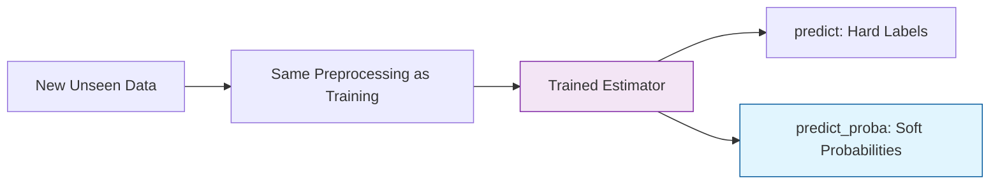

Once a model has been trained using `.fit()`, it is ready for **Inference**. In Scikit-Learn, this is handled by a consistent set of methods that allow you to generate outcomes for new data.

## 1. Point Predictions with `.predict()`

The most common way to get an answer from your model is the `.predict()` method. It returns a single value for each input sample.

* **In Regression:** Returns the predicted continuous value (e.g., $250,000$).
* **In Classification:** Returns the predicted class label (e.g., "Spam").

```python
from sklearn.ensemble import RandomForestClassifier

# Assuming model is already trained
# X_new contains unseen samples
predictions = model.predict(X_new)

print(f"Predicted labels: {predictions}")

```

## 2. Predicting Probabilities with `.predict_proba()`

In many classification tasks, knowing the **label** isn't enough; you need to know how **confident** the model is. Most Scikit-Learn classifiers provide the `.predict_proba()` method.

It returns an array of shape `(n_samples, n_classes)`, where each value represents the probability of a sample belonging to a specific class.

```python
# Returns probabilities for [Class 0, Class 1]
probs = model.predict_proba(X_new)

# Example output: [0.1, 0.9] means 90% confidence it is Class 1
print(f"Confidence levels: {probs}")

```

### Why use probabilities?

1. **Risk Management:** In medical diagnosis, you might only take action if the probability is .
2. **Threshold Tuning:** By default, `.predict()` uses a  threshold. You can manually set a higher threshold to reduce False Positives.

## 3. Decision Functions

Some models, like **SVM (Support Vector Machines)** or **Linear Classifiers**, provide a `.decision_function()`.

Unlike probabilities (which range from  to ), the decision function returns a "signed distance" to the decision boundary.

* **Positive value:** Predicted as the positive class.
* **Negative value:** Predicted as the negative class.
* **Magnitude:** Indicates how far the point is from the boundary (certainty).

## 4. Predicting in Regression

For regression models, `.predict()` returns the expected numerical value. Note that standard Scikit-Learn regression models do not provide "probabilities" because the output is a continuous range, not a discrete set of classes.

$$
\hat{y} = w_1x_1 + w_2x_2 + ... + b
$$

## 5. Deployment Checklist: The "Input Shape" Trap

One of the most frequent errors during prediction is a **Shape Mismatch**.

* Scikit-Learn estimators expect a **2D array** for the input .
* If you are predicting for a **single sample**, you must reshape it.

```python
# Error: model.predict([1, 2, 3]) 
# Correct:
single_sample = [1, 2, 3]
model.predict([single_sample]) # Wrapped in a list to make it 2D

```

## 6. The Workflow Summary



## References for More Details

* **[Probability Calibration](https://scikit-learn.org/stable/modules/calibration.html):** Learning how to turn decision scores into reliable probability estimates.

---

**Predictions are useless if they aren't accurate. Now that you know how to get answers from your model, you must learn how to verify if those answers are correct.**