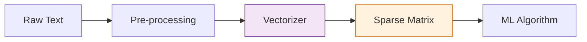

Machine Learning algorithms operate on fixed-size numerical arrays. They cannot understand a sentence like *"I love this product"* directly. To process text, we must convert it into numbers. In Scikit-Learn, this process is called **Feature Extraction** or **Vectorization**.

## 1. The Bag of Words (BoW) Model

The simplest way to turn text into numbers is to count how many times each word appears in a document. This is known as the **Bag of Words** approach.

1.  **Tokenization:** Breaking sentences into individual words (tokens).
2.  **Vocabulary Building:** Collecting all unique words across all documents.
3.  **Encoding:** Creating a vector for each document representing word counts.

### Implementation: `CountVectorizer`

```python
from sklearn.feature_extraction.text import CountVectorizer

corpus = [
    'Machine learning is great.',
    'Learning machine learning is fun.',
    'Data science is the future.'
]

vectorizer = CountVectorizer()
X = vectorizer.fit_transform(corpus)

# View the vocabulary
print(vectorizer.get_feature_names_out())
# View the resulting matrix
print(X.toarray())

```

## 2. TF-IDF: Beyond Simple Counts

A major problem with simple counts is that words like "is", "the", and "and" appear frequently but carry very little meaning. **TF-IDF (Term Frequency-Inverse Document Frequency)** fixes this by penalizing words that appear too often across all documents.

$$
W_{i,j} = TF_{i,j} \times \log\left(\frac{N}{DF_i}\right)
$$

* **TF (Term Frequency):** How often a word appears in a specific document.
* **IDF (Inverse Document Frequency):** How rare a word is across the entire corpus.

### Implementation: `TfidfVectorizer`

```python
from sklearn.feature_extraction.text import TfidfVectorizer

tfidf = TfidfVectorizer()
X_tfidf = tfidf.fit_transform(corpus)

# High values are given to unique, meaningful words like 'future' or 'fun'
print(X_tfidf.toarray())

```

## 3. Handling Large Vocabularies: Hashing

If you have millions of unique words, your feature matrix becomes massive and may crash your memory. The **HashingVectorizer** uses a mathematical hash function to map words to a fixed number of features without storing a vocabulary in memory.

## 4. Text Preprocessing Pipeline

Before vectorizing, it is common practice to "clean" the text to reduce noise:

* **Lowercasing:** Converting all text to lowercase.
* **Stop-word Removal:** Removing common words (a, an, the) using `stop_words='english'`.
* **N-grams:** Looking at pairs or triplets of words (e.g., "not good" instead of just "not" and "good") using `ngram_range=(1, 2)`.

```python
# Advanced Vectorizer configuration
vectorizer = CountVectorizer(
    stop_words='english', 
    ngram_range=(1, 2), # Captures single words and two-word phrases
    max_features=1000   # Only keep the top 1000 most frequent words
)

```

## 5. The "Sparsity" Challenge

Text data results in **Sparse Matrices**. Since most documents only contain a tiny fraction of the total vocabulary, most entries in your matrix will be zero. Scikit-Learn stores these as `scipy.sparse` objects to save RAM.



## References for More Details

* **[Sklearn Text Feature Extraction](https://scikit-learn.org/stable/modules/feature_extraction.html#text-feature-extraction):** Understanding the math behind TF-IDF implementation.
* **[Natural Language Processing with Python](https://www.nltk.org/book/):** Deep diving into linguistics and advanced tokenization.

---

**Now that you can convert text and numbers into features, you need to learn how to organize these steps into a clean, repeatable workflow.**