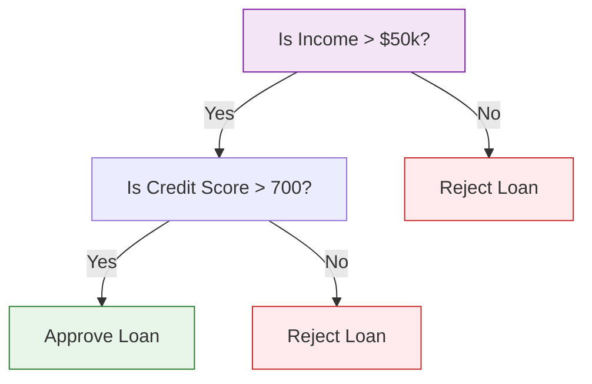

A **Decision Tree** is a non-parametric supervised learning method used for both classification and regression. The goal is to create a model that predicts the value of a target variable by learning simple decision rules inferred from the data features.

Think of a Decision Tree as a flow chart where each internal node represents a "test" on an attribute, each branch represents the outcome of the test, and each leaf node represents a class label.

## 1. Anatomy of a Tree

* **Root Node:** The very top node that represents the entire dataset. It is the first split.
* **Internal Node:** A point where the data is split based on a specific feature.
* **Leaf Node:** The final output nodes that contain the prediction. No further splits occur here.
* **Branches:** The paths connecting nodes based on the outcome of a decision.

## 2. How the Tree Decides to Split

The algorithm aims to split the data into subsets that are as "pure" as possible. A subset is pure if all data points in it belong to the same class.

### Gini Impurity

This is the default metric used by Scikit-Learn. It measures the probability of a random sample being misclassified.

$$
Gini = 1 - \sum_{i=1}^{n} (p_i)^2
$$

**Where:**

* $p_i$ is the probability of an object being classified to a particular class.

### Information Gain (Entropy)

Based on Information Theory, it measures the "disorder" or uncertainty in the data.

$$
H(S) = -\sum_{i=1}^{n} p_i \log_2(p_i)
$$

**Where:**

* $p_i$ is the proportion of instances in class $i$.

## 3. The Problem of Overfitting

Decision Trees are notorious for **overfitting**. Left unchecked, a tree will continue to split until every single data point has its own leaf, essentially "memorizing" the training data rather than finding patterns.

**How to stop the tree from growing too much:**
* **max_depth:** Limit how "tall" the tree can get.
* **min_samples_split:** The minimum number of samples required to split an internal node.
* **min_samples_leaf:** The minimum number of samples required to be at a leaf node.
* **Pruning:** Removing branches that provide little power to classify instances.

```mermaid
graph LR
    X["$$X$$ (Training Data)"] --> ODT["Overfitted Decision Tree"]

    ODT --> O1["$$\text{Very Deep Tree}$$"]
    O1 --> O2["$$\text{Many Splits}$$"]
    O2 --> O3["$$\text{Memorizes Noise}$$"]
    O3 --> O4["$$\text{Low Bias,\ High Variance}$$"]
    O4 --> O5["$$\text{Training Accuracy} \approx 100\%$$"]
    O5 --> O6["$$\text{Poor Generalization}$$"]

    X --> PDT["Pruned Decision Tree"]

    PDT --> P1["$$\text{Limited Depth}$$"]
    P1 --> P2["$$\text{Fewer Splits}$$"]
    P2 --> P3["$$\text{Removes Irrelevant Branches}$$"]
    P3 --> P4["$$\text{Balanced Bias–Variance}$$"]
    P4 --> P5["$$\text{Better Test Accuracy}$$"]
    P5 --> P6["$$\text{Good Generalization}$$"]

    O6 -.->|"$$\text{Comparison}$$"| P6
```



In this diagram, we see two paths from the same training data: one leading to an overfitted decision tree and the other to a pruned decision tree. The overfitted tree has very low bias but high variance, resulting in nearly perfect training accuracy but poor generalization to new data. In contrast, the pruned tree balances bias and variance, leading to better test accuracy and generalization.

## 4. Implementation with Scikit-Learn

```python
from sklearn.tree import DecisionTreeClassifier, plot_tree
import matplotlib.pyplot as plt

# 1. Initialize with constraints to prevent overfitting
model = DecisionTreeClassifier(max_depth=3, criterion='gini')

# 2. Train
model.fit(X_train, y_train)

# 3. Visualize the Tree
plt.figure(figsize=(12,8))
plot_tree(model, filled=True, feature_names=feature_cols)
plt.show()

```

## 5. Pros and Cons

| Advantages | Disadvantages |
| --- | --- |
| **Interpretable:** Easy to explain to non-technical stakeholders. | **High Variance:** Small changes in data can result in a completely different tree. |
| **No Scaling Required:** Does not require feature normalization or standardization. | **Overfitting:** Extremely prone to capturing noise in the data. |
| Handles both numerical and categorical data. | **Bias:** Can create biased trees if some classes dominate. |

## 6. Mathematical Visualisation



## References for More Details

* **[Scikit-Learn Tree Module](https://scikit-learn.org/stable/modules/tree.html):** Understanding the algorithmic implementation (CART).

---

**Single Decision Trees are weak learners. To build a truly robust model, we combine hundreds of trees into a "forest."**