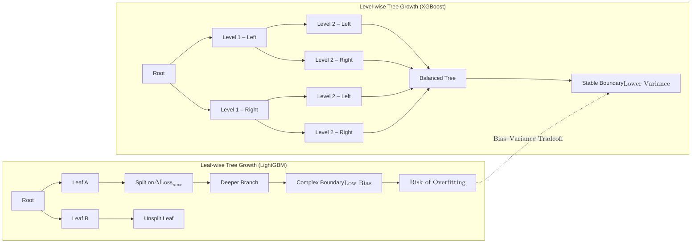

**Gradient Boosting** is an ensemble technique that builds models sequentially. Unlike [Random Forest](./random-forest), which builds trees independently in parallel, Gradient Boosting builds one tree at a time, where each new tree attempts to correct the errors (residuals) made by the previous trees.

## 1. How Boosting Works

The core idea is **Additive Modeling**. We start with a very simple model and keep adding "corrective" models until the error is minimized.

1.  **Base Model:** Start with a simple prediction (usually the mean of the target values).
2.  **Calculate Residuals:** Find the difference between the actual values and the current prediction.
3.  **Train on Errors:** Fit a new "weak" decision tree to predict those residuals (errors), not the actual target.
4.  **Update Prediction:** Add the new tree's prediction to the previous model's prediction.
5.  **Repeat:** Continue this process for $N$ iterations.

## 2. Gradient Descent in Boosting

Gradient Boosting gets its name because it uses the **Gradient Descent** algorithm to minimize the loss function. 

In each step, the algorithm identifies the direction in which the loss (error) decreases most rapidly and adds a new tree that moves the model in that direction.

$$
F_{m}(x) = F_{m-1}(x) + \nu \cdot h_m(x)
$$

* $F_{m}(x)$: The updated model.
* $F_{m-1}(x)$: The model from the previous step.
* $\nu$ (Nu): The **Learning Rate** (Shrinkage). It scales the contribution of each tree to prevent overfitting.
* $h_m(x)$: The new tree trained on residuals.

## 3. Key Hyperparameters

* **learning_rate:** Determines how much each tree contributes to the final result. Lower values usually require more trees but lead to better generalization.
* **n_estimators:** The number of sequential trees to be modeled.
* **subsample:** The fraction of samples to be used for fitting the individual base learners. Using less than 1.0 leads to **Stochastic Gradient Boosting**.
* **max_depth:** Limits the complexity of each individual tree (usually kept shallow, e.g., 3-5).

## 4. Popular Implementations

While Scikit-Learn has a `GradientBoostingClassifier`, the data science community often uses specialized libraries for better speed and performance:

1.  **XGBoost (Extreme Gradient Boosting):** Optimized for speed and performance; includes built-in regularization.
2.  **LightGBM:** Uses a "leaf-wise" growth strategy; extremely fast and memory-efficient for large datasets.
3.  **CatBoost:** Specifically designed to handle categorical features automatically without manual encoding.



## 5. Implementation with Scikit-Learn

```python
from sklearn.ensemble import GradientBoostingClassifier

# 1. Initialize the Gradient Booster
# Note: learning_rate and n_estimators have a trade-off
gbc = GradientBoostingClassifier(
    n_estimators=100, 
    learning_rate=0.1, 
    max_depth=3, 
    random_state=42
)

# 2. Train the model
gbc.fit(X_train, y_train)

# 3. Predict
y_pred = gbc.predict(X_test)

```

## 6. Pros and Cons

| Advantages | Disadvantages |
| --- | --- |
| **State-of-the-art Accuracy:** Often wins Kaggle competitions for tabular data. | **Sequential Training:** Slower to train than Random Forest because trees cannot be built in parallel. |
| **Flexibility:** Can optimize almost any differentiable loss function. | **Hyperparameter Sensitive:** Requires careful tuning of learning rate and tree counts to avoid overfitting. |
| **Handles Non-linearities:** Captures complex interactions between features. | **Black Box:** Much harder to interpret than a single Decision Tree. |

## References for More Details

* **[XGBoost Documentation](https://xgboost.readthedocs.io/):** Learning about advanced regularization and hardware acceleration.
