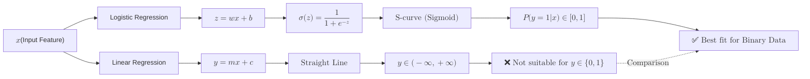

**Logistic Regression** is the go-to algorithm for binary classification (problems with two possible outcomes). While Linear Regression predicts a continuous number, Logistic Regression predicts the **probability** that an input belongs to a specific category.

## 1. The Sigmoid Function

The core difference between linear and logistic regression is the **Activation Function**. To turn a real-valued number into a probability between $0$ and $1$, we use the **Sigmoid (or Logistic) function**.

**The Formula:**

$$
\sigma(z) = \frac{1}{1 + e^{-z}}
$$

**Where:**
* $z$ is the input (a linear combination of features).
* $e$ is Euler's number (approximately $2.71828$).

**Key Properties:**
* If $z$ is a large positive number, $\sigma(z)$ approaches $1$.
* If $z$ is a large negative number, $\sigma(z)$ approaches $0$.
* If $z = 0$, $\sigma(z) = 0.5$.

## 2. From Linear to Logistic

Logistic Regression starts by calculating a linear combination of inputs, just like Linear Regression:
    
$$
z = \beta_0 + \beta_1x_1 + \beta_2x_2 + ...
$$

It then passes that result through the Sigmoid function to get the probability ($p$):

$$
p = \sigma(z)
$$



## 3. The Decision Boundary

To make a final classification, we apply a **threshold** (usually $0.5$).
* If $p \geq 0.5$, classify as **Class 1** (e.g., "Spam").
* If $p < 0.5$, classify as **Class 0** (e.g., "Not Spam").

The line (or plane) where the probability is exactly $0.5$ is called the **Decision Boundary**.

## 4. Implementation with Scikit-Learn

```python
from sklearn.linear_model import LogisticRegression
from sklearn.model_selection import train_test_split

# 1. Initialize the model
# 'liblinear' is a good solver for small datasets
model = LogisticRegression(solver='liblinear')

# 2. Train
model.fit(X_train, y_train)

# 3. Predict Class Labels
y_pred = model.predict(X_test)

# 4. Predict Probabilities
y_probs = model.predict_proba(X_test)[:, 1] # Probability of being Class 1

```

## 5. Cost Function: Log Loss

In Linear Regression, we use Mean Squared Error. However, because of the Sigmoid function, MSE would result in a non-convex function that is hard to optimize. Instead, Logistic Regression uses **Log Loss** (Cross-Entropy).

Log Loss penalizes the model heavily when it is confident about a wrong prediction.

$$
J(\theta) = -\frac{1}{m} \sum_{i=1}^{m} [y^{(i)} \log(\hat{y}^{(i)}) + (1 - y^{(i)}) \log(1 - \hat{y}^{(i)})]
$$

## 6. Multi-class Classification (One-vs-Rest)

By default, Logistic Regression is binary. To handle multiple classes (e.g., classifying an image as "Cat", "Dog", or "Bird"), Scikit-Learn uses the **One-vs-Rest (OvR)** strategy, where it trains one binary classifier per class.

## 7. Pros and Cons

| Advantages | Disadvantages |
| --- | --- |
| Highly interpretable (you can see feature weights). | Assumes a linear relationship between features and log-odds. |
| Fast to train and predict. | Easily outperformed by more complex models (like Random Forests). |
| Provides probabilities, not just hard labels. | Can struggle with highly non-linear data. |


## References for More Details

* **[Scikit-Learn Logistic Regression Documentation](https://scikit-learn.org/stable/modules/generated/sklearn.linear_model.LogisticRegression.html):** Understanding regularization parameters like `C` (inverse of regularization strength).
* In this video, StatQuest provides an excellent visual explanation of Logistic Regression concepts:

<div className="px-4">
<LiteYouTubeEmbed
  id="yIYKR4sgzI8"
  params="autoplay=1&autohide=1&showinfo=0&rel=0"
  title="StatQuest: Logistic Regression"
  poster="maxresdefault"
  webp
/>
</div>

<br />

---

**Logistic Regression is a "linear" classifier. What if your data is organized like a flowchart?**