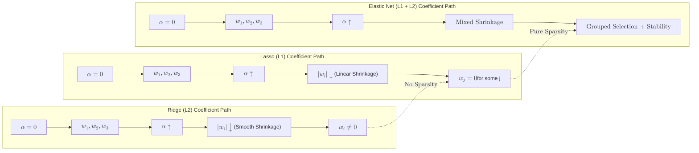

**Elastic Net** is a regularized regression method that linearly combines the $L1$ and $L2$ penalties of the [Lasso](./lasso) and [Ridge](./ridge) methods.

It was developed to overcome the limitations of Lasso, particularly when dealing with highly correlated features or situations where the number of features exceeds the number of samples.

## 1. The Mathematical Objective

Elastic Net adds both penalties to the loss function. It uses a ratio to determine how much of each penalty to apply.

The cost function is:

$$
Cost = \text{MSE} + \alpha \cdot \rho \sum_{j=1}^{p} |\beta_j| + \frac{\alpha \cdot (1 - \rho)}{2} \sum_{j=1}^{p} \beta_j^2
$$

* **$\alpha$ (Alpha):** The overall regularization strength.
* **$\rho$ (L1 Ratio):** Controls the mix between Lasso and Ridge.
    * If $\rho = 1$, it is pure **Lasso**.
    * If $\rho = 0$, it is pure **Ridge**.
    * If $0 < \rho < 1$, it is a **combination**.

## 2. Why use Elastic Net?

### A. Overcoming Lasso's Limitations
Lasso tends to pick one variable from a group of highly correlated variables and ignore the others. Elastic Net is more likely to keep the whole group in the model (the "grouping effect") thanks to the Ridge component.

### B. High-Dimensional Data
In cases where the number of features ($p$) is greater than the number of observations ($n$), Lasso can only select at most $n$ variables. Elastic Net can select more than $n$ variables if necessary.

### C. Maximum Flexibility
Because you can tune the ratio, you can "slide" your model anywhere on the spectrum between Ridge and Lasso to find the exact point that minimizes validation error.



## 3. Key Hyperparameters in Scikit-Learn

* **`alpha`**: Constant that multiplies the penalty terms. High values mean more regularization.
* **`l1_ratio`**: The $\rho$ parameter. Scikit-Learn uses `l1_ratio=0.5` by default, giving equal weight to $L1$ and $L2$.

## 4. Implementation with Scikit-Learn

```python
from sklearn.linear_model import ElasticNet
from sklearn.preprocessing import StandardScaler

# 1. Scaling is mandatory
scaler = StandardScaler()
X_scaled = scaler.fit_transform(X)

# 2. Initialize and Train
# l1_ratio=0.5 means 50% Lasso, 50% Ridge
model = ElasticNet(alpha=1.0, l1_ratio=0.5)
model.fit(X_scaled, y)

# 3. View the results
print(f"Coefficients: {model.coef_}")

```

## 5. Decision Matrix: Which one to use?

| Scenario | Recommended Model |
| --- | --- |
| Most features are useful and small. | **Ridge** |
| You suspect only a few features are actually important. | **Lasso** |
| You have many features that are highly correlated with each other. | **Elastic Net** |
| Number of features is much larger than the number of samples ($p \gg n$). | **Elastic Net** |


## 6. Automated Tuning with ElasticNetCV

Like Ridge and Lasso, Scikit-Learn provides a cross-validation version that tests multiple `alpha` values and `l1_ratio` values to find the best combination for you.

```python
from sklearn.linear_model import ElasticNetCV

# Search for the best alpha and l1_ratio
model_cv = ElasticNetCV(l1_ratio=[.1, .5, .7, .9, .95, .99, 1], cv=5)
model_cv.fit(X_scaled, y)

print(f"Best Alpha: {model_cv.alpha_}")
print(f"Best L1 Ratio: {model_cv.l1_ratio_}")

```

## References for More Details

* **[Scikit-Learn ElasticNet Documentation](https://scikit-learn.org/stable/modules/generated/sklearn.linear_model.ElasticNet.html):** Understanding technical parameters like `tol` (tolerance) and `max_iter`.

---

**You've now covered all the primary linear regression models! But what if your goal isn't to predict a number, but to group similar data points together?** Head over to the [Clustering](/category/clustering) section to explore techniques like K-Means and DBSCAN!