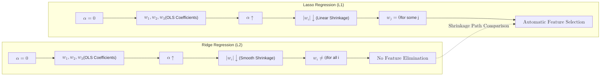

**Lasso Regression** (Least Absolute Shrinkage and Selection Operator) is a type of linear regression that uses **L1 Regularization**. 

While standard Linear Regression tries to minimize only the error, Lasso adds a penalty equal to the absolute value of the magnitude of the coefficients. This forces the model to not only be accurate but also as simple as possible.

## 1. The Mathematical Objective

Lasso minimizes the following cost function:

$$
Cost = \text{MSE} + \alpha \sum_{j=1}^{p} |\beta_j|
$$

Where:

* **MSE (Mean Squared Error):** Keeps the model accurate.
* **$\alpha$ (Alpha):** The tuning parameter that controls the strength of the penalty.
* **$|\beta_j|$:** The absolute value of the coefficients.

## 2. Feature Selection: The Power of Zero

The most significant difference between Lasso and its sibling, [Ridge Regression](./ridge), is that Lasso can shrink coefficients **exactly to zero**.

When a coefficient becomes zero, that feature is effectively removed from the model. This makes Lasso an excellent tool for:
1.  **Automated Feature Selection:** Identifying the most important variables in a dataset with hundreds of features.
2.  **Model Interpretability:** Creating "sparse" models that are easier for humans to understand.



## 3. Choosing the Alpha ($\alpha$) Parameter

* **If $\alpha = 0$:** The penalty is removed, and the result is standard Ordinary Least Squares (OLS).
* **As $\alpha$ increases:** More coefficients are pushed to zero, leading to a simpler, more biased model.
* **If $\alpha$ is too high:** All coefficients become zero, and the model predicts only the mean (Underfitting).

## 4. Implementation with Scikit-Learn

```python
from sklearn.linear_model import Lasso
from sklearn.preprocessing import StandardScaler

# 1. Scaling is REQUIRED for Lasso
scaler = StandardScaler()
X_train_scaled = scaler.fit_transform(X_train)

# 2. Initialize and Train
# 'alpha' is the regularization strength
lasso = Lasso(alpha=0.1)
lasso.fit(X_train_scaled, y_train)

# 3. Check which features were selected (non-zero)
import pandas as pd
importance = pd.Series(lasso.coef_, index=feature_names)
print(importance[importance != 0])

```

## 5. Lasso vs. Ridge

| Feature | Ridge ($L2$) | Lasso ($L1$) |
| --- | --- | --- |
| **Penalty** | Square of coefficients | Absolute value of coefficients |
| **Coefficients** | Shrink towards zero, but never reach it | Can shrink exactly to **zero** |
| **Use Case** | When most features are useful | When you have many "noisy" or useless features |
| **Model Type** | Dense (all features kept) | Sparse (some features removed) |

## 6. Limitations of Lasso

1. **Correlated Features:** If two features are highly correlated, Lasso will randomly pick one and discard the other, which can lead to instability.
2. **Sample Size:** If , Lasso can select at most  features.

## References for More Details

* **[Scikit-Learn Lasso Documentation](https://scikit-learn.org/stable/modules/generated/sklearn.linear_model.Lasso.html):** Exploring `LassoCV`, which automatically finds the best Alpha using cross-validation.