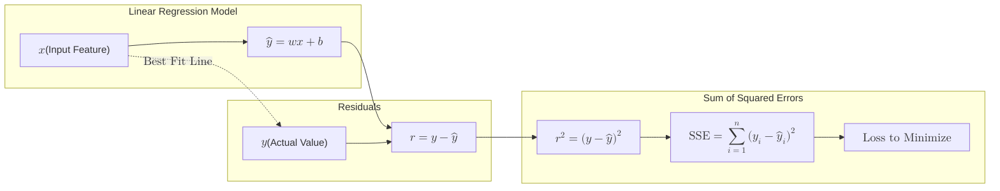

**Linear Regression** is a supervised learning algorithm used to predict a continuous numerical output based on one or more input features. It assumes that there is a linear relationship between the input variables ($X$) and the single output variable ($y$).

## 1. The Mathematical Model

The goal of linear regression is to find the "Line of Best Fit." Mathematically, this line is represented by the equation:

$$
y = \beta_0 + \beta_1x_1 + \beta_2x_2 + ... + \epsilon
$$

Where:

* **$y$**: The dependent variable (Target).
* **$x$**: The independent variables (Features).
* **$\beta_0$**: The **Intercept** (where the line crosses the y-axis).
* **$\beta_1, \beta_2$**: The **Coefficients** or Slopes (representing the weight of each feature).
* **$\epsilon$**: The error term (Residual).

## 2. Ordinary Least Squares (OLS)

How does the model find the "best" line? It uses a method called **Ordinary Least Squares**. 

The algorithm calculates the distance between every actual data point and the predicted point on the line. It then squares these distances (to remove negative signs) and sums them up. The "best" line is the one that minimizes this **Sum of Squared Errors (SSE)**.



In this diagram:

* The input feature ($x$) is fed into the linear model to produce a predicted value ($\hat{y}$).
* The residual ($r$) is calculated as the difference between the actual value ($y$) and the predicted value ($\hat{y}$).
* The squared residuals are summed up to compute the SSE, which the model aims to minimize.


## 3. Simple vs. Multiple Linear Regression

* **Simple Linear Regression:** Uses only one feature to predict the target (e.g., predicting house price based *only* on square footage).
* **Multiple Linear Regression:** Uses two or more features (e.g., predicting house price based on square footage, number of bedrooms, and age of the house).

## 4. Key Assumptions

For Linear Regression to be effective and reliable, the data should ideally meet these criteria:
1.  **Linearity:** The relationship between $X$ and $y$ is a straight line.
2.  **Independence:** Observations are independent of each other.
3.  **Homoscedasticity:** The variance of residual errors is constant across all levels of the independent variables.
4.  **Normality:** The residuals (errors) of the model are normally distributed.

## 5. Implementation with Scikit-Learn

```python title="Linear Regression with Scikit-Learn"
import numpy as np
import pandas as pd
from sklearn.model_selection import train_test_split
from sklearn.linear_model import LinearRegression
from sklearn.metrics import mean_squared_error, r2_score

# --------------------------------------------------
# 1. Create a sample dataset
# --------------------------------------------------
# Example: Predict salary based on years of experience

np.random.seed(42)

X = np.array([1, 2, 3, 4, 5, 6, 7, 8, 9, 10]).reshape(-1, 1)  # Feature
y = np.array([30, 35, 37, 42, 45, 50, 52, 56, 60, 65])      # Target

# --------------------------------------------------
# 2. Split the data into training and testing sets
# --------------------------------------------------
X_train, X_test, y_train, y_test = train_test_split(
    X, y, test_size=0.2, random_state=42
)

# --------------------------------------------------
# 3. Initialize the Linear Regression model
# --------------------------------------------------
model = LinearRegression()

# --------------------------------------------------
# 4. Train the model
# --------------------------------------------------
model.fit(X_train, y_train)

# --------------------------------------------------
# 5. Make predictions
# --------------------------------------------------
y_pred = model.predict(X_test)

# --------------------------------------------------
# 6. Inspect learned parameters
# --------------------------------------------------
print(f"Intercept (β₀): {model.intercept_}")
print(f"Coefficient (β₁): {model.coef_[0]}")

# --------------------------------------------------
# 7. Evaluate the model
# --------------------------------------------------
mse = mean_squared_error(y_test, y_pred)
r2 = r2_score(y_test, y_pred)

print(f"Mean Squared Error (MSE): {mse}")
print(f"R² Score: {r2}")

# --------------------------------------------------
# 8. Compare actual vs predicted values
# --------------------------------------------------
results = pd.DataFrame({
    "Actual": y_test,
    "Predicted": y_pred
})

print("\nPrediction Results:")
print(results)

```

```bash title="Output"
Intercept (β₀): 26.025862068965512
Coefficient (β₁): 3.836206896551725
Mean Squared Error (MSE): 0.9994426278240237
R² Score: 0.9936035671819262

Prediction Results:
   Actual  Predicted
0      60  60.551724
1      35  33.698276

```


## 6. Evaluating Regression

Unlike classification (where we use accuracy), we evaluate regression using error metrics:

* **Mean Squared Error (MSE):** The average of the squared differences between predicted and actual values.
* **Root Mean Squared Error (RMSE):** The square root of MSE (brings the error back to the original units).
* **R-Squared ($R^2$):** Measures how much of the variance in $y$ is explained by the model (ranges from 0 to 1).

```python title="Evaluating Linear Regression Model"
from sklearn.metrics import mean_squared_error, r2_score
import numpy as np

# Calculate evaluation metrics
mse = mean_squared_error(y_test, y_pred)
rmse = np.sqrt(mse)   # Root Mean Squared Error
r2 = r2_score(y_test, y_pred)

# Display results
print("Model Evaluation Metrics")
print("------------------------")
print(f"Mean Squared Error (MSE): {mse:.4f}")
print(f"Root Mean Squared Error (RMSE): {rmse:.4f}")
print(f"R-Squared (R²): {r2:.4f}")
```

```bash title="Output"
Model Evaluation Metrics
------------------------
Mean Squared Error (MSE): 0.9994
Root Mean Squared Error (RMSE): 0.9997
R-Squared (R²): 0.9936
```

## 7. Pros and Cons

| Advantages | Disadvantages |
| --- | --- |
| **Highly Interpretable:** You can see exactly how much each feature influences the result. | **Sensitive to Outliers:** A single extreme value can significantly tilt the line. |
| **Fast:** Requires very little computational power. | **Assumption Heavy:** Fails if the underlying relationship is non-linear. |
| **Baseline Model:** Excellent starting point for any regression task. | **Overfitting:** Can overfit if there are too many features (Multicollinearity). |

## References for More Details

* **[Scikit-Learn Linear Models](https://scikit-learn.org/stable/modules/linear_model.html):** Technical details on OLS and alternative solvers.