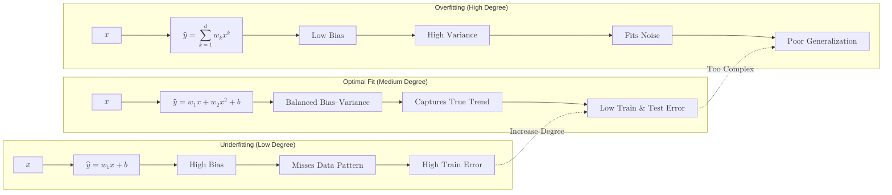

**Polynomial Regression** is a form of regression analysis in which the relationship between the independent variable $x$ and the dependent variable $y$ is modelled as an $n^{th}$ degree polynomial. 

While it fits a non-linear model to the data, as a statistical estimation problem, it is still considered **linear** because the regression function is linear in terms of the unknown parameters ($\beta$) that are estimated from the data.

## 1. Why use Polynomial Regression?

Linear regression requires a straight-line relationship. However, real-world data often follows curves, such as:
* **Growth Rates:** Biological growth or interest rates.
* **Physics:** The path of a projectile or the relationship between speed and braking distance.
* **Economics:** Diminishing returns on investment.

## 2. The Mathematical Equation

In a simple linear model, we have:

$$
y = \beta_0 + \beta_1x_1
$$

In Polynomial Regression, we add higher-degree terms of the same feature:

$$
y = \beta_0 + \beta_1x + \beta_2x^2 + \beta_3x^3 + ... + \beta_nx^n + \epsilon
$$

Where:

* **$y$**: The dependent variable (Target).
* **$x$**: The independent variable (Feature).
* **$\beta_0$**: The Intercept.
* **$\beta_1, \beta_2, ..., \beta_n$**: The Coefficients for each polynomial term.
* **$\epsilon$**: The error term (Residual).

By treating $x^2, x^3, ...$ as distinct features, we allow the model to "bend" to fit the data points.

## 3. The Danger of Degree: Overfitting

Choosing the right **degree** ($n$) is the most critical part of Polynomial Regression:

* **Underfitting (Degree 1):** A straight line that fails to capture the curve in the data.
* **Optimal Fit (Degree 2 or 3):** A smooth curve that captures the general trend.
* **Overfitting (Degree 10+):** A wiggly line that passes through every single data point but fails to predict new data because it has captured the noise instead of the signal.



## 4. Implementation with Scikit-Learn

In Scikit-Learn, we perform Polynomial Regression by using a **Transformer** to generate new features and then passing them to a standard `LinearRegression` model.

```python title="Polynomial Regression with Scikit-Learn"
from sklearn.preprocessing import PolynomialFeatures
from sklearn.linear_model import LinearRegression
from sklearn.pipeline import make_pipeline

# 1. Generate data (Example: a parabola)
# X, y = ... 

# 2. Create a pipeline that:
#    a) Generates polynomial terms (x^2)
#    b) Fits a linear regression to those terms
degree = 2
poly_model = make_pipeline(PolynomialFeatures(degree), LinearRegression())

# 3. Train the model
poly_model.fit(X, y)

# 4. Predict
y_pred = poly_model.predict(X)

```

## 5. Feature Scaling is Mandatory

When you square or cube features, the range of values expands drastically.

* If , then  and .
* If , then  and .

Because of this explosive growth, you should **always scale your features** (e.g., using `StandardScaler`) before or after applying polynomial transformations to prevent numerical instability.

## 6. Pros and Cons

| Advantages | Disadvantages |
| --- | --- |
| Can model complex, non-linear relationships. | Extremely sensitive to outliers. |
| Broad range of functions can be mapped under it. | High risk of overfitting if the degree is too high. |
| Fits into the linear regression framework. | Becomes computationally expensive with many features. |


## References for More Details

* **[Interactive Polynomial Regression Demo](https://phet.colorado.edu/sims/html/least-squares-regression/latest/least-squares-regression_en.html):** Visualizing how adding degrees changes the line of best fit in real-time.

* **[Scikit-Learn: Polynomial Features](https://scikit-learn.org/stable/modules/generated/sklearn.preprocessing.PolynomialFeatures.html):** Understanding how the `interaction_only` parameter works for multiple variables.

---

**Polynomial models can easily become too complex and overfit. How do we keep the model's weights in check?**