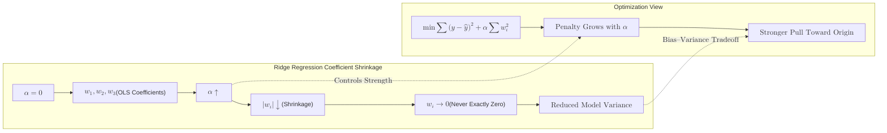
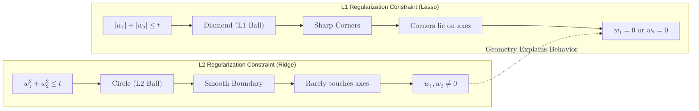

**Ridge Regression** is an extension of linear regression that adds a regularization term to the cost function. It is specifically designed to handle **overfitting** and issues caused by **multicollinearity** (when input features are highly correlated).

## 1. The Mathematical Objective

In standard OLS (Ordinary Least Squares), the model only cares about minimizing the error. In Ridge Regression, we add a "penalty" proportional to the square of the magnitude of the coefficients ($\beta$).

The cost function becomes:

$$
Cost = \text{MSE} + \alpha \sum_{j=1}^{p} \beta_j^2
$$

* **MSE (Mean Squared Error):** The standard loss (prediction error).
* **$\alpha$ (Alpha):** The complexity parameter. It controls how much you want to penalize the size of the coefficients.
* **$\beta_j^2$:** The L2 norm. Squaring the coefficients ensures they stay small but rarely hit exactly zero.

## 2. Why use Ridge?

### A. Preventing Overfitting
When a model has too many features or the features are highly correlated, the coefficients ($\beta$) can become very large. This makes the model extremely sensitive to small fluctuations in the training data. Ridge "shrinks" these coefficients, making the model more stable.

### B. Handling Multicollinearity
If two variables are nearly identical (e.g., height in inches and height in centimeters), standard regression might assign one a massive positive weight and the other a massive negative weight. Ridge forces the weights to be distributed more evenly and kept small.



## 3. The Alpha ($\alpha$) Trade-off

Choosing the right $\alpha$ is a balancing act between **Bias** and **Variance**:

* **$\alpha = 0$:** Equivalent to standard Linear Regression (High variance, Low bias).
* **As $\alpha \to \infty$:** The penalty dominates. Coefficients approach zero, and the model becomes a flat line (Low variance, High bias).

## 4. Implementation with Scikit-Learn

```python
from sklearn.linear_model import Ridge
from sklearn.preprocessing import StandardScaler

# 1. Scaling is MANDATORY for Ridge
# Because the penalty is based on the size of coefficients,
# features with larger scales will be penalized unfairly.
scaler = StandardScaler()
X_train_scaled = scaler.fit_transform(X_train)

# 2. Initialize and Train
# alpha=1.0 is the default
ridge = Ridge(alpha=1.0)
ridge.fit(X_train_scaled, y_train)

# 3. Predict
y_pred = ridge.predict(X_test_scaled)

```

## 5. Ridge vs. Lasso: A Summary

| Feature | Ridge Regression ($L2$) | Lasso Regression ($L1$) |
| --- | --- | --- |
| **Penalty Term** | $\alpha \sum_{j=1}^{p} \beta_j^2$ | $\alpha \sum_{j=1}^{p} \vert \beta_j \vert$ |
| **Mathematical Goal** | Minimizes the **square** of the weights. | Minimizes the **absolute value** of the weights. |
| **Coefficient Shrinkage** | Shrinks coefficients asymptotically toward zero, but they rarely reach exactly zero. | Can shrink coefficients **exactly to zero**, effectively removing the feature. |
| **Feature Selection** | **No.** Keeps all predictors in the final model, though some may have tiny weights. | **Yes.** Acts as an automated feature selector by discarding unimportant variables. |
| **Model Complexity** | Produces a **dense** model (uses all features). | Produces a **sparse** model (uses a subset of features). |
| **Ideal Scenario** | When you have many features that all contribute a small amount to the output. | When you have many features, but only a few are actually significant. |
| **Handling Correlated Data** | Very stable; handles multicollinearity by distributing weights across correlated features. | Less stable; if features are highly correlated, it may randomly pick one and zero out the others. |



## 6. RidgeCV: Finding the Best Alpha

Finding the perfect  manually is tedious. Scikit-Learn provides `RidgeCV`, which uses built-in cross-validation to find the optimal alpha for your specific dataset automatically.

```python
from sklearn.linear_model import RidgeCV

# Define a list of alphas to test
alphas = [0.1, 1.0, 10.0, 100.0]

# RidgeCV finds the best one automatically
ridge_cv = RidgeCV(alphas=alphas)
ridge_cv.fit(X_train_scaled, y_train)

print(f"Best Alpha: {ridge_cv.alpha_}")

```

## References for More Details

* **[Scikit-Learn: Linear Models](https://scikit-learn.org/stable/modules/linear_model.html#ridge-regression):** Technical details on the solvers used (like 'cholesky' or 'sag').
