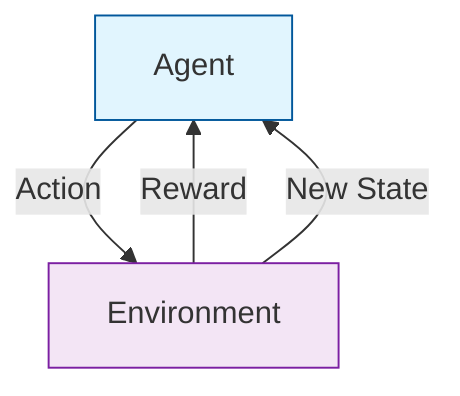

**Reinforcement Learning (RL)** is a type of machine learning where an **Agent** learns to make decisions by performing actions in an **Environment** to maximize a cumulative **Reward**.

Unlike Supervised Learning, where the model is told the "correct" answer, an RL agent learns from the consequences of its actions. It is a process of trial and error, much like how a human learns to ride a bicycle or how a dog is trained with treats.

## 1. The Core Components

To understand RL, you must understand the five pillars of the "RL Loop":

1.  **The Agent:** The AI "learner" or decision-maker (e.g., a self-driving car software).
2.  **The Environment:** The world the agent interacts with (e.g., the road and traffic).
3.  **State ($S$):** The current situation of the agent (e.g., the car's current speed and position).
4.  **Action ($A$):** What the agent does (e.g., steer left, brake, or accelerate).
5.  **Reward ($R$):** Feedback from the environment (e.g., $+10$ points for reaching the destination, $-100$ for a collision).

## 2. The Learning Loop

The process is continuous and follows a cycle:

1. The Agent observes the current **State**.
2. The Agent selects an **Action** based on its "Policy" (strategy).
3. The **Environment** changes in response to the action.
4. The Agent receives a **Reward** or penalty.
5. The Agent updates its strategy to prioritize actions that led to rewards.

## 3. Exploration vs. Exploitation

This is the most famous dilemma in Reinforcement Learning:

* **Exploitation:** The agent performs the action it *knows* gives the highest reward. (e.g., going to your favorite restaurant).
* **Exploration:** The agent tries a *new* action to see if it leads to an even better reward. (e.g., trying a new restaurant that might be better or worse).

An effective RL agent must find the perfect balance: exploring early to find high-value strategies and exploiting later to maximize "points."

## 4. Key Concepts: Policy and Value

* **Policy ():** The agent's "brain" or strategy. It defines which action to take in a given state.
* **Value Function ():** The agent's prediction of the *total future reward* it will get from its current state.

$$
G_t = R_{t+1} + \gamma R_{t+2} + \gamma^2 R_{t+3} + ...
$$

*In the formula above,  (gamma) is the **discount factor**, which determines how much the agent cares about immediate rewards vs. long-term rewards.*

## 5. Real-World Applications

| Industry | RL Use Case |
| --- | --- |
| **Gaming** | Training AI to beat world champions in Chess, Go, or StarCraft II. |
| **Robotics** | Teaching a robotic arm to pick up fragile objects without breaking them. |
| **Finance** | Algorithmic trading where the agent learns when to buy/sell for max profit. |
| **Healthcare** | Optimizing treatment plans for chronic diseases based on patient reactions. |
| **NLP** | **RLHF** (Reinforcement Learning from Human Feedback)—used to make models like ChatGPT more helpful and safe. |

## 6. Comparison Table

| Feature | Supervised | Unsupervised | Reinforcement |
| --- | --- | --- | --- |
| **Goal** | Mapping  | Finding clusters | Maximize rewards |
| **Data** | Labeled | Unlabeled | Interactions/Feedback |
| **Learning** | Passive | Passive | **Active/Interactive** |

## References for More Details

* **[OpenAI Spinning Up in RL](https://spinningup.openai.com/en/latest/):** Practical implementation and code for modern RL algorithms.

---

**You have now explored all the major branches of Machine Learning! You know how models learn from labels, patterns, themselves, and rewards. Now, it's time to learn how to measure if these models are actually doing a good job.**