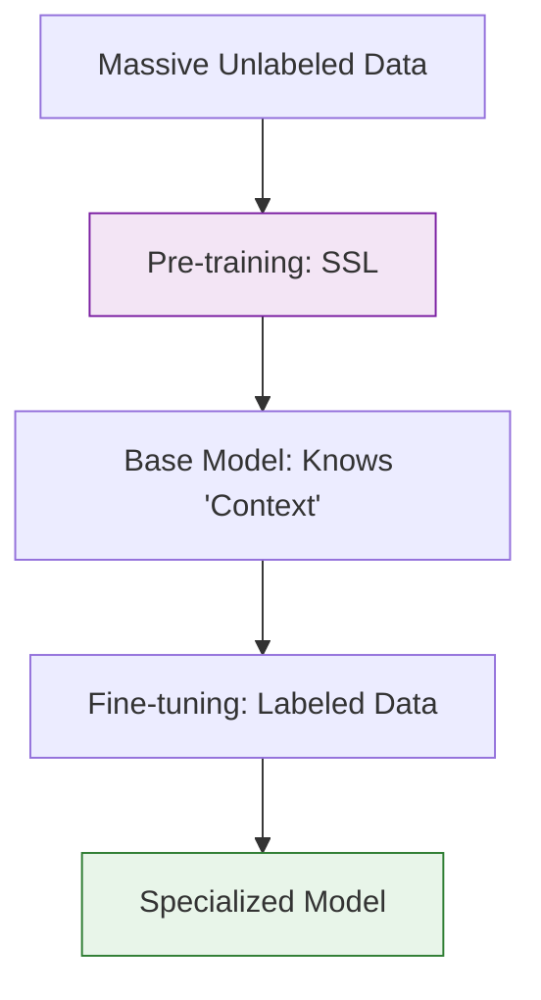

**Self-Supervised Learning (SSL)** is a paradigm where the model generates its own labels from the data itself. It eliminates the "bottleneck" of human labeling by hiding part of the input and asking the model to predict it.

If Supervised Learning is "Learning with a teacher," and Unsupervised Learning is "Learning alone," Self-Supervised Learning is **"Learning by solving puzzles."**

## 1. How it Works: The Pretext Task

In SSL, we create a **Pretext Task** a synthetic challenge where the "ground truth" is already contained within the data.

### A. In Natural Language Processing (NLP)
This is how models like GPT and BERT are trained. We take a normal sentence and hide words:
* **Original:** "The cat sat on the mat."
* **Input:** "The cat [MASK] on the mat."
* **Target:** "sat"

By predicting the masked word, the model forcedly learns grammar, context, and even world facts.

### B. In Computer Vision
We can take an image and modify it to create a puzzle for the model:
* **Rotation Prediction:** Rotate an image by 90° and ask the model "What is the orientation?" To answer, the model must understand what a "head" or "tree" looks like.
* **Jigsaw Puzzles:** Shuffling patches of an image and asking the model to reassemble them.
* **Colorization:** Giving the model a black-and-white photo and asking it to predict the colors.

## 2. The Two-Stage Pipeline

Self-supervised learning is almost always used as a "pre-training" step before a specific downstream task.

1.  **Stage 1: Pre-training (SSL):** Train on a massive, unlabeled dataset (e.g., all of Wikipedia) to learn general representations.
2.  **Stage 2: Fine-tuning (Supervised):** Take that "smart" model and train it on a very small, labeled dataset for a specific task (e.g., medical sentiment analysis).

## 3. Contrastive Learning

A popular modern approach to SSL is **Contrastive Learning**. Instead of predicting a missing part, the model learns to distinguish between "similar" and "different" things.

* **Positive Pair:** Two different crops of the same photo of a dog.
* **Negative Pair:** A photo of a dog and a photo of a car.
* **Goal:** The model learns to pull the "dog" representations together and push the "car" representation away in mathematical space.

## 4. Why SSL is the Future

| Feature | Supervised Learning | Self-Supervised Learning |
| --- | --- | --- |
| **Data Source** | Human-curated labels | Raw, "wild" data (Internet) |
| **Scalability** | Limited by human hours | Unlimited (Scales with compute) |
| **Knowledge** | Narrow/Task-specific | General/Versatile |

## 5. Real-World Impact

* **Large Language Models (LLMs):** Every "GPT" model uses SSL to learn how to predict the next token.
* **Robotics:** Robots learning to understand their environment by predicting the next frame in a video feed.
* **Medical AI:** Pre-training on millions of unlabeled X-rays to understand "anatomy" before learning to spot specific rare diseases.

## References for More Details

* **[Yann LeCun - Self-Supervised Learning](https://ai.meta.com/blog/self-supervised-learning-the-dark-matter-of-intelligence/):** Understanding why the pioneers of AI believe SSL is "the dark matter of intelligence."
* **[Illustrated Word2Vec](https://jalammar.github.io/illustrated-word2vec/):** A visual guide to the earliest successful SSL techniques in NLP.

---

**You've now seen how AI learns from labeled data, patterns, and even itself. There is one final, radical way for AI to learn: by "playing" and receiving rewards.**